# ASTRA User Feedback-to-Fix System — Implementation Plan

**Date:** 2026-07-09

**Status:** In progress — contract gate active; dependent production work blocked

**Core delivery:** 14 mergeable pull requests: PRs 1–10, 11A, 11B, 11C-server,
and 11C-client; followed by non-merging integration Gate 11D

**Optional resilience extension:** PR 12, standalone reporter (15th mergeable PR
if selected)

**Primary repository:** `aandresalvarez/astra`

**Program-plan draft PR:** [#255](https://github.com/aandresalvarez/astra/pull/255)

**Backend design-only draft PR:**
[#256](https://github.com/aandresalvarez/astra/pull/256) (ADR/API/threat model;
explicitly not PR 7 or PR 8)

**Backend repository/deployment:** To be selected before PR 7

## Goal

Build a deterministic, privacy-preserving feedback system that lets an ASTRA
user report a problem even when Codex, Claude, Copilot, Antigravity, or every AI
runtime is unavailable. The system must preserve the user's intent and the
exact technical evidence, create or update an engineering issue, support a
read-only AI assessment when available, apply deterministic prioritization,
gate implementation behind human approval, require root-cause analysis and a
regression test, and notify the reporter when the fix ships.

The reporting control plane must not depend on the runtime execution plane.
Submitting a report must use only ASTRA-owned deterministic code, durable local
storage, and native HTTPS transport.

## Scope

### In scope

- In-app problem reporting from Help, Logs, and task failure surfaces.
- Deterministic evidence capture and redaction.
- Provider-neutral runtime failure evidence.
- Durable offline outbox, idempotent submission, and visible delivery state.
- Private evidence storage with bounded retention.
- GitHub App issue creation, deduplication, labeling, and occurrence counting.
- Read-only AI assessment with a structured root-cause contract.
- Deterministic priority policy and human triage gate.
- Draft ASTRA implementation tasks and isolated implementation branches.
- Mandatory regression tests, validation evidence, draft PRs, and release
  notification.
- Regression, integration, security, and failure-injection coverage throughout.

### Out of scope for the core 14 PRs

- Automatic merging or releasing of agent-authored fixes.
- Public upload of raw logs, browser evidence, or macOS crash reports.
- Requiring reporters to own a GitHub account.
- Using provider CLIs, MCP, connectors, `gh`, or an AI model to prepare or send
  the original report.
- General-purpose telemetry or behavioral analytics unrelated to a user-created
  feedback report.
- Reporting when ASTRA itself cannot launch; that is the optional PR 12.
- Reporter email collection or outbound email notification; V1 uses the
  receipt-scoped in-app status and optional local notification only.

## First-Principles Invariants

These are acceptance requirements for the full system, not implementation
preferences.

1. **Runtime independence:** report preparation and submission never invoke an
   `AgentRuntimeAdapter`, provider CLI, utility model, MCP server, connector, or
   `gh`.
2. **Durable ownership:** `FeedbackReport` owns local report and submission
   state. Logs, GitHub labels, and transient UI state do not become competing
   owners.
3. **Determinism:** the same normalized inputs and evidence selections produce
   the same canonical payload bytes and evidence hashes.
4. **Explicit failure:** a report is never shown as submitted until the intake
   service returns and ASTRA persists a valid receipt.
5. **Idempotency:** retrying the same report cannot create a second remote
   report or duplicate GitHub issue occurrence.
6. **Privacy before transport:** all selected artifacts pass an allowlist,
   redaction, size, and manifest check before entering the outbox.
7. **Minimum disclosure:** browser evidence, screenshots, and macOS diagnostic
   reports are opt-in and visibly listed before submission.
8. **Untrusted intake:** user text, log text, issue bodies, filenames, and remote
   metadata are data, never executable instructions.
9. **Assessment is optional:** report acceptance and GitHub projection do not
   wait for an AI assessment. Humans can triage when all agents are unavailable.
10. **Policy owns priority:** AI extracts evidence and recommends; deterministic
    rules assign priority, with recorded human override.
11. **Human implementation gate:** external input cannot authorize immediate
    task execution. Accepted reports create draft work until a developer
    approves execution.
12. **Root-cause gate:** implementation cannot be marked ready without a named
    behavioral owner, evidence, alternatives considered, a regression-test
    plan, and acceptance criteria.
13. **No silent patching:** implementation agents create draft PRs. Review,
    merge, and release authority remain human-controlled.

## System Flow

```mermaid
flowchart LR
    A["User selects Report a Problem"] --> B["Deterministic evidence builder"]
    B --> C["User reviews disclosure inventory"]
    C --> D["Durable local outbox"]
    D --> E["Native HTTPS intake"]
    E --> F["Encrypted private evidence store"]
    E --> G["GitHub issue or duplicate occurrence"]
    G --> H["Read-only assessment agent"]
    H --> I["Deterministic priority policy"]
    I --> J["Human triage gate"]
    J --> K["Draft ASTRA implementation task"]
    K --> L["Isolated implementation and regression test"]
    L --> M["Draft PR and CI"]
    M --> N["Human review, merge, and release"]
    N --> O["Reporter sees Fixed in version X"]
```



## State Ownership

### Local feedback report states

```text
draft
  -> prepared
  -> queued
  -> uploading
  -> submitted

queued | uploading
  -> retryable_failure
  -> queued

draft | prepared | queued
  -> cancelled

uploading
  -> permanent_failure
```

`submitted` requires a persisted remote receipt. A report in
`retryable_failure` remains one logical report with the same idempotency key.

### Remote engineering states

```text
received
  -> assessment_pending
  -> needs_information | accepted | duplicate | declined | security_private
accepted
  -> implementation_queued
  -> in_progress
  -> fix_ready
  -> merged
  -> released
```

The server owns remote engineering status. ASTRA stores the last confirmed
remote status and receipt as a local projection.

## Canonical Report Inputs and Outputs

### Required inputs

- Stable report UUID and idempotency key.
- User statement: intended outcome, actual result, expected result, and whether
  work is blocked.
- ASTRA version, build, channel, and source provenance.
- macOS version and architecture.
- Report creation timestamp and selected evidence window.
- Explicit evidence selections and consent version.
- Current or most relevant task/run identifiers when available.
- Provider-neutral runtime diagnostic snapshot when a runtime is implicated.

### Optional inputs

- Sanitized application and task logs.
- Browser evidence, only with explicit selection.
- Screenshot thumbnails, only with explicit selection.
- macOS crash, hang, spin, or diagnostic reports, only with explicit selection.
- No reporter contact address in V1; the opaque receipt/status credential owns
  reporter-visible follow-up without identity collection.

### Local outputs

- Canonical `feedback-report.json`.
- `manifest.json` containing format version, hashes, byte sizes, artifact kinds,
  redaction results, omissions, and warnings.
- Sanitized Markdown summary for human inspection.
- Evidence archive with deterministic ordering and bounded content.
- Durable `FeedbackReport` and outbox state.

### Remote outputs

- Opaque report receipt.
- Private evidence object references with expiry metadata.
- GitHub issue number/URL or duplicate issue link.
- Structured assessment and deterministic priority decision.
- Implementation task and draft PR links when approved.
- Released version and reporter-visible resolution state.

## Pull Request Index and Progress Tracker

Update this table whenever a branch is created, a PR is opened, validation
changes, or a blocker appears. Use only the listed status values:
`not_started`, `in_progress`, `blocked`, `in_review`, `merged`, `released`, or
`optional` for PR 12 only.

| PR | Status | Owner | Branch | PR link | Depends on | Wave | Last validation | Blocker/notes |
| --- | --- | --- | --- | --- | --- | --- | --- | --- |
| 1. Feedback contract | in_review | Task `019f4890-bde1-7793-8b4a-10be3eb4bf21` | `alvaro/feedback-contract-v1` | [#257](https://github.com/aandresalvarez/astra/pull/257) | — | 0 | 19/19 focused; 4,625/4,625 full; 500/500 pre-push; schema/fixtures pass | Hard language-neutral contract gate; stacked on program PR #255 |
| 2. Diagnostics privacy | blocked | Task `019f4890-bdd6-71a2-ac82-42aab7b8cd18` | TBD after PR 1 | — | 1 | 1 | Baseline `LogDiagnosticsTests` 49/49 pass | Wait for golden contract |
| 3. Runtime evidence | blocked | Task `019f4890-bdd6-71a2-ac82-42aab7b8cd18` | Mapping branch after PR 1; integration stack after PR 2 | — | 1 for development; 2 for integration | 2 | Baseline diagnostics 49/49 pass | May map fixtures after PR 1; integrates PR 2 policy |
| 4. Durable outbox | blocked | Task `019f4890-c2e8-7543-8fcd-f149f4ba7c75` | TBD after PR 1 | — | 1 | 1 | Discovery active | Owns V12 migration and prepared-package adoption |
| 5. Report UI | blocked | Task `019f4890-c2e8-7543-8fcd-f149f4ba7c75` | TBD | — | 2, 3, 4; live Send also 6 | 3 | Discovery active | Queue/preview only until transport is integrated |
| 6. Native transport | blocked | Task `019f4890-c2e8-7543-8fcd-f149f4ba7c75` | TBD | — | 1, 2, 4, 7 | 2–3 | Discovery active | Fake server allowed; production needs intake authority |
| 7. Intake service | blocked | Task `019f4890-bdd9-7560-bde7-b057ec395791` | Backend repo TBD | — | 1 plus backend authority | 1 | Design-only PR #256; 61/61 + 500/500 pass | #256 is not PR 7; authority unresolved |
| 8. GitHub projection | blocked | Task `019f4890-bdd9-7560-bde7-b057ec395791` | Backend repo TBD | — | 7 | 2 | Design-only PR #256; 61/61 + 500/500 pass | #256 is not PR 8; private repo/App required |
| 9. Assessment/priority | blocked | Task `019f4890-bdc8-7872-8f2c-7af6798f3ed2` | Backend repo TBD | — | 1 for fixtures; 7–8 for integration | 1–2 | Baseline triage suites 20/20 pass | Production worker belongs with backend |
| 10. Developer triage | blocked | Task `019f4890-bdc8-7872-8f2c-7af6798f3ed2` | TBD | — | 7, 8, 9 | 3 | Baseline triage suites 20/20 pass | Requires authenticated staff triage API |
| 11A. Root-cause/validation gate | blocked | Task `019f4890-c38c-74c0-92d2-b00a97387278` | TBD | — | 10 | 4 | Baseline focused suites 43/43 pass | Wait for upstream contracts |
| 11B. Branch/worktree/draft PR | blocked | Task `019f4890-c38c-74c0-92d2-b00a97387278` | TBD | — | 10, 11A | 4 | Baseline focused suites 43/43 pass | ASTRA repository boundary |
| 11C-server. Merge/release reconciliation | blocked | Task `019f4890-c38c-74c0-92d2-b00a97387278` | Backend branch TBD | — | 7, 8, 11B | 4 | Contract discovery | Backend authority required |
| 11C-client. Released-status UI | blocked | Task `019f4890-c38c-74c0-92d2-b00a97387278` | ASTRA branch TBD | — | 6, 11C-server contract | 4 | Baseline focused suites 43/43 pass | ASTRA status projection only |
| Gate 11D. End-to-end integration | blocked | Task `019f4890-c38c-74c0-92d2-b00a97387278` | Disposable integration branch | — | 1–11C-client | 4 | `040e80a6`: 43/43 focused pass | Non-merging proof; never a feature base |
| 12. Standalone reporter | optional | — | — | — | 1–3 for export; add 6–7 for submission | parallel | — | Not core scope |

## Parallelization and Merge Order

The program-plan branch is intentionally one commit ahead of `main`. Feature
branches are stacked only on their declared dependency, target that dependency
for review, and are retargeted after it merges. The disposable Gate 11D branch
is never used as a feature base and never replaces the individual PR histories.

### Wave 0 — contract gate

- [ ] Merge PR 1 before implementation branches freeze their schemas.

### Wave 1 — parallel foundations

- [ ] Track A: PR 2, diagnostics privacy and deterministic evidence packaging.
- [ ] Track B: PR 4, durable feedback report and outbox.
- [ ] Track C: PR 7 only after backend repository, hosting, authentication,
  retention, cost, and deployment ownership are authorized.
- [ ] Track D: PR 9, assessment and priority contracts using fixtures.

### Wave 2 — parallel extensions

- [ ] PR 3 contract mapping can start after PR 1 in parallel with PR 2; its
  production integration follows PR 2.
- [ ] PR 8 follows PR 7.
- [ ] PR 6 can develop against the PR 1 API fixture after PR 2 defines final
  package semantics; merge it only after client/server contract verification.
- [ ] PR 9 integrates with PR 7/8 after its pure assessment and priority tests
  pass against fixtures.

### Wave 3 — product and developer workflows

- [ ] PR 5 integrates diagnostics, runtime evidence, and durable report state.
  Its live Send action remains queue-only until PR 6 is integrated.
- [ ] PR 6 completes native upload and remote-status synchronization.
- [ ] PR 10 integrates the authenticated staff triage API, GitHub projection,
  assessment, priority, and human gates.

### Wave 4 — final integration

- [ ] PR 11A adds the ASTRA root-cause and validation readiness gate.
- [ ] PR 11B adds isolated branch/worktree and idempotent draft-PR orchestration.
- [ ] PR 11C-server owns backend merge/release reconciliation and notification;
  PR 11C-client owns ASTRA released-status consumption and presentation.
- [ ] Gate 11D proves the complete loop and operational failure paths on a
  disposable integration branch. The integration branch is never merged
  wholesale and is never used as a feature base.

### Conflict ownership

Assign one active editor at a time for these hotspots:

- `ASTRACore/Feedback/*`: PR 1 only until the contract gate merges.
- `Astra/Services/Diagnostics/LogDiagnosticsService.swift`: PR 2 only.
- `Astra/Services/Diagnostics/CrashDiagnosticsService.swift`: PR 2, then PR 5.
- `Astra/Models/SchemaVersions.swift`: PR 4 only for V12 and its migration.
- `Package.swift`: optional PR 12 only unless a separately reviewed need appears.
- `Tests/ArchitectureFitnessTests/ArchitectureFitnessTests.swift`: one named
  integration owner at a time.

## PR 1 — Versioned Feedback Contract and Privacy Model

**Objective:** Establish stable client, server, assessment, and status contracts
before parallel implementation begins.

**Root cause addressed:** Without a canonical contract, client, backend,
GitHub, and agents will derive parallel schemas and silently disagree about
status, consent, evidence, and idempotency.

**Dependencies:** None.

### Inputs

- Existing diagnostics manifest and build provenance.
- Runtime failure categories.
- Local and remote state machines defined in this plan.
- Privacy and consent requirements.

### Outputs

- `FeedbackReportEnvelopeV1`, `FeedbackReportPayloadV1`, evidence inventory,
  runtime snapshot, receipt, and status DTOs.
- Language-neutral JSON Schema and OpenAPI definitions for request, receipt,
  status, error, assessment, and staff-triage DTOs.
- Canonical JSON rules covering timestamp precision, UTC formatting, Unicode
  normalization, number encoding, stable enum values, artifact ordering, hash
  inputs, request framing, unknown values, and size limits.
- Checked-in golden request, receipt, status, and error bytes/hashes that every
  implementation language must consume directly.
- Idempotency and authentication semantics. A report identity is non-secret;
  its status-read credential is separate and never placed in URLs, issues, or
  logs. V1 does not freeze or expose a request-signature field/algorithm until
  the authentication model is selected.
- Sanitized example and adversarial fixtures usable by client and server without
  re-encoding them through Swift-specific defaults.
- Contract documentation and compatibility policy.

### Likely files

- New `ASTRACore/Feedback/FeedbackReportContract.swift`
- New `ASTRACore/Feedback/FeedbackReportStatus.swift`
- New `Tests/FeedbackReportContractTests.swift`
- This plan and a focused security-boundary update under `docs/security/`

### Implementation checklist

- [ ] Define all V1 Codable structures and explicit coding keys.
- [ ] Keep the contract Foundation-only and independent of SwiftData, SwiftUI,
  runtime adapters, and network clients.
- [ ] Define required versus optional fields and maximum lengths/counts.
- [ ] Define local status, remote status, receipt, and retry semantics.
- [ ] Define evidence disclosure classes: standard, sensitive, explicit opt-in.
- [ ] Define canonical encoding and hashing test vectors across Swift and an
  independent reference implementation; the selected backend language must
  later pass the same checked-in vectors.
- [ ] Bind an idempotency key to installation identity and canonical digest:
  same key/same digest returns the original report; same key/different digest is
  a typed conflict; cross-install replay and status reads are forbidden.
- [ ] Define the digest over schema version, canonical payload, redaction-policy
  version, and ordered hashes of the final artifact bytes.
- [ ] Keep receipt/status credentials out of URLs and define protected-at-rest
  server representation before backend implementation begins.
- [ ] Define backward-compatible decoding expectations for additive V1 fields.
- [ ] Add examples containing hostile strings, malformed Unicode, and unknown
  future enum values.

### Tests and regression coverage

- [ ] Round-trip every contract type.
- [ ] Assert golden canonical JSON bytes and hashes match across Swift and an
  independent reference implementation, locales, time zones, timestamp
  boundaries, Unicode forms, and supported numeric values.
- [ ] Assert evidence ordering is deterministic.
- [ ] Assert unknown or missing required versions fail with typed errors.
- [ ] Assert size/count limits reject oversized payloads before transport.
- [ ] Assert hostile strings remain inert data.
- [ ] Assert same-key/different-digest, expired/malformed receipt,
  cross-install status read, and remote-status downgrade fail with typed errors.

### Acceptance criteria

- [ ] Client and fake-server implementations validate checked-in golden bytes
  and hashes rather than independently deriving compatible-looking fixtures.
- [ ] No contract type imports runtime, UI, persistence, or GitHub code.
- [ ] Contract changes after merge require a compatibility review and fixture
  update.

## PR 2 — Deterministic Diagnostics Privacy and Evidence Packaging

**Objective:** Make every automatically shareable artifact safe, bounded,
inspectable, and reproducible.

**Root cause addressed:** The existing diagnostics report sanitizes structured
entries, but archive assembly also copies logs, browser flight artifacts, and
macOS reports. Automatic transport requires a second privacy boundary over
every included artifact.

**Dependencies:** PR 1.

### Inputs

- V1 evidence and manifest contract.
- `LogDiagnosticsService`, `LogSanitizer`, `CrashDiagnosticsService`, app/task
  logs, breadcrumbs, and browser flight logs.
- User evidence selections and time window.

### Outputs

- `FeedbackEvidenceBuilder` with deterministic artifact ordering.
- Central `FeedbackEvidencePolicy` allowlist and disclosure classification.
- Typed per-artifact transformers and omission records. Generic raw-file copy is
  not a valid remote-feedback path.
- Manifest V1 hashes, byte counts, redaction counts, and warnings.
- A temporary immutable prepared package produced transactionally and handed to
  PR 4 through an explicit `prepare -> adopt` boundary.
- Safe evidence package with stable metadata, permissions, ordering, and no
  raw-copy shortcut for remotely shareable content.

### Likely files

- `Astra/Services/Diagnostics/LogDiagnosticsService.swift`
- `Astra/Services/Diagnostics/CrashDiagnosticsService.swift`
- `ASTRALogging/ASTRALogging.swift`
- New `Astra/Services/Feedback/FeedbackEvidenceBuilder.swift`
- New `Astra/Services/Feedback/FeedbackEvidencePolicy.swift`
- `Tests/LogDiagnosticsTests.swift`
- New `Tests/FeedbackEvidencePrivacyTests.swift`

### Implementation checklist

- [ ] Separate local diagnostics export from remotely shareable feedback
  evidence while reusing common analysis code.
- [ ] Build feedback only from typed allowlisted fields. Never consume generic
  `TaskEvent.payload`, `TaskRun.output`, or arbitrary source files.
- [ ] Classify each artifact kind and require explicit opt-in where necessary.
- [ ] Transform browser JSONL structurally and exclude embedded base64 JPEGs;
  screenshots are separate explicit-opt-in artifacts.
- [ ] Transform crash and runtime diagnostics into typed bounded fields before
  staging; regex-only redaction is not sufficient.
- [ ] Reject or omit unsupported binary and oversized artifacts.
- [ ] Make crash/browser evidence opt-in by construction.
- [ ] Replace or omit stable unsalted browser hashes; any diagnostic
  correlation identifier must be report-local and keyed.
- [ ] Record omissions and redaction warnings in the manifest.
- [ ] Inject one stable report timestamp; never derive hash-affecting timestamps
  independently for each file or archive entry.
- [ ] Hash final bytes, not source bytes.
- [ ] Define manifest/package hashing without a circular self-hash.
- [ ] Construct in a temporary location and atomically transfer ownership only
  after all transforms, hashes, manifest checks, and close steps succeed. PR 4
  owns retention and deletion after adoption.
- [ ] Ensure temporary staging cleanup occurs on success, failure, cancellation,
  and disk-full errors.

### Tests and regression coverage

- [ ] Prove secrets, tokens, credentials, emails, home paths, and entered browser
  values do not survive in any shareable artifact.
- [ ] Prove crash/browser artifacts are absent without explicit selection.
- [ ] Prove deterministic package inventory and hashes. If an archive is used,
  its timestamps, permissions, entry ordering, and bytes must also be stable.
- [ ] Prove traversal, hardlinks, symlinks, corrupt, injected-unreadable,
  changing-during-read, and oversized artifacts fail closed without adopting a
  partial package.
- [ ] Prove cancellation and disk-full failure clean temporary artifacts.
- [ ] Prove diagnostics export still works for existing local users.
- [ ] Prove generated files retain restrictive filesystem permissions.

### Acceptance criteria

- [ ] No included artifact bypasses policy and redaction.
- [ ] The UI can display a complete disclosure inventory without opening the
  archive.
- [ ] Existing `LogDiagnosticsTests` and new privacy tests pass.

## PR 3 — Provider-Neutral Runtime Evidence Snapshot

**Objective:** Capture actionable evidence for Codex, Claude, Copilot,
Antigravity, and future runtimes without calling an AI or rerunning a failed
provider.

**Root cause addressed:** Provider-specific stderr, readiness, version, stream,
and failure facts exist, but a feedback report needs one stable cross-runtime
shape and must never wait on a hung provider.

**Dependencies:** PR 1 for contract mapping; PR 2 for production integration
with its privacy policy and prepared-package boundary.

### Inputs

- Typed persisted runtime diagnostic records and approved log fields.
- `AgentRuntimeFailureDiagnostic` fields.
- Runtime readiness results already recorded before or during launch.
- Antigravity diagnostic summaries and provider stream telemetry.

### Outputs

- `RuntimeFeedbackSnapshotV1` populated from existing durable evidence.
- Deterministic runtime failure category, provider version, executable discovery
  result, readiness result, exit/stop reason, stream counters, sandbox/policy
  state, and sanitized summary.
- Typed `unavailable`/`not_recorded` evidence reasons rather than empty strings.

### Likely files

- `Astra/Services/Diagnostics/AgentRuntimeDiagnostics.swift`
- `Astra/Services/Diagnostics/AgentRuntimeFailurePayload.swift`
- `Astra/Services/Runtime/*RuntimeAdapter.swift`
- `Astra/Services/Runtime/AntigravityCLIRuntime.swift`
- New `Astra/Services/Feedback/RuntimeFeedbackSnapshotBuilder.swift`
- New `Tests/RuntimeFeedbackSnapshotTests.swift`

### Implementation checklist

- [ ] Define one provider-neutral mapping from existing runtime evidence.
- [ ] Read persisted evidence only; never launch readiness probes during report
  preparation.
- [ ] Never expose generic task-event payloads, task-run output, raw stderr, raw
  environment, or arbitrary files through the snapshot contract.
- [ ] Bound and sanitize provider output.
- [ ] Record whether the runtime was missing, unauthenticated, misconfigured,
  denied, timed out, rate-limited, quota-limited, or failed opaquely.
- [ ] Preserve unknown future runtimes without crashing or mislabeling them.
- [ ] Exclude credential values and raw environment variables.

### Tests and regression coverage

- [ ] Test Codex missing, logged out, and model unavailable.
- [ ] Test Claude empty stderr with useful result-output failure.
- [ ] Test Copilot permission/auth failure.
- [ ] Test Antigravity diagnostic-log evidence.
- [ ] Test a recorded hung-runtime state completes without starting or awaiting
  a real provider process; use a fail-fast spy to prove no readiness/launch call.
- [ ] Test all runtimes absent and feedback evidence still builds.
- [ ] Test unknown runtime and unknown failure category preservation.

### Acceptance criteria

- [ ] Report creation has no production call path into runtime launch/readiness.
- [ ] Every supported runtime maps to the same contract.
- [ ] Runtime-specific regression suites remain green.

## PR 4 — Durable FeedbackReport and Outbox

**Objective:** Give report creation and submission one durable owner with
idempotent retry behavior.

**Root cause addressed:** UI flags or transient network tasks cannot guarantee
that a report survives relaunch, network loss, cancellation, or server failure.

**Dependencies:** PR 1.

### Inputs

- V1 feedback contract and local state machine.
- SwiftData schema and persistence coordinator conventions.
- Generated evidence archive and manifest locations.

### Outputs

- SwiftData `FeedbackReport` model and V12 migration.
- `FeedbackOutboxService` owning legal transitions and persistence.
- Atomic adoption of PR 2's immutable prepared package into outbox-owned local
  storage; PR 4 becomes the sole retention/deletion owner after adoption.
- Stable idempotency key created before the first network attempt.
- Retry scheduling metadata, attempt history, receipt projection, and cleanup
  policy.

### Likely files

- New `Astra/Models/FeedbackReport.swift`
- `Astra/Models/SchemaVersions.swift`
- New `Astra/Services/Feedback/FeedbackOutboxService.swift`
- New `Tests/FeedbackReportPersistenceTests.swift`
- New `Tests/FeedbackOutboxStateMachineTests.swift`

### Implementation checklist

- [ ] Add immutable report identity and idempotency key.
- [ ] Adopt only complete prepared packages; reject missing, corrupt, or
  manifest-mismatched packages without advancing report state.
- [ ] Persist intent, selections, local artifact references, hashes, consent
  version, state, attempts, last error, receipt, and remote status.
- [ ] Route all state changes through one service.
- [ ] Define retryable versus permanent transport failures.
- [ ] Recover `uploading` reports deterministically after app termination.
- [ ] Prevent duplicate concurrent sends for one report.
- [ ] Bound local retention and preserve submitted receipts after artifact expiry.
- [ ] Use injected clocks/backoff and separate persistence contexts for
  deterministic retry, retention, and concurrent-claim tests.

### Tests and regression coverage

- [ ] Open a populated disk-backed V11 store through the V12 migration and
  verify existing rows and relationships remain intact.
- [ ] Round-trip every state and optional receipt field.
- [ ] Reject illegal transitions.
- [ ] Recover an interrupted upload to a retryable queued state.
- [ ] Prove repeated retry uses one idempotency key.
- [ ] Prove concurrent send attempts result in one active claim.
- [ ] Prove adoption, retention, and cancellation races never delete a package
  still owned by an active outbox record.
- [ ] Run full `swift test --no-parallel` because this changes the SwiftData
  schema.

### Acceptance criteria

- [ ] No UI or transport code writes report status directly.
- [ ] Relaunch cannot lose a prepared or queued report.
- [ ] Existing stores and workspace persistence tests remain valid.

## PR 5 — In-App Report Experience and Crash Recovery

**Objective:** Give users a short, understandable reporting flow with exact
disclosure preview and useful entry points.

**Root cause addressed:** Users should describe intent and impact, not manually
translate logs into a developer issue. Privacy consent must occur at the moment
evidence is selected.

**Dependencies:** PRs 2, 3, and 4. A live Send action additionally depends on
PR 6; before then, this PR is queue/preview-only.

### Inputs

- Deterministic evidence inventory and runtime snapshot.
- Durable draft/outbox service.
- Existing Logs view, task failure surfaces, application commands, and lean UI
  design system.

### Outputs

- `Report a Problem` command and sheet.
- Required intent/actual/expected/blocked fields.
- Default 15-minute evidence window.
- Exact selectable disclosure inventory and privacy warnings.
- Queued/report status presentation; live receipt/status presentation is
  enabled only after PR 6 is integrated.
- Next-launch prompt for a newly detected unreported ASTRA crash.

### Likely files

- New `Astra/Views/Feedback/FeedbackReportView.swift`
- New `Astra/Views/Feedback/FeedbackEvidencePreview.swift`
- `Astra/Views/LogViewerView.swift`
- Relevant task failure/decision surfaces in `Astra/Views/TaskMainView.swift`
- App command wiring in `Astra/ASTRAApp.swift` or the current command owner
- `Astra/Services/Diagnostics/CrashDiagnosticsService.swift`
- New `Tests/FeedbackReportPresentationTests.swift`
- New `Tests/FeedbackCrashRecoveryTests.swift`

### Implementation checklist

- [ ] Read `docs/design-system/lean-ui-system.md` before implementation.
- [ ] Add Help, Logs, and task-failure entry points using one shared action.
- [ ] Prefill technical metadata without requiring the user to understand it.
- [ ] Require review of sensitive evidence selections.
- [ ] Save a draft before expensive evidence work.
- [ ] Show queued, sending, submitted, retryable, and permanent-failure states.
- [ ] Do not expose a live Send path on a branch without PR 6; label the action
  as queue-only in intermediate stacked review.
- [ ] Detect only new, not-yet-offered crash reports on next launch.
- [ ] Keep reporting available when runtime settings are invalid or empty.

### Tests and regression coverage

- [ ] Test entry-point routing opens the same draft/report identity.
- [ ] Test default selections exclude browser, screenshots, and crash artifacts.
- [ ] Test submission cannot proceed without required user intent fields.
- [ ] Test cancelling preserves or deletes a draft according to explicit choice.
- [ ] Test all runtimes unavailable and the report UI remains enabled.
- [ ] Test one crash prompt per crash fingerprint.
- [ ] Test crash opt-out, corrupt crash metadata, fingerprint stability, consent
  version changes, and preview-to-final-manifest identity.
- [ ] Add accessibility identifiers and presentation/command routing tests.
  Document a manual keyboard and accessibility pass unless this PR deliberately
  adds a real UI automation harness.

### Acceptance criteria

- [ ] A user can prepare a complete report without opening Logs or GitHub.
- [ ] The preview matches the final manifest exactly.
- [ ] UI state derives from `FeedbackReport`, not a competing state machine.

## PR 6 — Native Transport and Remote Status Synchronization

**Objective:** Submit and track reports through native HTTPS without any runtime
or GitHub client dependency.

**Root cause addressed:** A runtime-related failure cannot be reported reliably
if delivery depends on a provider CLI, connector, MCP package, or `gh` login.

**Dependencies:** PRs 1, 2, and 4 plus the PR 7 server contract. Development may
begin against the golden PR 1 fake server after PR 2 freezes package semantics.

### Inputs

- Prepared canonical payload and PR 4-owned immutable evidence package.
- Durable outbox claim and idempotency key.
- Intake endpoint configuration and receipt/status contract.

### Outputs

- `FeedbackTransport` protocol.
- Native `URLSessionFeedbackTransport`.
- Upload orchestration with bounded retry/backoff and cancellation.
- Receipt validation and remote-status polling or refresh.
- Typed transport errors safe for user display and logs.

### Likely files

- New `Astra/Services/Feedback/FeedbackTransport.swift`
- New `Astra/Services/Feedback/URLSessionFeedbackTransport.swift`
- New `Astra/Services/Feedback/FeedbackSubmissionService.swift`
- Settings/build configuration for the intake base URL
- New `Tests/FeedbackSubmissionServiceTests.swift`
- New `Tests/FeedbackTransportContractTests.swift`

### Implementation checklist

- [ ] Use native HTTPS and ephemeral request configuration as appropriate.
- [ ] Reject plaintext HTTP, HTTPS downgrades, cross-origin redirects, and
  redirects that could forward status credentials or report content.
- [ ] Send idempotency key and payload/evidence hashes.
- [ ] Validate status codes, MIME types, receipt shape, and server hash echo.
- [ ] Classify offline, timeout, server, validation, auth, and permanent errors.
- [ ] Persist state before and after every network boundary.
- [ ] Prevent unbounded retry loops and battery/network churn.
- [ ] Keep submission independent of app runtime settings and credentials.

### Tests and regression coverage

- [ ] Use a deterministic fake URL protocol/server for every response class.
- [ ] Test offline queueing and later successful retry.
- [ ] Test timeout after server acceptance followed by idempotent retry.
- [ ] Test duplicate receipt response maps to the original report.
- [ ] Test malformed/hostile server response fails closed.
- [ ] Test a real local server boundary, HTTPS enforcement, redirect rejection,
  cancellation/backoff, same key/different digest, expired/malformed/cross-
  report receipts, and remote-status downgrade.
- [ ] Test app termination during upload and next-launch recovery.
- [ ] Assert no runtime, MCP, connector, or `gh` call is reachable.

### Acceptance criteria

- [ ] All runtime executables can be absent and submission still succeeds.
- [ ] Failed delivery is visible and recoverable without duplicate remote state.
- [ ] No server receipt means no local `submitted` state.

## PR 7 — Intake Service and Private Evidence Storage

**Objective:** Accept reports safely, persist evidence privately, and return an
idempotent receipt without waiting for GitHub or AI.

**Root cause addressed:** Shipping GitHub credentials in ASTRA or uploading raw
diagnostics directly to issues would expose credentials, couple the client to
GitHub availability, and require reporters to use GitHub.

**Dependencies:** PR 1 plus explicit authorization of the backend repository,
provider, region, authentication, retention, cost limits, deployment owner, and
GitHub visibility. Production code cannot begin in the ASTRA app repository.

### Inputs

- V1 request/receipt/status contract and fixtures.
- Canonical payload and evidence hashes.
- Selected hosting, encrypted object storage, secret manager, and deployment
  environment.

### Outputs

- Authenticated/rate-limited intake endpoint.
- Idempotent report record and opaque receipt token.
- Encrypted private evidence objects with bounded retention.
- Hash/size/type verification before storage.
- Asynchronous jobs for GitHub projection and assessment.
- Status read endpoint scoped to the receipt.
- Authenticated staff-triage API used by PR 10.
- Release/status reconciliation API used by PR 11C-server/client.

### Likely files/repository

- Backend repository and deployment configuration: **TBD and a hard production
  start gate**. The ASTRA app repository may hold ADR/API/security design only;
  it must not add an in-process feedback backend target.
- Contract fixtures copied or consumed from PR 1 without manual divergence.
- Service unit, integration, infrastructure, and deployment tests.

### Implementation checklist

- [ ] Implement and validate the authorized hosting, datastore, object storage,
  retention, queue, KMS, and secret-storage design from the pre-PR ADR.
- [ ] Implement the authorized client-authentication model without an embedded
  app-wide secret.
- [ ] Separate non-secret report identity from status-read credentials; store
  credential verifiers encrypted or one-way protected and never log them.
- [ ] Validate version, size, hash, MIME type, and consent inventory.
- [ ] Prefer typed multipart artifact parts. If archives are accepted, enforce
  path, symlink, entry-count, expanded-size, compression-ratio, and time limits
  before extraction into an isolated location.
- [ ] Store report metadata separately from encrypted evidence blobs.
- [ ] Store evidence in private object storage with KMS-backed encryption and no
  public or issue-visible object URLs.
- [ ] Make idempotency and accepted-report/job enqueue atomic at the datastore
  boundary using a transactional outbox.
- [ ] Return receipt before GitHub or assessment processing.
- [ ] Apply per-client and per-network abuse controls without collecting
  unnecessary identity data.
- [ ] Expire evidence while retaining minimal issue/status audit metadata.
- [ ] Add operational logs that never contain report bodies, artifact names,
  credentials, contact data, or evidence.

### Tests and regression coverage

- [ ] Contract tests against PR 1 fixtures.
- [ ] Concurrent duplicate requests create one report.
- [ ] Hash, size, version, and MIME mismatches are rejected.
- [ ] Storage failure cannot return success.
- [ ] Accepted-report persistence with enqueue failure recovers exactly once
  through the transactional outbox.
- [ ] Archive traversal and decompression-bomb fixtures fail before storage.
- [ ] GitHub/assessment outage does not reject accepted intake.
- [ ] Retention job deletes evidence and preserves required audit metadata.
- [ ] Authorization prevents one receipt from reading another report.
- [ ] Expired, malformed, replayed, and cross-install status credentials fail
  without leaking report existence.
- [ ] Load and rate-limit tests cover expected abuse paths.

### Acceptance criteria

- [ ] The client receives a stable receipt without GitHub or AI availability.
- [ ] Evidence is private, encrypted, expiring, and access-audited.
- [ ] Replaying one request cannot duplicate storage or downstream jobs.
- [ ] Backend-native lint, unit, integration, infrastructure, and deployment
  checks pass in addition to the shared golden contract suite.

## PR 8 — GitHub App Projection, Deduplication, and Security Routing

**Objective:** Project sanitized reports into engineering workflow without
making GitHub the evidence store or client authentication mechanism.

**Root cause addressed:** Creating an issue for every occurrence produces noise;
placing sensitive evidence in issue bodies creates privacy and retention risk.

**Dependencies:** PR 7.

### Inputs

- Accepted report record and sanitized summary.
- Deterministic failure fingerprint.
- GitHub App installation with minimum Issue permissions.
- Private repository, labels, and private security-routing configuration for V1.

### Outputs

- New GitHub issue or occurrence update on a matching open issue.
- Stored issue number/URL and projection status.
- Component, kind, confidence, and intake labels.
- Private routing for possible security, credential exposure, or data loss.
- Reconciliation job for partial failures.

### Likely files/repository

- Backend GitHub projection module.
- GitHub App configuration and deployment secrets.
- Repository issue template/labels as code where possible.
- Tests using a fake GitHub API.

### Implementation checklist

- [ ] Define fingerprint inputs and normalization rules.
- [ ] Own deduplication through a database unique constraint and per-fingerprint
  projection record; GitHub search is reconciliation evidence, not the owner.
- [ ] Keep raw evidence, credentials, and expiring links out of issue bodies.
- [ ] Generate titles from trusted component/kind enums and neutralize user
  mentions, issue/commit autolinks, and hostile Markdown in projected text.
- [ ] Record occurrence count and affected build range privately or in sanitized
  issue metadata.
- [ ] Route high-risk reports to a private security workflow.
- [ ] Make projection idempotent and reconcilable after partial API failures.
- [ ] Use short-lived GitHub App installation tokens with repository metadata
  read and issues write only.

### Tests and regression coverage

- [ ] Same fingerprint updates one issue and increments one occurrence.
- [ ] Different component/build evidence does not false-deduplicate.
- [ ] GitHub timeout after creation reconciles without a second issue.
- [ ] Concurrent projection, token expiry/renewal, and closed-fixed-issue versus
  genuine-regression cases remain deterministic.
- [ ] Security/credential signals never leave the private security route.
- [ ] Hostile title/body strings remain data and cannot alter API calls.
- [ ] Missing labels/permissions produce a recoverable projection failure.

### Acceptance criteria

- [ ] Every remote report maps to zero or one active engineering issue.
- [ ] GitHub contains enough sanitized context for triage and no raw evidence.
- [ ] Intake remains successful when projection is delayed or unavailable.
- [ ] Any future public projection is a separate explicit human decision and is
  not part of the V1 automation.

## PR 9 — Read-Only Assessment and Deterministic Priority

**Objective:** Produce a rigorous root-cause assessment when an agent is
available while preserving a complete human path when no AI can run.

**Root cause addressed:** Free-form AI comments can overstate uncertain causes,
prioritize inconsistently, and treat hostile report content as instructions.

**Dependencies:** PR 1. Integrates with PRs 7 and 8; pure work can begin with
fixtures.

### Inputs

- Sanitized report contract and evidence inventory.
- Read-only source checkout at the exact reported build/release commit.
- Current `main` for drift comparison.
- Existing open issue fingerprints and sanitized summaries.

### Outputs

- Structured `FeedbackAssessmentV1`.
- Classification, impact, affected owner, evidence, counterevidence, root-cause
  hypothesis, reproduction confidence, duplicate candidates, missing questions,
  regression-test proposal, and acceptance criteria.
- Deterministic priority decision with reasons.
- `assessment_pending`/`assessment_failed` state that does not block humans.

### Likely files/repository

- Backend assessment job/worker.
- Shared assessment contract under `ASTRACore/Feedback` if the developer ASTRA
  client consumes it directly.
- Priority-policy module independent of model output wording.
- Security and prompt-injection tests.

### Implementation checklist

- [ ] Separate the read-only analyzer from the privileged GitHub publisher.
- [ ] Treat source as untrusted. A trusted fetcher maps signed ASTRA build
  provenance to an allowlisted repository and full commit SHA.
- [ ] Materialize a read-only snapshot with hooks, submodules, LFS smudge,
  credential helpers, build scripts, and repository-local executables disabled.
- [ ] Provide report contents as quoted/serialized data, never shell fragments.
- [ ] Enforce an analyzer sandbox with no process/shell launch, network,
  credential, database, GitHub, deployment, or source-write capabilities.
- [ ] Require schema-valid, length-bounded output with citations to allowlisted
  source/evidence identifiers; fail closed on malformed assessments.
- [ ] Persist an immutable assessment draft, then let a distinct publisher
  validate and publish it.
- [ ] Compute priority from validated facts and deterministic policy.
- [ ] Record human priority overrides and reasons.
- [ ] Retry agent failures without blocking issue creation or human triage.

### Tests and regression coverage

- [ ] Prompt-injection payloads cannot trigger tools, shell, writes, or secret
  access.
- [ ] Source-code prompt injection, malicious repo configuration, hooks,
  submodules, and build scripts remain inert.
- [ ] Malformed or missing model output leaves `assessment_pending/failed`.
- [ ] Same facts produce the same deterministic priority.
- [ ] P0 security/data-loss conditions override lower model recommendations.
- [ ] Unknown cause produces `needs_information`, not a confident root cause.
- [ ] Exact release source versus current-main drift is represented explicitly.
- [ ] Missing/unknown build provenance and non-allowlisted commits cannot enter
  the analyzer sandbox.
- [ ] Full human triage remains possible with assessment disabled.

### Acceptance criteria

- [ ] AI never owns final priority or implementation authorization.
- [ ] Every accepted assessment cites evidence and uncertainty.
- [ ] Assessment failure cannot lose, close, or downgrade the original report.

## PR 10 — Developer Triage Workspace App and Human Gate

**Objective:** Give the ASTRA team a review queue that turns accepted reports
into draft implementation work only after an explicit human decision.

**Root cause addressed:** Automatically running implementation from external
input would cross the trust boundary and bypass product, priority, and scope
judgment.

**Dependencies:** PRs 7, 8, and 9. PR 7 must expose an authenticated staff API;
the Workspace App must not read backend storage or evidence objects directly.

### Inputs

- GitHub issue projection, assessment, priority, evidence availability, and
  reporter status.
- Existing Workspace App review-queue, agentic-workflow, and human-approval
  primitives.
- ASTRA repository workspace and current `main`.

### Outputs

- Internal ASTRA Feedback Triage Workspace App.
- Review queue with received, needs-information, accepted, declined, duplicate,
  security-private, and implementation states.
- Human approval/rejection/override history.
- Draft `AgentTask` with exact issue/report/build handles and root-cause quality
  requirements.

### Likely files

- Workspace App manifest/template under `Astra/Resources/Packs` or the selected
  first-party app location.
- `Astra/Services/WorkspaceApps/*` only where new primitives are genuinely
  required.
- New `Tests/FeedbackTriageWorkspaceAppTests.swift`
- Existing `Tests/WorkspaceAppApprovalQueueTests.swift`
- Existing `Astra/Services/Settings/AstraExternalRouting.swift` safety contract

### Implementation checklist

- [ ] Prefer existing review-queue and human-gate primitives over new native
  workflow machinery.
- [ ] Show sanitized assessment and private-evidence availability separately.
- [ ] Require an explicit acceptance decision before task creation.
- [ ] Create a draft task; never authorize immediate run from external data.
- [ ] Populate constraints, acceptance criteria, exact release/source handles,
  and proposed regression test.
- [ ] Record duplicate, decline, needs-information, and override decisions.
- [ ] Bind approval to an immutable assessment/revision and reject stale
  approvals after the underlying report, assessment, or proposed scope changes.

### Tests and regression coverage

- [ ] Unapproved reports cannot create or run implementation tasks.
- [ ] Approval creates exactly one draft task.
- [ ] Repeated approval/retry returns the existing task.
- [ ] Concurrent approvals still create one task and preserve one audit trail.
- [ ] Stale assessment approval is rejected and re-prompts the reviewer.
- [ ] A later gate re-prompts rather than inheriting earlier approval.
- [ ] Declined/duplicate/security reports follow their distinct paths.
- [ ] Missing assessment still permits human triage but requires explicit scope.
- [ ] External route `run=1` remains unable to authorize execution.
- [ ] Run the `FeedbackTriageWorkspaceApp`, `WorkspaceAppApprovalQueue`,
  `AgenticWorkflow`, `AstraExternalRouting`, and Workspace App end-to-end suites.

### Acceptance criteria

- [ ] The queue is operational with all assessment agents disabled.
- [ ] Every implementation task links to one report/issue and one recorded human
  acceptance.
- [ ] No external input directly mutates task execution status.

## PR 11 Work Package — Root Cause to Released Fix

**Objective:** Complete the accepted-report-to-released-fix loop through four
repository-local PRs with independent ownership and regression gates.

**Root cause addressed:** Creating a task is not a closed feedback loop. The
former single PR 11 crossed validation, Git authoring, backend reconciliation,
release, notification, and end-to-end ownership boundaries. Splitting it keeps
each state transition deterministic and reviewable.

### PR 11A — Root-Cause and Validation Readiness Gate

**Dependencies:** PR 10.

**Inputs:** Human-approved draft implementation task, immutable assessment
revision, exact reported release, current source revision, and acceptance scope.

**Outputs:** A typed readiness decision requiring behavioral owner, evidence,
counterevidence, alternatives, regression plan, acceptance criteria, and
validation commands before `agent_ready` or `fix_ready`.

**Likely files:** `Astra/Services/Validation/*`,
`Astra/Services/Validation/TaskCorrectiveWorkService.swift`, task-validation
events, and focused validation regression tests.

**Tests and acceptance:**

- [ ] Missing or stale root-cause fields prevent implementation readiness.
- [ ] A bug fix without linked regression proof cannot become `fix_ready`.
- [ ] CI/validation failure prevents ready, merged, or released projection.
- [ ] Existing task-completion, validation, corrective-work, and durable-event
  suites remain green.

### PR 11B — Isolated Branch, Worktree, Handoff, and Draft PR

**Dependencies:** PRs 10 and 11A.

**Inputs:** Ready implementation task, pinned repository/full SHA, branch
policy, validation evidence, and human acceptance record.

**Outputs:** Isolated feature branch/worktree, durable implementation handoff,
regression-tested change, and exactly one draft PR linked to the report, issue,
task, assessment revision, and validation record.

**Likely files:** `Astra/Services/Tasks/TaskWorkerHandoffService.swift`,
`Astra/Services/Git/GitAuthoringService.swift`, PR/worktree services, and their
existing regression suites.

**Tests and acceptance:**

- [ ] Work is pinned to the intended repository and full source revision.
- [ ] Code changes require an isolated branch/worktree.
- [ ] Repeated or concurrent PR creation returns the same draft PR.
- [ ] The handoff records files, commands, evidence, blockers, and residual risk.
- [ ] No agent-authored change is auto-merged or auto-released.

### PRs 11C-server and 11C-client — Release and Reporter Loop

**Dependencies:** PR 11C-server depends on PRs 7, 8, and 11B. PR 11C-client
depends on PR 6 and the frozen PR 11C-server status/release contract.

**Inputs:** GitHub PR/merge events, validated fix-to-release mapping, signed
release/appcast metadata, report receipts, and reporter notification policy.

**Outputs:** Backend-owned merged-versus-released reconciliation, client status
projection, in-app `Fixed in version X`, update guidance, and idempotent reporter
notification without exposing private reports or other reporters.

**Repository split:** PR 11C-server implements backend merge/release
reconciliation and notification in the authorized backend repository. PR
11C-client implements only status consumption and reporter presentation in
ASTRA. They are two of the 14 core mergeable PRs.

**Tests and acceptance:**

- [ ] Merge without a matching release remains `merged`, never `released`.
- [ ] Replayed, wrong-version, unrelated, or out-of-order release events do not
  release a report.
- [ ] Appcast/release confirmation moves only included fixes to `released`.
- [ ] Notification retry does not duplicate messages or reveal private data.
- [ ] Reporter-visible resolution names the actual released version.

### Gate 11D — Disposable End-to-End Integration and Release Proof

**Dependencies:** PRs 1–11C-client.

**Inputs:** Reviewable branches from every prerequisite repository, private
preview backend/repository, test GitHub App, test appcast/release, and isolated
ASTRA development data.

**Outputs:** Cross-repository compatibility proof and an auditable matrix of the
complete user-to-release flow. The integration branch is disposable, never a
feature base, and never merged wholesale; validated feature PRs retain their
own ancestry and review history. Gate 11D is not counted as a mergeable PR.

**Tests and acceptance:**

- [ ] Full fake end-to-end run covers runtime outage, offline retry, duplicate
  issue, assessment outage, human approval, draft PR, merge, and release.
- [ ] Preview-environment tests cover private GitHub projection, release-event
  replay, status downgrade, notification retry, and evidence expiry.
- [ ] All ASTRA focused suites, `script/prepush.sh`, full non-parallel Swift
  tests, whitespace, and development build verification pass.
- [ ] Production-channel verification runs only in a clean test account against
  isolated data, never the user's active production workspaces or Keychain.
- [ ] Backend-native lint, unit, integration, infrastructure, deployment, and
  reconciliation suites pass in the selected backend repository.

## Optional PR 12 — Standalone ASTRA Reporter

**Objective:** Permit diagnostics collection when the main ASTRA application
cannot launch.

**Dependencies:** PRs 1–3 for local export. Native submission additionally
depends on PRs 6 and 7.

### Inputs

- Shared evidence policy, redaction, contract, and runtime snapshot readers.
- Channel-specific ASTRA log and crash locations.

### Outputs

- Minimal bundled `astra-report` executable or helper app.
- Read-only discovery of ASTRA logs and macOS diagnostic reports.
- Local package/export and native submission using the same intake contract.

### Regression requirements

- [ ] Helper links no runtime, SwiftData app store, Workspace App, or provider
  code.
- [ ] Helper cannot read outside explicitly allowed ASTRA logs/diagnostics.
- [ ] Main-app and helper payloads pass the same canonical fixtures.
- [ ] Packaging tests prove the helper is present and signed correctly.

## Global Regression Matrix

Every row must have at least one automated test before Gate 11D passes.

| Scenario | Expected result | Owning PR |
| --- | --- | --- |
| Codex missing | Report prepared/submitted with missing-runtime evidence | 3, 6 |
| Claude exits with stdout-only error | Typed sanitized diagnostic cause retained | 3 |
| Antigravity hangs | Snapshot completes without waiting | 3 |
| All runtimes unavailable | Report creation and transport remain enabled | 3, 5, 6 |
| Network offline | One durable queued report | 4, 6 |
| Server accepts then client times out | Retry returns same receipt | 6, 7 |
| GitHub unavailable | Intake succeeds; projection stays pending | 7, 8 |
| Assessment agent unavailable | Human triage remains available | 9, 10 |
| Duplicate report | One issue, incremented occurrence | 8 |
| Security/credential signal | Private security route, no public issue | 8 |
| Prompt injection in user text/log | No shell/tool/write interpretation | 1, 9 |
| Secret/path/email in evidence | Redacted or artifact omitted | 2 |
| Browser evidence not selected | Browser files/screenshots absent | 2, 5 |
| Disk full during preparation/adoption | No partial package or advanced state | 2, 4 |
| Preparation cancelled before adoption | Temporary artifacts removed; nothing adopted | 2 |
| Outbox cancellation races adopted package use | Active owned package retained until safe cleanup | 4 |
| Prepared package missing/corrupt | Adoption fails closed and remains recoverable | 4 |
| App killed during upload | Report recovers to retryable state | 4, 6 |
| Same idempotency key, different digest | Typed conflict; original report unchanged | 1, 6, 7 |
| Receipt expired, malformed, or for another report | Status read denied without existence leak | 1, 6, 7 |
| Remote status downgrade | Client/server reject stale transition | 1, 6, 7 |
| Intake persists report but enqueue fails | Transactional outbox resumes exactly once | 7 |
| Archive traversal or decompression bomb | Rejected before private storage | 7 |
| Concurrent GitHub projections | One projection and occurrence update | 8 |
| GitHub token expires during projection | Short-lived token refresh resumes idempotently | 8 |
| Prior issue closed as fixed, new affected build | Explicit regression policy, no blind dedup | 8 |
| Prompt injection in source code | Analyzer cannot execute source or repo config | 9 |
| Repeated approval | One implementation task | 10 |
| Concurrent or stale approval | One task or typed re-review requirement | 10 |
| New crash offered/declined | Offered once per fingerprint and consent version | 5 |
| Fix without regression test | Cannot become fix-ready | 11A |
| Repeated draft-PR request | One linked draft PR | 11B |
| PR merged but not released | Reporter sees merged, not fixed/released | 11C-server, 11C-client |
| Release webhook replay/wrong/unrelated version | No duplicate or false release | 11C-server |
| Release contains fix | Reporter sees released version | 11C-server, 11C-client |

## Validation Ladder

Each PR runs its narrow tests first. Broaden verification based on risk.

### Every ASTRA PR

```bash
swift test --filter <RelevantSuite>
script/prepush.sh
swift test --no-parallel
git diff --check origin/main...HEAD
```

`script/precommit.sh` remains a local staged-diff guard, but is not sufficient as
PR validation. Add every new feedback suite to `script/focused_test_targets.sh`
and its mapping regression tests so the required `Focused Swift tests` check can
select it.

### Narrow-first development loop

```bash
swift test --filter <RelevantSuite>
```

Then run the full Every ASTRA PR commands before publication. Full tests use
`--no-parallel` because this repository has documented load-sensitive/deadlock
risk under parallel execution.

### Backend PRs

```bash
<backend lint command>
<backend unit command>
<backend integration command>
<infrastructure validation command>
<deployment/preview validation command>
<shared golden contract command>
```

Concrete commands are frozen by the PR 7 backend ADR after the repository and
runtime are authorized. Backend PRs do not substitute ASTRA Swift checks for
backend-native verification.

### App integration PRs and Gate 11D

```bash
./script/build_and_run.sh --verify
```

### Production/release validation

```bash
ASTRA_CHANNEL=prod ./script/build_and_run.sh --verify
```

Run production validation only for Gate 11D/release proof, in a clean test
account against isolated data. Do not use active production workspaces or
Keychain state for feature development.

## Review Checklist for Every PR

- [ ] PR description names the root cause and durable behavioral owner.
- [ ] Scope is limited to one owner boundary.
- [ ] Regression test fails on the prior behavior and passes with the change.
- [ ] No unrelated user changes are included.
- [ ] Privacy and secret-handling consequences are documented.
- [ ] Failure behavior is explicit and logged safely.
- [ ] Compatibility/migration behavior is documented where applicable.
- [ ] Focused tests and required broader checks are recorded with commands and
  outcomes.
- [ ] Review findings are fixed or rebutted with evidence.
- [ ] All review conversations are resolved before merge.
- [ ] Progress tracker is updated after merge.

## Operational Metrics

Collect only aggregate operational metrics needed to verify the system, never
report bodies or evidence content.

- Report preparation success/failure counts by app build.
- Submission success, retry, and permanent-failure counts.
- Intake-to-receipt latency.
- GitHub projection delay/failure count.
- Duplicate occurrence rate.
- Assessment pending/success/failure counts.
- Human override count and reason category.
- Accepted-to-draft-task, task-to-PR, PR-to-merge, and merge-to-release latency.
- Reporter status-sync failures.
- Evidence deletion/retention job failures.

## Open Decisions

These do not block PR 1, local fixture work, or ADRs. Items 1–4 are hard blockers
for PR 7/8 production code, deployment, secrets, paid resources, and live GitHub
configuration; they also block production integration of PRs 6, 9, 10, and 11C.

1. **Backend location and hosting** — choose before PR 7 production work starts.
   Decide private repository/org/name, provider/runtime, region/data residency,
   datastore, object storage, queue, secret manager/KMS, IaC, deployment and
   on-call owner, billing, and cost limits. The current unapproved recommendation
   is a private `aandresalvarez/astra-feedback-service` using Cloud Run,
   Firestore, Cloud Storage, Cloud Tasks, and Secret Manager.
2. **Authentication/abuse model** — choose before PR 7 production work starts.
   Define reporter installation identity, status-read credential, staff IdP/RBAC,
   rate limits, replay rules, and credential recovery without requiring a
   personal reporter account or embedding an app-wide secret.
3. **Evidence retention** — define default and security-report retention before
   PR 7 merges.
4. **GitHub repository visibility** — select the private V1 issue/security
   destination and authorize a least-privilege GitHub App before PR 8.
5. **Reporter contact (resolved for V1)** — use receipt-scoped in-app status and
   optional local notification. Email/contact collection is deferred.
6. **Standalone reporter** — decide whether inability to launch ASTRA is a V1
   requirement before Gate 11D begins.

## Final Definition of Done

The system is complete when all of the following are true:

- [ ] A user can report a runtime failure with every provider CLI missing or
  broken.
- [ ] The report survives offline use, relaunch, retry, and partial server
  failure without duplication.
- [ ] The user sees and controls every sensitive artifact before submission.
- [ ] The server accepts a report independently of GitHub and AI availability.
- [ ] GitHub receives a sanitized issue or duplicate occurrence without raw
  evidence.
- [ ] A human can triage the report with no assessment agent available.
- [ ] An available agent produces a structured, evidence-backed assessment and
  deterministic priority policy is applied.
- [ ] Implementation requires human approval, root-cause analysis, and a
  regression test.
- [ ] Agent-authored work opens a draft PR and cannot auto-merge or auto-release.
- [ ] The reporter receives the actual released fix version.
- [ ] All PR-specific tests, the global regression matrix, full Swift tests,
  whitespace, build verification, and release/status integration pass.
