# ASTRA User Feedback-to-Fix System — Implementation Plan

**Date:** 2026-07-09

**Status:** Proposed

**Core delivery:** 11 pull requests

**Optional resilience extension:** PR 12, standalone reporter

**Primary repository:** `aandresalvarez/astra`

**Backend repository/deployment:** To be selected before PR 7

## Goal

Build a deterministic, privacy-preserving feedback system that lets an ASTRA
user report a problem even when Codex, Claude, Copilot, Antigravity, or every AI
runtime is unavailable. The system must preserve the user's intent and the
exact technical evidence, create or update an engineering issue, support a
read-only AI assessment when available, apply deterministic prioritization,
gate implementation behind human approval, require root-cause analysis and a
regression test, and notify the reporter when the fix ships.

The reporting control plane must not depend on the runtime execution plane.
Submitting a report must use only ASTRA-owned deterministic code, durable local
storage, and native HTTPS transport.

## Scope

### In scope

- In-app problem reporting from Help, Logs, and task failure surfaces.
- Deterministic evidence capture and redaction.
- Provider-neutral runtime failure evidence.
- Durable offline outbox, idempotent submission, and visible delivery state.
- Private evidence storage with bounded retention.
- GitHub App issue creation, deduplication, labeling, and occurrence counting.
- Read-only AI assessment with a structured root-cause contract.
- Deterministic priority policy and human triage gate.
- Draft ASTRA implementation tasks and isolated implementation branches.
- Mandatory regression tests, validation evidence, draft PRs, and release
  notification.
- Regression, integration, security, and failure-injection coverage throughout.

### Out of scope for the core 11 PRs

- Automatic merging or releasing of agent-authored fixes.
- Public upload of raw logs, browser evidence, or macOS crash reports.
- Requiring reporters to own a GitHub account.
- Using provider CLIs, MCP, connectors, `gh`, or an AI model to prepare or send
  the original report.
- General-purpose telemetry or behavioral analytics unrelated to a user-created
  feedback report.
- Reporting when ASTRA itself cannot launch; that is the optional PR 12.

## First-Principles Invariants

These are acceptance requirements for the full system, not implementation
preferences.

1. **Runtime independence:** report preparation and submission never invoke an
   `AgentRuntimeAdapter`, provider CLI, utility model, MCP server, connector, or
   `gh`.
2. **Durable ownership:** `FeedbackReport` owns local report and submission
   state. Logs, GitHub labels, and transient UI state do not become competing
   owners.
3. **Determinism:** the same normalized inputs and evidence selections produce
   the same canonical payload bytes and evidence hashes.
4. **Explicit failure:** a report is never shown as submitted until the intake
   service returns and ASTRA persists a valid receipt.
5. **Idempotency:** retrying the same report cannot create a second remote
   report or duplicate GitHub issue occurrence.
6. **Privacy before transport:** all selected artifacts pass an allowlist,
   redaction, size, and manifest check before entering the outbox.
7. **Minimum disclosure:** browser evidence, screenshots, and macOS diagnostic
   reports are opt-in and visibly listed before submission.
8. **Untrusted intake:** user text, log text, issue bodies, filenames, and remote
   metadata are data, never executable instructions.
9. **Assessment is optional:** report acceptance and GitHub projection do not
   wait for an AI assessment. Humans can triage when all agents are unavailable.
10. **Policy owns priority:** AI extracts evidence and recommends; deterministic
    rules assign priority, with recorded human override.
11. **Human implementation gate:** external input cannot authorize immediate
    task execution. Accepted reports create draft work until a developer
    approves execution.
12. **Root-cause gate:** implementation cannot be marked ready without a named
    behavioral owner, evidence, alternatives considered, a regression-test
    plan, and acceptance criteria.
13. **No silent patching:** implementation agents create draft PRs. Review,
    merge, and release authority remain human-controlled.

## System Flow

```mermaid
flowchart LR
    A["User selects Report a Problem"] --> B["Deterministic evidence builder"]
    B --> C["User reviews disclosure inventory"]
    C --> D["Durable local outbox"]
    D --> E["Native HTTPS intake"]
    E --> F["Encrypted private evidence store"]
    E --> G["GitHub issue or duplicate occurrence"]
    G --> H["Read-only assessment agent"]
    H --> I["Deterministic priority policy"]
    I --> J["Human triage gate"]
    J --> K["Draft ASTRA implementation task"]
    K --> L["Isolated implementation and regression test"]
    L --> M["Draft PR and CI"]
    M --> N["Human review, merge, and release"]
    N --> O["Reporter sees Fixed in version X"]
```



## State Ownership

### Local feedback report states

```text
draft
  -> prepared
  -> queued
  -> uploading
  -> submitted

queued | uploading
  -> retryable_failure
  -> queued

draft | prepared | queued
  -> cancelled

uploading
  -> permanent_failure
```

`submitted` requires a persisted remote receipt. A report in
`retryable_failure` remains one logical report with the same idempotency key.

### Remote engineering states

```text
received
  -> assessment_pending
  -> needs_information | accepted | duplicate | declined | security_private
accepted
  -> implementation_queued
  -> in_progress
  -> fix_ready
  -> merged
  -> released
```

The server owns remote engineering status. ASTRA stores the last confirmed
remote status and receipt as a local projection.

## Canonical Report Inputs and Outputs

### Required inputs

- Stable report UUID and idempotency key.
- User statement: intended outcome, actual result, expected result, and whether
  work is blocked.
- ASTRA version, build, channel, and source provenance.
- macOS version and architecture.
- Report creation timestamp and selected evidence window.
- Explicit evidence selections and consent version.
- Current or most relevant task/run identifiers when available.
- Provider-neutral runtime diagnostic snapshot when a runtime is implicated.

### Optional inputs

- Sanitized application and task logs.
- Browser evidence, only with explicit selection.
- Screenshot thumbnails, only with explicit selection.
- macOS crash, hang, spin, or diagnostic reports, only with explicit selection.
- Optional reporter contact address, separately consented and never required.

### Local outputs

- Canonical `feedback-report.json`.
- `manifest.json` containing format version, hashes, byte sizes, artifact kinds,
  redaction results, omissions, and warnings.
- Sanitized Markdown summary for human inspection.
- Evidence archive with deterministic ordering and bounded content.
- Durable `FeedbackReport` and outbox state.

### Remote outputs

- Opaque report receipt.
- Private evidence object references with expiry metadata.
- GitHub issue number/URL or duplicate issue link.
- Structured assessment and deterministic priority decision.
- Implementation task and draft PR links when approved.
- Released version and reporter-visible resolution state.

## Pull Request Index and Progress Tracker

Update this table whenever a branch is created, a PR is opened, validation
changes, or a blocker appears. Use only the listed status values:
`not_started`, `in_progress`, `blocked`, `in_review`, `merged`, `released`.

| PR | Status | Owner | Branch | PR link | Depends on | Wave | Last validation | Blocker/notes |
| --- | --- | --- | --- | --- | --- | --- | --- | --- |
| 1. Feedback contract | not_started | — | — | — | — | 0 | — | Contract gate |
| 2. Diagnostics privacy | not_started | — | — | — | 1 | 1 | — | — |
| 3. Runtime evidence | not_started | — | — | — | 2 | 2 | — | — |
| 4. Durable outbox | not_started | — | — | — | 1 | 1 | — | SwiftData migration |
| 5. Report UI | not_started | — | — | — | 2, 3, 4 | 3 | — | — |
| 6. Native transport | not_started | — | — | — | 4, 7 | 2–3 | — | Can develop against fake server |
| 7. Intake service | not_started | — | — | — | 1 | 1 | — | Backend location required |
| 8. GitHub projection | not_started | — | — | — | 7 | 2 | — | GitHub App setup |
| 9. Assessment/priority | not_started | — | — | — | 1; integrate with 7–8 | 1–2 | — | Use fixtures initially |
| 10. Developer triage | not_started | — | — | — | 8, 9 | 3 | — | — |
| 11. Closed-loop delivery | not_started | — | — | — | 5, 6, 8, 9, 10 | 4 | — | Final integration |
| 12. Standalone reporter | optional | — | — | — | 2, 3 | parallel | — | Not core scope |

## Parallelization and Merge Order

### Wave 0 — contract gate

- [ ] Merge PR 1 before implementation branches freeze their schemas.

### Wave 1 — parallel foundations

- [ ] Track A: PR 2, diagnostics privacy and deterministic evidence packaging.
- [ ] Track B: PR 4, durable feedback report and outbox.
- [ ] Track C: PR 7, intake service and private evidence storage.
- [ ] Track D: PR 9, assessment and priority contracts using fixtures.

### Wave 2 — parallel extensions

- [ ] PR 3 follows PR 2.
- [ ] PR 8 follows PR 7.
- [ ] PR 6 can develop against the PR 1 API fixture while PR 7 is in progress;
  merge it only after client/server contract verification.
- [ ] PR 9 integrates with PR 7/8 after its pure assessment and priority tests
  pass against fixtures.

### Wave 3 — product and developer workflows

- [ ] PR 5 integrates diagnostics, runtime evidence, and durable report state.
- [ ] PR 6 completes native upload and remote-status synchronization.
- [ ] PR 10 integrates GitHub projection, assessment, priority, and human gates.

### Wave 4 — final integration

- [ ] PR 11 proves the complete user-to-release loop and operational failure
  paths on a disposable integration branch before merging.

### Conflict ownership

Assign one active editor at a time for these hotspots:

- `Astra/Services/Diagnostics/LogDiagnosticsService.swift`
- `Astra/Models/SchemaVersions.swift`
- `Package.swift`
- `Tests/ArchitectureFitnessTests/ArchitectureFitnessTests.swift`
- Shared feedback contract types in `ASTRACore`

## PR 1 — Versioned Feedback Contract and Privacy Model

**Objective:** Establish stable client, server, assessment, and status contracts
before parallel implementation begins.

**Root cause addressed:** Without a canonical contract, client, backend,
GitHub, and agents will derive parallel schemas and silently disagree about
status, consent, evidence, and idempotency.

**Dependencies:** None.

### Inputs

- Existing diagnostics manifest and build provenance.
- Runtime failure categories.
- Local and remote state machines defined in this plan.
- Privacy and consent requirements.

### Outputs

- `FeedbackReportEnvelopeV1`, `FeedbackReportPayloadV1`, evidence inventory,
  runtime snapshot, receipt, and status DTOs.
- Canonical JSON encoding rules: sorted keys, ISO-8601 UTC timestamps, stable
  enum raw values, deterministic artifact ordering.
- Idempotency and request-signature rules.
- Sanitized example and adversarial fixtures usable by client and server.
- Contract documentation and compatibility policy.

### Likely files

- New `ASTRACore/Feedback/FeedbackReportContract.swift`
- New `ASTRACore/Feedback/FeedbackReportStatus.swift`
- New `Tests/FeedbackReportContractTests.swift`
- This plan and a focused security-boundary update under `docs/security/`

### Implementation checklist

- [ ] Define all V1 Codable structures and explicit coding keys.
- [ ] Keep the contract Foundation-only and independent of SwiftData, SwiftUI,
  runtime adapters, and network clients.
- [ ] Define required versus optional fields and maximum lengths/counts.
- [ ] Define local status, remote status, receipt, and retry semantics.
- [ ] Define evidence disclosure classes: standard, sensitive, explicit opt-in.
- [ ] Define canonical encoding and hashing test vectors.
- [ ] Define backward-compatible decoding expectations for additive V1 fields.
- [ ] Add examples containing hostile strings, malformed Unicode, and unknown
  future enum values.

### Tests and regression coverage

- [ ] Round-trip every contract type.
- [ ] Assert canonical JSON bytes are stable across repeated encodes.
- [ ] Assert evidence ordering is deterministic.
- [ ] Assert unknown or missing required versions fail with typed errors.
- [ ] Assert size/count limits reject oversized payloads before transport.
- [ ] Assert hostile strings remain inert data.

### Acceptance criteria

- [ ] Client and fake-server fixtures validate the same payload bytes and hash.
- [ ] No contract type imports runtime, UI, persistence, or GitHub code.
- [ ] Contract changes after merge require a compatibility review and fixture
  update.

## PR 2 — Deterministic Diagnostics Privacy and Evidence Packaging

**Objective:** Make every automatically shareable artifact safe, bounded,
inspectable, and reproducible.

**Root cause addressed:** The existing diagnostics report sanitizes structured
entries, but archive assembly also copies logs, browser flight artifacts, and
macOS reports. Automatic transport requires a second privacy boundary over
every included artifact.

**Dependencies:** PR 1.

### Inputs

- V1 evidence and manifest contract.
- `LogDiagnosticsService`, `LogSanitizer`, `CrashDiagnosticsService`, app/task
  logs, breadcrumbs, and browser flight logs.
- User evidence selections and time window.

### Outputs

- `FeedbackEvidenceBuilder` with deterministic artifact ordering.
- Central `FeedbackEvidencePolicy` allowlist and disclosure classification.
- Second-pass textual sanitizer and typed omission records.
- Manifest V1 hashes, byte counts, redaction counts, and warnings.
- Safe evidence archive with no raw-copy shortcut for shareable content.

### Likely files

- `Astra/Services/Diagnostics/LogDiagnosticsService.swift`
- `Astra/Services/Diagnostics/CrashDiagnosticsService.swift`
- `ASTRALogging/ASTRALogging.swift`
- New `Astra/Services/Feedback/FeedbackEvidenceBuilder.swift`
- New `Astra/Services/Feedback/FeedbackEvidencePolicy.swift`
- `Tests/LogDiagnosticsTests.swift`
- New `Tests/FeedbackEvidencePrivacyTests.swift`

### Implementation checklist

- [ ] Separate local diagnostics export from remotely shareable feedback
  evidence while reusing common analysis code.
- [ ] Classify each artifact kind and require explicit opt-in where necessary.
- [ ] Sanitize every textual artifact after reading and before staging.
- [ ] Reject or omit unsupported binary and oversized artifacts.
- [ ] Make crash/browser evidence opt-in by construction.
- [ ] Record omissions and redaction warnings in the manifest.
- [ ] Hash final bytes, not source bytes.
- [ ] Ensure staging cleanup occurs on success, failure, and cancellation.

### Tests and regression coverage

- [ ] Prove secrets, tokens, credentials, emails, home paths, and entered browser
  values do not survive in any shareable artifact.
- [ ] Prove crash/browser artifacts are absent without explicit selection.
- [ ] Prove deterministic archive inventory and hashes.
- [ ] Prove corrupt, unreadable, symlinked, and oversized artifacts fail closed.
- [ ] Prove diagnostics export still works for existing local users.
- [ ] Prove generated files retain restrictive filesystem permissions.

### Acceptance criteria

- [ ] No included artifact bypasses policy and redaction.
- [ ] The UI can display a complete disclosure inventory without opening the
  archive.
- [ ] Existing `LogDiagnosticsTests` and new privacy tests pass.

## PR 3 — Provider-Neutral Runtime Evidence Snapshot

**Objective:** Capture actionable evidence for Codex, Claude, Copilot,
Antigravity, and future runtimes without calling an AI or rerunning a failed
provider.

**Root cause addressed:** Provider-specific stderr, readiness, version, stream,
and failure facts exist, but a feedback report needs one stable cross-runtime
shape and must never wait on a hung provider.

**Dependencies:** PR 2.

### Inputs

- Persisted run/task events and logs.
- `AgentRuntimeFailureDiagnostic` fields.
- Runtime readiness results already recorded before or during launch.
- Antigravity diagnostic summaries and provider stream telemetry.

### Outputs

- `RuntimeFeedbackSnapshotV1` populated from existing durable evidence.
- Deterministic runtime failure category, provider version, executable discovery
  result, readiness result, exit/stop reason, stream counters, sandbox/policy
  state, and sanitized summary.
- Typed `unavailable`/`not_recorded` evidence reasons rather than empty strings.

### Likely files

- `Astra/Services/Diagnostics/AgentRuntimeDiagnostics.swift`
- `Astra/Services/Diagnostics/AgentRuntimeFailurePayload.swift`
- `Astra/Services/Runtime/*RuntimeAdapter.swift`
- `Astra/Services/Runtime/AntigravityCLIRuntime.swift`
- New `Astra/Services/Feedback/RuntimeFeedbackSnapshotBuilder.swift`
- New `Tests/RuntimeFeedbackSnapshotTests.swift`

### Implementation checklist

- [ ] Define one provider-neutral mapping from existing runtime evidence.
- [ ] Read persisted evidence only; never launch readiness probes during report
  preparation.
- [ ] Bound and sanitize provider output.
- [ ] Record whether the runtime was missing, unauthenticated, misconfigured,
  denied, timed out, rate-limited, quota-limited, or failed opaquely.
- [ ] Preserve unknown future runtimes without crashing or mislabeling them.
- [ ] Exclude credential values and raw environment variables.

### Tests and regression coverage

- [ ] Test Codex missing, logged out, and model unavailable.
- [ ] Test Claude empty stderr with useful result-output failure.
- [ ] Test Copilot permission/auth failure.
- [ ] Test Antigravity diagnostic-log evidence.
- [ ] Test hung runtime snapshot completes without awaiting the process.
- [ ] Test all runtimes absent and feedback evidence still builds.
- [ ] Test unknown runtime and unknown failure category preservation.

### Acceptance criteria

- [ ] Report creation has no production call path into runtime launch/readiness.
- [ ] Every supported runtime maps to the same contract.
- [ ] Runtime-specific regression suites remain green.

## PR 4 — Durable FeedbackReport and Outbox

**Objective:** Give report creation and submission one durable owner with
idempotent retry behavior.

**Root cause addressed:** UI flags or transient network tasks cannot guarantee
that a report survives relaunch, network loss, cancellation, or server failure.

**Dependencies:** PR 1.

### Inputs

- V1 feedback contract and local state machine.
- SwiftData schema and persistence coordinator conventions.
- Generated evidence archive and manifest locations.

### Outputs

- SwiftData `FeedbackReport` model and migration.
- `FeedbackOutboxService` owning legal transitions and persistence.
- Stable idempotency key created before the first network attempt.
- Retry scheduling metadata, attempt history, receipt projection, and cleanup
  policy.

### Likely files

- New `Astra/Models/FeedbackReport.swift`
- `Astra/Models/SchemaVersions.swift`
- New `Astra/Services/Feedback/FeedbackOutboxService.swift`
- New `Tests/FeedbackReportPersistenceTests.swift`
- New `Tests/FeedbackOutboxStateMachineTests.swift`

### Implementation checklist

- [ ] Add immutable report identity and idempotency key.
- [ ] Persist intent, selections, local artifact references, hashes, consent
  version, state, attempts, last error, receipt, and remote status.
- [ ] Route all state changes through one service.
- [ ] Define retryable versus permanent transport failures.
- [ ] Recover `uploading` reports deterministically after app termination.
- [ ] Prevent duplicate concurrent sends for one report.
- [ ] Bound local retention and preserve submitted receipts after artifact expiry.

### Tests and regression coverage

- [ ] Open an existing pre-feature store through the new migration.
- [ ] Round-trip every state and optional receipt field.
- [ ] Reject illegal transitions.
- [ ] Recover an interrupted upload to a retryable queued state.
- [ ] Prove repeated retry uses one idempotency key.
- [ ] Prove concurrent send attempts result in one active claim.
- [ ] Run full `swift test` because this changes the SwiftData schema.

### Acceptance criteria

- [ ] No UI or transport code writes report status directly.
- [ ] Relaunch cannot lose a prepared or queued report.
- [ ] Existing stores and workspace persistence tests remain valid.

## PR 5 — In-App Report Experience and Crash Recovery

**Objective:** Give users a short, understandable reporting flow with exact
disclosure preview and useful entry points.

**Root cause addressed:** Users should describe intent and impact, not manually
translate logs into a developer issue. Privacy consent must occur at the moment
evidence is selected.

**Dependencies:** PRs 2, 3, and 4.

### Inputs

- Deterministic evidence inventory and runtime snapshot.
- Durable draft/outbox service.
- Existing Logs view, task failure surfaces, application commands, and lean UI
  design system.

### Outputs

- `Report a Problem` command and sheet.
- Required intent/actual/expected/blocked fields.
- Default 15-minute evidence window.
- Exact selectable disclosure inventory and privacy warnings.
- Submission receipt/status presentation.
- Next-launch prompt for a newly detected unreported ASTRA crash.

### Likely files

- New `Astra/Views/Feedback/FeedbackReportView.swift`
- New `Astra/Views/Feedback/FeedbackEvidencePreview.swift`
- `Astra/Views/LogViewerView.swift`
- Relevant task failure/decision surfaces in `Astra/Views/TaskMainView.swift`
- App command wiring in `Astra/ASTRAApp.swift` or the current command owner
- `Astra/Services/Diagnostics/CrashDiagnosticsService.swift`
- New `Tests/FeedbackReportPresentationTests.swift`
- New `Tests/FeedbackCrashRecoveryTests.swift`

### Implementation checklist

- [ ] Read `docs/design-system/lean-ui-system.md` before implementation.
- [ ] Add Help, Logs, and task-failure entry points using one shared action.
- [ ] Prefill technical metadata without requiring the user to understand it.
- [ ] Require review of sensitive evidence selections.
- [ ] Save a draft before expensive evidence work.
- [ ] Show queued, sending, submitted, retryable, and permanent-failure states.
- [ ] Detect only new, not-yet-offered crash reports on next launch.
- [ ] Keep reporting available when runtime settings are invalid or empty.

### Tests and regression coverage

- [ ] Test entry-point routing opens the same draft/report identity.
- [ ] Test default selections exclude browser, screenshots, and crash artifacts.
- [ ] Test submission cannot proceed without required user intent fields.
- [ ] Test cancelling preserves or deletes a draft according to explicit choice.
- [ ] Test all runtimes unavailable and the report UI remains enabled.
- [ ] Test one crash prompt per crash fingerprint.
- [ ] Add accessibility identifiers and keyboard/navigation coverage.

### Acceptance criteria

- [ ] A user can prepare a complete report without opening Logs or GitHub.
- [ ] The preview matches the final manifest exactly.
- [ ] UI state derives from `FeedbackReport`, not a competing state machine.

## PR 6 — Native Transport and Remote Status Synchronization

**Objective:** Submit and track reports through native HTTPS without any runtime
or GitHub client dependency.

**Root cause addressed:** A runtime-related failure cannot be reported reliably
if delivery depends on a provider CLI, connector, MCP package, or `gh` login.

**Dependencies:** PR 4 and the PR 7 server contract. Development may begin
against the PR 1 fake server.

### Inputs

- Prepared canonical payload and evidence archive.
- Durable outbox claim and idempotency key.
- Intake endpoint configuration and receipt/status contract.

### Outputs

- `FeedbackTransport` protocol.
- Native `URLSessionFeedbackTransport`.
- Upload orchestration with bounded retry/backoff and cancellation.
- Receipt validation and remote-status polling or refresh.
- Typed transport errors safe for user display and logs.

### Likely files

- New `Astra/Services/Feedback/FeedbackTransport.swift`
- New `Astra/Services/Feedback/URLSessionFeedbackTransport.swift`
- New `Astra/Services/Feedback/FeedbackSubmissionService.swift`
- Settings/build configuration for the intake base URL
- New `Tests/FeedbackSubmissionServiceTests.swift`
- New `Tests/FeedbackTransportContractTests.swift`

### Implementation checklist

- [ ] Use native HTTPS and ephemeral request configuration as appropriate.
- [ ] Send idempotency key and payload/evidence hashes.
- [ ] Validate status codes, MIME types, receipt shape, and server hash echo.
- [ ] Classify offline, timeout, server, validation, auth, and permanent errors.
- [ ] Persist state before and after every network boundary.
- [ ] Prevent unbounded retry loops and battery/network churn.
- [ ] Keep submission independent of app runtime settings and credentials.

### Tests and regression coverage

- [ ] Use a deterministic fake URL protocol/server for every response class.
- [ ] Test offline queueing and later successful retry.
- [ ] Test timeout after server acceptance followed by idempotent retry.
- [ ] Test duplicate receipt response maps to the original report.
- [ ] Test malformed/hostile server response fails closed.
- [ ] Test app termination during upload and next-launch recovery.
- [ ] Assert no runtime, MCP, connector, or `gh` call is reachable.

### Acceptance criteria

- [ ] All runtime executables can be absent and submission still succeeds.
- [ ] Failed delivery is visible and recoverable without duplicate remote state.
- [ ] No server receipt means no local `submitted` state.

## PR 7 — Intake Service and Private Evidence Storage

**Objective:** Accept reports safely, persist evidence privately, and return an
idempotent receipt without waiting for GitHub or AI.

**Root cause addressed:** Shipping GitHub credentials in ASTRA or uploading raw
diagnostics directly to issues would expose credentials, couple the client to
GitHub availability, and require reporters to use GitHub.

**Dependencies:** PR 1.

### Inputs

- V1 request/receipt/status contract and fixtures.
- Canonical payload and evidence hashes.
- Selected hosting, encrypted object storage, secret manager, and deployment
  environment.

### Outputs

- Authenticated/rate-limited intake endpoint.
- Idempotent report record and opaque receipt token.
- Encrypted private evidence objects with bounded retention.
- Hash/size/type verification before storage.
- Asynchronous jobs for GitHub projection and assessment.
- Status read endpoint scoped to the receipt.

### Likely files/repository

- Backend repository and deployment configuration: **TBD before starting**.
- Contract fixtures copied or consumed from PR 1 without manual divergence.
- Service unit, integration, infrastructure, and deployment tests.

### Implementation checklist

- [ ] Select hosting, datastore, object storage, retention, and secret storage.
- [ ] Validate version, size, hash, MIME type, and consent inventory.
- [ ] Store report metadata separately from encrypted evidence blobs.
- [ ] Make idempotency atomic at the datastore boundary.
- [ ] Return receipt before GitHub or assessment processing.
- [ ] Apply per-client and per-network abuse controls without collecting
  unnecessary identity data.
- [ ] Expire evidence while retaining minimal issue/status audit metadata.
- [ ] Add operational logs that never contain report bodies or evidence.

### Tests and regression coverage

- [ ] Contract tests against PR 1 fixtures.
- [ ] Concurrent duplicate requests create one report.
- [ ] Hash, size, version, and MIME mismatches are rejected.
- [ ] Storage failure cannot return success.
- [ ] GitHub/assessment outage does not reject accepted intake.
- [ ] Retention job deletes evidence and preserves required audit metadata.
- [ ] Authorization prevents one receipt from reading another report.
- [ ] Load and rate-limit tests cover expected abuse paths.

### Acceptance criteria

- [ ] The client receives a stable receipt without GitHub or AI availability.
- [ ] Evidence is private, encrypted, expiring, and access-audited.
- [ ] Replaying one request cannot duplicate storage or downstream jobs.

## PR 8 — GitHub App Projection, Deduplication, and Security Routing

**Objective:** Project sanitized reports into engineering workflow without
making GitHub the evidence store or client authentication mechanism.

**Root cause addressed:** Creating an issue for every occurrence produces noise;
placing sensitive evidence in issue bodies creates privacy and retention risk.

**Dependencies:** PR 7.

### Inputs

- Accepted report record and sanitized summary.
- Deterministic failure fingerprint.
- GitHub App installation with minimum Issue permissions.
- Repository, labels, and private security-routing configuration.

### Outputs

- New GitHub issue or occurrence update on a matching open issue.
- Stored issue number/URL and projection status.
- Component, kind, confidence, and intake labels.
- Private routing for possible security, credential exposure, or data loss.
- Reconciliation job for partial failures.

### Likely files/repository

- Backend GitHub projection module.
- GitHub App configuration and deployment secrets.
- Repository issue template/labels as code where possible.
- Tests using a fake GitHub API.

### Implementation checklist

- [ ] Define fingerprint inputs and normalization rules.
- [ ] Search open issues by stored mapping/fingerprint before creation.
- [ ] Keep raw evidence and expiring links out of public issue bodies.
- [ ] Record occurrence count and affected build range privately or in sanitized
  issue metadata.
- [ ] Route high-risk reports to a private security workflow.
- [ ] Make projection idempotent and reconcilable after partial API failures.
- [ ] Use a GitHub App installation token with minimum permissions.

### Tests and regression coverage

- [ ] Same fingerprint updates one issue and increments one occurrence.
- [ ] Different component/build evidence does not false-deduplicate.
- [ ] GitHub timeout after creation reconciles without a second issue.
- [ ] Security/credential signals never create a public issue.
- [ ] Hostile title/body strings remain data and cannot alter API calls.
- [ ] Missing labels/permissions produce a recoverable projection failure.

### Acceptance criteria

- [ ] Every remote report maps to zero or one active engineering issue.
- [ ] GitHub contains enough sanitized context for triage and no raw evidence.
- [ ] Intake remains successful when projection is delayed or unavailable.

## PR 9 — Read-Only Assessment and Deterministic Priority

**Objective:** Produce a rigorous root-cause assessment when an agent is
available while preserving a complete human path when no AI can run.

**Root cause addressed:** Free-form AI comments can overstate uncertain causes,
prioritize inconsistently, and treat hostile report content as instructions.

**Dependencies:** PR 1. Integrates with PRs 7 and 8; pure work can begin with
fixtures.

### Inputs

- Sanitized report contract and evidence inventory.
- Read-only source checkout at the exact reported build/release commit.
- Current `main` for drift comparison.
- Existing open issue fingerprints and sanitized summaries.

### Outputs

- Structured `FeedbackAssessmentV1`.
- Classification, impact, affected owner, evidence, counterevidence, root-cause
  hypothesis, reproduction confidence, duplicate candidates, missing questions,
  regression-test proposal, and acceptance criteria.
- Deterministic priority decision with reasons.
- `assessment_pending`/`assessment_failed` state that does not block humans.

### Likely files/repository

- Backend assessment job/worker.
- Shared assessment contract under `ASTRACore/Feedback` if the developer ASTRA
  client consumes it directly.
- Priority-policy module independent of model output wording.
- Security and prompt-injection tests.

### Implementation checklist

- [ ] Separate the read-only analyzer from the privileged GitHub publisher.
- [ ] Provide report contents as quoted/serialized data, never shell fragments.
- [ ] Give the analyzer no code-write, issue-write, secret-read, or deployment
  permissions.
- [ ] Require schema-valid output and fail closed on malformed assessments.
- [ ] Compute priority from validated facts and deterministic policy.
- [ ] Record human priority overrides and reasons.
- [ ] Retry agent failures without blocking issue creation or human triage.

### Tests and regression coverage

- [ ] Prompt-injection payloads cannot trigger tools, shell, writes, or secret
  access.
- [ ] Malformed or missing model output leaves `assessment_pending/failed`.
- [ ] Same facts produce the same deterministic priority.
- [ ] P0 security/data-loss conditions override lower model recommendations.
- [ ] Unknown cause produces `needs_information`, not a confident root cause.
- [ ] Exact release source versus current-main drift is represented explicitly.
- [ ] Full human triage remains possible with assessment disabled.

### Acceptance criteria

- [ ] AI never owns final priority or implementation authorization.
- [ ] Every accepted assessment cites evidence and uncertainty.
- [ ] Assessment failure cannot lose, close, or downgrade the original report.

## PR 10 — Developer Triage Workspace App and Human Gate

**Objective:** Give the ASTRA team a review queue that turns accepted reports
into draft implementation work only after an explicit human decision.

**Root cause addressed:** Automatically running implementation from external
input would cross the trust boundary and bypass product, priority, and scope
judgment.

**Dependencies:** PRs 8 and 9.

### Inputs

- GitHub issue projection, assessment, priority, evidence availability, and
  reporter status.
- Existing Workspace App review-queue, agentic-workflow, and human-approval
  primitives.
- ASTRA repository workspace and current `main`.

### Outputs

- Internal ASTRA Feedback Triage Workspace App.
- Review queue with received, needs-information, accepted, declined, duplicate,
  security-private, and implementation states.
- Human approval/rejection/override history.
- Draft `AgentTask` with exact issue/report/build handles and root-cause quality
  requirements.

### Likely files

- Workspace App manifest/template under `Astra/Resources/Packs` or the selected
  first-party app location.
- `Astra/Services/WorkspaceApps/*` only where new primitives are genuinely
  required.
- New `Tests/FeedbackTriageWorkspaceAppTests.swift`
- Existing `Tests/WorkspaceAppApprovalQueueTests.swift`
- Existing `Astra/Services/Settings/AstraExternalRouting.swift` safety contract

### Implementation checklist

- [ ] Prefer existing review-queue and human-gate primitives over new native
  workflow machinery.
- [ ] Show sanitized assessment and private-evidence availability separately.
- [ ] Require an explicit acceptance decision before task creation.
- [ ] Create a draft task; never authorize immediate run from external data.
- [ ] Populate constraints, acceptance criteria, exact release/source handles,
  and proposed regression test.
- [ ] Record duplicate, decline, needs-information, and override decisions.

### Tests and regression coverage

- [ ] Unapproved reports cannot create or run implementation tasks.
- [ ] Approval creates exactly one draft task.
- [ ] Repeated approval/retry returns the existing task.
- [ ] A later gate re-prompts rather than inheriting earlier approval.
- [ ] Declined/duplicate/security reports follow their distinct paths.
- [ ] Missing assessment still permits human triage but requires explicit scope.
- [ ] External route `run=1` remains unable to authorize execution.

### Acceptance criteria

- [ ] The queue is operational with all assessment agents disabled.
- [ ] Every implementation task links to one report/issue and one recorded human
  acceptance.
- [ ] No external input directly mutates task execution status.

## PR 11 — Root-Cause Implementation, Draft PR, Release, and Reporter Loop

**Objective:** Complete the accepted-report-to-released-fix loop with enforced
root-cause, regression, review, and notification gates.

**Root cause addressed:** Creating a task is not a closed feedback loop. Without
explicit implementation and release gates, issues can receive symptom patches,
lose validation evidence, or close before users receive the fix.

**Dependencies:** PRs 5, 6, 8, 9, and 10.

### Inputs

- Human-approved draft implementation task.
- Exact reported release and current `main`.
- Structured assessment and private evidence access policy.
- Repository branch protection, CI, release, and appcast metadata.

### Outputs

- Root-cause quality gate before implementation readiness.
- Isolated feature branch/worktree and implementation task execution.
- Regression test reproducing the defect and passing after the fix.
- Validation contract, handoff, and draft PR linked to the issue.
- GitHub/reporter status transitions through merged and released.
- In-app `Fixed in version X` status and update guidance.

### Likely files

- `Astra/Services/Validation/*`
- `Astra/Services/Tasks/TaskWorkerHandoffService.swift`
- `Astra/Services/Validation/TaskCorrectiveWorkService.swift`
- `Astra/Services/Git/GitAuthoringService.swift`
- Feedback status synchronization services from PR 6
- `.github/workflows/ci.yml` or a focused new workflow only if necessary
- Release/appcast integration and dedicated end-to-end tests

### Implementation checklist

- [ ] Require behavioral owner, evidence, alternatives, regression plan, and
  acceptance criteria before marking `agent_ready`.
- [ ] Pin work to the intended repository and source revision.
- [ ] Require an isolated branch/worktree for code changes.
- [ ] Require a regression test for every accepted bug fix.
- [ ] Run narrow tests before adjacent and full validation ladders.
- [ ] Produce a durable handoff with files, commands, evidence, blockers, and
  residual risks.
- [ ] Open a draft PR; preserve human review, merge, and release authority.
- [ ] Reconcile merged PR and release/appcast version back to report status.
- [ ] Notify the reporter without exposing other reporters or private issues.

### Tests and regression coverage

- [ ] Task cannot become implementation-ready without root-cause fields.
- [ ] Bug-fix task cannot become fix-ready without a linked regression test and
  passing validation evidence.
- [ ] PR creation is idempotent and links the correct issue/task.
- [ ] CI failure prevents `fix_ready`/`merged` reporting.
- [ ] Merge without release remains `merged`, not `released`.
- [ ] Appcast/release confirmation moves only affected reports to `released`.
- [ ] Reporter notification retries without duplicating messages.
- [ ] Full fake end-to-end run covers runtime outage, offline retry, duplicate
  issue, assessment outage, human approval, draft PR, and release.

### Acceptance criteria

- [ ] No agent-authored change is auto-merged or auto-released.
- [ ] Every shipped bug fix has root-cause documentation and regression proof.
- [ ] Reporter-visible resolution names the actual released version.
- [ ] Full Swift tests, whitespace, build verification, and end-to-end feedback
  tests pass on the integrated tree.

## Optional PR 12 — Standalone ASTRA Reporter

**Objective:** Permit diagnostics collection when the main ASTRA application
cannot launch.

**Dependencies:** PRs 2 and 3.

### Inputs

- Shared evidence policy, redaction, contract, and runtime snapshot readers.
- Channel-specific ASTRA log and crash locations.

### Outputs

- Minimal bundled `astra-report` executable or helper app.
- Read-only discovery of ASTRA logs and macOS diagnostic reports.
- Local package/export and native submission using the same intake contract.

### Regression requirements

- [ ] Helper links no runtime, SwiftData app store, Workspace App, or provider
  code.
- [ ] Helper cannot read outside explicitly allowed ASTRA logs/diagnostics.
- [ ] Main-app and helper payloads pass the same canonical fixtures.
- [ ] Packaging tests prove the helper is present and signed correctly.

## Global Regression Matrix

Every row must have at least one automated test before PR 11 merges.

| Scenario | Expected result | Owning PR |
| --- | --- | --- |
| Codex missing | Report prepared/submitted with missing-runtime evidence | 3, 6 |
| Claude exits with stdout-only error | Sanitized result-output cause retained | 3 |
| Antigravity hangs | Snapshot completes without waiting | 3 |
| All runtimes unavailable | Report creation and transport remain enabled | 3, 5, 6 |
| Network offline | One durable queued report | 4, 6 |
| Server accepts then client times out | Retry returns same receipt | 6, 7 |
| GitHub unavailable | Intake succeeds; projection stays pending | 7, 8 |
| Assessment agent unavailable | Human triage remains available | 9, 10 |
| Duplicate report | One issue, incremented occurrence | 8 |
| Security/credential signal | Private security route, no public issue | 8 |
| Prompt injection in user text/log | No shell/tool/write interpretation | 1, 9 |
| Secret/path/email in evidence | Redacted or artifact omitted | 2 |
| Browser evidence not selected | Browser files/screenshots absent | 2, 5 |
| App killed during upload | Report recovers to retryable state | 4, 6 |
| Repeated approval | One implementation task | 10 |
| Fix without regression test | Cannot become fix-ready | 11 |
| PR merged but not released | Reporter sees merged, not fixed/released | 11 |
| Release contains fix | Reporter sees released version | 11 |

## Validation Ladder

Each PR runs its narrow tests first. Broaden verification based on risk.

### Every PR

```bash
swift test --filter <RelevantSuite>
git diff --check
script/precommit.sh
```

### Runtime, persistence, process, package, or Workspace App PRs

```bash
script/prepush.sh
```

### SwiftData schema, cross-runtime policy, release, or final integration PRs

```bash
swift test
./script/build_and_run.sh --verify
```

### Production/release validation

```bash
ASTRA_CHANNEL=prod ./script/build_and_run.sh --verify
```

Run production validation only against isolated test data. Do not use active
production workspaces or Keychain state for feature development.

## Review Checklist for Every PR

- [ ] PR description names the root cause and durable behavioral owner.
- [ ] Scope is limited to one owner boundary.
- [ ] Regression test fails on the prior behavior and passes with the change.
- [ ] No unrelated user changes are included.
- [ ] Privacy and secret-handling consequences are documented.
- [ ] Failure behavior is explicit and logged safely.
- [ ] Compatibility/migration behavior is documented where applicable.
- [ ] Focused tests and required broader checks are recorded with commands and
  outcomes.
- [ ] Review findings are fixed or rebutted with evidence.
- [ ] All review conversations are resolved before merge.
- [ ] Progress tracker is updated after merge.

## Operational Metrics

Collect only aggregate operational metrics needed to verify the system, never
report bodies or evidence content.

- Report preparation success/failure counts by app build.
- Submission success, retry, and permanent-failure counts.
- Intake-to-receipt latency.
- GitHub projection delay/failure count.
- Duplicate occurrence rate.
- Assessment pending/success/failure counts.
- Human override count and reason category.
- Accepted-to-draft-task, task-to-PR, PR-to-merge, and merge-to-release latency.
- Reporter status-sync failures.
- Evidence deletion/retention job failures.

## Open Decisions

These do not block PR 1, but the named decision deadline must be respected.

1. **Backend location and hosting** — choose before PR 7 starts. Decide service
   repository, region, datastore, object storage, deployment owner, and cost
   limits.
2. **Authentication/abuse model** — finalize before PR 7 merges. Prefer an
   installation-scoped opaque identity and rate limits without requiring a
   personal account.
3. **Evidence retention** — define default and security-report retention before
   PR 7 merges.
4. **GitHub repository visibility** — select a private feedback/security repo or
   private routing strategy before PR 8.
5. **Reporter contact** — decide whether in-app status alone is sufficient or
   optional email is supported before PR 5.
6. **Standalone reporter** — decide whether inability to launch ASTRA is a V1
   requirement before PR 11 begins.

## Final Definition of Done

The system is complete when all of the following are true:

- [ ] A user can report a runtime failure with every provider CLI missing or
  broken.
- [ ] The report survives offline use, relaunch, retry, and partial server
  failure without duplication.
- [ ] The user sees and controls every sensitive artifact before submission.
- [ ] The server accepts a report independently of GitHub and AI availability.
- [ ] GitHub receives a sanitized issue or duplicate occurrence without raw
  evidence.
- [ ] A human can triage the report with no assessment agent available.
- [ ] An available agent produces a structured, evidence-backed assessment and
  deterministic priority policy is applied.
- [ ] Implementation requires human approval, root-cause analysis, and a
  regression test.
- [ ] Agent-authored work opens a draft PR and cannot auto-merge or auto-release.
- [ ] The reporter receives the actual released fix version.
- [ ] All PR-specific tests, the global regression matrix, full Swift tests,
  whitespace, build verification, and release/status integration pass.
