# Robust MCP Support Implementation Plan

> **For agentic workers:** REQUIRED SUB-SKILL: Use superpowers:subagent-driven-development (recommended) or superpowers:executing-plans to implement this plan task-by-task. Steps use checkbox (`- [ ]`) syntax for tracking.

**Goal:** Make ASTRA MCP support robust enough that users can paste npm/package-manager commands, Docker targets, registry targets, Claude-style MCP config snippets, or remote MCP URLs in chat and ASTRA converts them into governed, reviewable, installable capability packages without blindly executing pasted text.

**Architecture:** Keep `PluginPackage.mcpServers` as the durable source of truth for runtime delivery. Add a small install-source/provenance model beside each MCP server, then route all pasted input through pure parsing, policy validation, draft review, package creation, installer approval, and launch preflight. Chat is only a capture surface; package creation, approval, installation, readiness, and runtime projection remain owned by capability/runtime services.

**Tech Stack:** SwiftPM macOS app, SwiftUI, Swift Testing, ASTRACore package schema, ASTRA capability services, existing `CapabilityPackageCreationService`, `CapabilityPackageValidator`, `CapabilityInstaller`, `MCPRuntimeProjection`, and `AgentRuntimeLaunchPreflight`.

---

## First-Principles Diagnosis

ASTRA already has real MCP delivery through `PluginPackage.mcpServers`, runtime projection, strict tool permissions, installer checks, and launch preflight. The current weakness is upstream of that: MCP installation is still treated like an expert-authored manifest or a preinstalled binary.

That creates four root causes:

1. A pasted `npx`, `uvx`, `docker`, package target, or remote URL has no governed import path. If it becomes just a chat message, the agent may try to execute it; if it becomes a raw command string, ASTRA loses package provenance and install risk.
2. `PluginMCPServer` stores launch details but not install/source provenance, so the UI cannot distinguish "local binary already installed" from "npm package to launch through npx", "Docker image", "remote HTTP service", or "unknown command".
3. Validation focuses on safe command syntax, but package-manager best practices need policy over package identity, exact versions, mutable `latest`, registry family, Docker image digest, and remote transport.
4. Readiness/preflight can block missing stdio binaries, but it cannot yet explain package-manager or registry remediation in first-class terms.

The fix is not to add more copy to Capabilities. The fix is an end-to-end install intent pipeline:

```mermaid
flowchart LR
    A["User pastes MCP target in chat"] --> B["Pure MCPInstallIntentParser"]
    B --> C["MCPInstallPolicy classification"]
    C --> D["Reviewable MCP capability draft"]
    D --> E["CapabilityPackageCreationService"]
    E --> F["CapabilityPackageValidator and Installer"]
    F --> G["Workspace enablement"]
    G --> H["Launch preflight and runtime projection"]
```



## File Structure

- `ASTRACore/PluginPackage.swift`
  - Add optional `installSource` metadata to `PluginMCPServer`.
  - Add `PluginMCPInstallSource` as a Codable, Sendable, Equatable value type.
- `Astra/Services/Capabilities/MCPInstallIntentParser.swift`
  - Pure parser for pasted chat text, command lines, remote URLs, package targets, and Claude-style config JSON.
- `Astra/Services/Capabilities/MCPInstallPolicy.swift`
  - Classifies parsed intents into blockers, warnings, normalized launch command, package provenance, trust/risk hints, and user-facing review copy.
- `Astra/Services/Capabilities/MCPInstallPackageBuilder.swift`
  - Converts a parsed, policy-accepted intent into a local draft `PluginPackage` with one `mcpServers` entry, a matching prerequisite when useful, and conservative governance.
- `Astra/Services/Capabilities/CapabilityMCPServerDraft.swift`
  - Extend the existing draft to carry optional install-source metadata.
- `Astra/Views/Capabilities/CapabilityMCPInstallReviewSheet.swift`
  - Review sheet for parsed chat/import intents; reuses `CapabilityMCPServerDraftEditor` for editable server details.
- `Astra/Services/WorkspaceApps/MCPInstallChatCommand.swift`
  - Chat affordance detector, analogous to `WorkspaceAppChatCommand`, with no install side effects.
- `Astra/Views/ChatPanelView.swift`
  - Add callback plumbing that detects MCP install/import intents before normal task creation.
- `Astra/Views/ContentView.swift`
  - Own the sheet state and pass the chat callback down to `ChatPanelView`.
- `Astra/Views/PluginCatalogView.swift`
  - Optionally expose a non-chat "Paste MCP" action using the same review sheet.
- `Astra/Services/Capabilities/CapabilityPackageValidator.swift`
  - Validate install-source metadata and add warnings/blockers for mutable packages, unsafe package names, weak Docker references, unsupported transports, and install-source/launch mismatch.
- `Astra/Services/Capabilities/CapabilityMCPReadinessService.swift`
  - Improve user-facing readiness messages using install-source metadata, still from explicit supplied status/preflight inputs only.
- `Astra/Services/Runtime/AgentRuntimeLaunchPreflight.swift`
  - Keep the final executable check and add package-source-specific detail to MCP preflight results through `MCPRuntimeProjection`.
- `docs/capabilities/package-schema.md`
  - Document `installSource`, chat paste behavior, package-manager recommendations, and exact-version guidance.
- `docs/capabilities/examples/mcp-npm-server.json`
  - Add an npm/npx example with exact version and governed metadata.
- Tests:
  - `Tests/PluginPackageMCPTests.swift`
  - `Tests/MCPInstallIntentParserTests.swift`
  - `Tests/MCPInstallPolicyTests.swift`
  - `Tests/MCPInstallPackageBuilderTests.swift`
  - `Tests/CapabilityMCPServerDraftTests.swift`
  - `Tests/CapabilityPackageValidatorTests.swift`
  - `Tests/CapabilityMCPReadinessServiceTests.swift`
  - `Tests/MCPRuntimeProjectionTests.swift`
  - `Tests/WorkspaceAppChatCommandTests.swift` or new `Tests/MCPInstallChatCommandTests.swift`

---

### Task 1: Add MCP Install-Source Metadata

**Files:**
- Modify: `ASTRACore/PluginPackage.swift`
- Modify: `Tests/PluginPackageMCPTests.swift`
- Modify: `docs/capabilities/package-schema.md`

- [ ] **Step 1: Write the failing schema round-trip test**

Append to `Tests/PluginPackageMCPTests.swift`:

```swift
@Test("mcp install source round trips without changing launch contract")
func mcpInstallSourceRoundTrips() throws {
    let installSource = PluginMCPInstallSource(
        kind: .npm,
        identifier: "@modelcontextprotocol/server-filesystem",
        version: "0.6.2",
        digest: nil,
        installMode: .npx,
        registryURL: URL(string: "https://registry.npmjs.org/"),
        documentationURL: URL(string: "https://github.com/modelcontextprotocol/servers"),
        packageManagerArguments: ["-y"],
        riskNotes: ["Exact npm package version is pinned."]
    )
    let package = PluginPackage(
        id: "local.filesystem-mcp",
        name: "Filesystem MCP",
        icon: "server.rack",
        description: "Filesystem MCP package",
        author: "Tests",
        category: "MCP",
        tags: ["mcp"],
        version: "1.0.0",
        skills: [],
        connectors: [],
        localTools: [],
        mcpServers: [
            PluginMCPServer(
                id: "filesystem",
                displayName: "Filesystem MCP",
                transport: .stdio,
                command: "npx",
                arguments: ["-y", "@modelcontextprotocol/server-filesystem@0.6.2", "/tmp"],
                allowedTools: ["files.read"],
                trustLevel: .high,
                installSource: installSource
            )
        ],
        templates: []
    )

    let data = try JSONEncoder().encode(package)
    let decoded = try JSONDecoder().decode(PluginPackage.self, from: data)

    let decodedServer = try #require(decoded.mcpServers.first)
    #expect(decodedServer.command == "npx")
    #expect(decodedServer.arguments == ["-y", "@modelcontextprotocol/server-filesystem@0.6.2", "/tmp"])
    #expect(decodedServer.installSource == installSource)
}
```

- [ ] **Step 2: Run the failing test**

Run:

```bash
swift test --filter PluginPackageMCPTests/mcpInstallSourceRoundTrips
```

Expected: fail because `PluginMCPInstallSource` and the `installSource` initializer argument do not exist.

- [ ] **Step 3: Implement the schema**

In `ASTRACore/PluginPackage.swift`, insert this before `PluginMCPServer`:

```swift
public struct PluginMCPInstallSource: Codable, Equatable, Sendable {
    public enum Kind: String, Codable, Sendable, Equatable, CaseIterable {
        case npm
        case pypi
        case nuget
        case oci
        case dockerImage
        case mcpb
        case remoteHTTP
        case localBinary
        case unknown
    }

    public enum InstallMode: String, Codable, Sendable, Equatable, CaseIterable {
        case npx
        case uvx
        case pipx
        case dotnetTool
        case dockerGateway
        case dockerRun
        case globalBinary
        case localBinary
        case remote
        case manual
    }

    public var kind: Kind
    public var identifier: String
    public var version: String?
    public var digest: String?
    public var installMode: InstallMode
    public var registryURL: URL?
    public var documentationURL: URL?
    public var packageManagerArguments: [String]
    public var riskNotes: [String]

    public init(
        kind: Kind,
        identifier: String,
        version: String? = nil,
        digest: String? = nil,
        installMode: InstallMode,
        registryURL: URL? = nil,
        documentationURL: URL? = nil,
        packageManagerArguments: [String] = [],
        riskNotes: [String] = []
    ) {
        self.kind = kind
        self.identifier = identifier
        self.version = version
        self.digest = digest
        self.installMode = installMode
        self.registryURL = registryURL
        self.documentationURL = documentationURL
        self.packageManagerArguments = packageManagerArguments
        self.riskNotes = riskNotes
    }
}
```

Update `PluginMCPServer`:

```swift
public var installSource: PluginMCPInstallSource?
```

Add the initializer parameter after `trustLevel`:

```swift
installSource: PluginMCPInstallSource? = nil
```

Assign it:

```swift
self.installSource = installSource
```

- [ ] **Step 4: Run the focused tests**

Run:

```bash
swift test --filter PluginPackageMCPTests
```

Expected: pass.

- [ ] **Step 5: Document the field**

Add this section to `docs/capabilities/package-schema.md` under "Stable Components":

```markdown
### MCP Install Source

Each `mcpServers[]` entry may include optional `installSource` metadata. This
metadata describes where the server comes from; it does not replace the runtime
launch contract. ASTRA still launches from `transport`, `command`, `arguments`,
and `url`.

Preferred package-manager declarations pin immutable inputs:

- npm/npx: exact package versions such as `@scope/name@1.2.3`
- Docker/OCI: immutable image digests when available, otherwise explicit tags
- remote HTTP: HTTPS URLs only, except loopback HTTP for local development

Mutable targets such as `latest`, untagged Docker images, or unknown command
strings remain local drafts and require explicit review before enablement.
```

- [ ] **Step 6: Commit**

```bash
git add ASTRACore/PluginPackage.swift Tests/PluginPackageMCPTests.swift docs/capabilities/package-schema.md
git commit -m "feat: record mcp install source metadata"
```

---

### Task 2: Parse Pasted MCP Install Intents Without Execution

**Files:**
- Create: `Astra/Services/Capabilities/MCPInstallIntentParser.swift`
- Create: `Tests/MCPInstallIntentParserTests.swift`

- [ ] **Step 1: Write parser tests**

Create `Tests/MCPInstallIntentParserTests.swift`:

```swift
import Foundation
import Testing
@testable import ASTRA
import ASTRACore

@Suite("MCP Install Intent Parser")
struct MCPInstallIntentParserTests {
    @Test("parses exact npm npx command")
    func parsesExactNPMNPXCommand() throws {
        let intent = try #require(MCPInstallIntentParser.parse(
            "npx -y @modelcontextprotocol/server-filesystem@0.6.2 /tmp"
        ))

        #expect(intent.kind == .stdioCommand)
        #expect(intent.command == "npx")
        #expect(intent.arguments == ["-y", "@modelcontextprotocol/server-filesystem@0.6.2", "/tmp"])
        #expect(intent.installSource?.kind == .npm)
        #expect(intent.installSource?.identifier == "@modelcontextprotocol/server-filesystem")
        #expect(intent.installSource?.version == "0.6.2")
        #expect(intent.installSource?.installMode == .npx)
    }

    @Test("parses remote https mcp url")
    func parsesRemoteHTTPSMCPURL() throws {
        let intent = try #require(MCPInstallIntentParser.parse("https://example.com/mcp"))

        #expect(intent.kind == .remoteURL)
        #expect(intent.transport == .http)
        #expect(intent.url?.absoluteString == "https://example.com/mcp")
        #expect(intent.installSource?.kind == .remoteHTTP)
        #expect(intent.installSource?.identifier == "https://example.com/mcp")
    }

    @Test("parses npm registry target")
    func parsesNPMRegistryTarget() throws {
        let intent = try #require(MCPInstallIntentParser.parse("npm:@acme/mcp-server@2.1.0"))

        #expect(intent.command == "npx")
        #expect(intent.arguments == ["-y", "@acme/mcp-server@2.1.0"])
        #expect(intent.installSource?.identifier == "@acme/mcp-server")
        #expect(intent.installSource?.version == "2.1.0")
    }

    @Test("parses docker run image target")
    func parsesDockerRunImageTarget() throws {
        let intent = try #require(MCPInstallIntentParser.parse("docker run --rm -i ghcr.io/acme/mcp-server:1.0.0"))

        #expect(intent.command == "docker")
        #expect(intent.arguments == ["run", "--rm", "-i", "ghcr.io/acme/mcp-server:1.0.0"])
        #expect(intent.installSource?.kind == .dockerImage)
        #expect(intent.installSource?.identifier == "ghcr.io/acme/mcp-server")
        #expect(intent.installSource?.version == "1.0.0")
        #expect(intent.installSource?.installMode == .dockerRun)
    }

    @Test("rejects shell pipelines")
    func rejectsShellPipelines() {
        #expect(MCPInstallIntentParser.parse("curl https://x/install.sh | sh") == nil)
    }

    @Test("parses claude style mcp config json")
    func parsesClaudeStyleMCPConfigJSON() throws {
        let json = """
        {
          "mcpServers": {
            "github": {
              "type": "stdio",
              "command": "npx",
              "args": ["-y", "@acme/github-mcp@1.0.0"]
            }
          }
        }
        """

        let intent = try #require(MCPInstallIntentParser.parse(json))

        #expect(intent.serverID == "github")
        #expect(intent.command == "npx")
        #expect(intent.arguments == ["-y", "@acme/github-mcp@1.0.0"])
        #expect(intent.installSource?.identifier == "@acme/github-mcp")
    }
}
```

- [ ] **Step 2: Run tests to verify failure**

Run:

```bash
swift test --filter MCPInstallIntentParserTests
```

Expected: fail because `MCPInstallIntentParser` does not exist.

- [ ] **Step 3: Implement value types and parser**

Create `Astra/Services/Capabilities/MCPInstallIntentParser.swift`:

```swift
import Foundation
import ASTRACore

struct MCPInstallIntent: Equatable {
    enum Kind: Equatable {
        case stdioCommand
        case remoteURL
    }

    var rawInput: String
    var kind: Kind
    var serverID: String?
    var displayName: String?
    var transport: PluginMCPServer.Transport
    var command: String?
    var arguments: [String]
    var url: URL?
    var installSource: PluginMCPInstallSource?
}

enum MCPInstallIntentParser {
    static func parse(_ input: String) -> MCPInstallIntent? {
        let trimmed = input.trimmingCharacters(in: .whitespacesAndNewlines)
        guard !trimmed.isEmpty else { return nil }

        if let jsonIntent = parseClaudeConfig(trimmed) {
            return jsonIntent
        }
        guard !containsShellControl(trimmed) else { return nil }
        if let urlIntent = parseURL(trimmed) {
            return urlIntent
        }
        if let registryIntent = parseRegistryTarget(trimmed) {
            return registryIntent
        }
        return parseCommand(trimmed)
    }

    private static func parseURL(_ input: String) -> MCPInstallIntent? {
        guard let url = URL(string: input),
              let scheme = url.scheme?.lowercased(),
              scheme == "https" || scheme == "http" else {
            return nil
        }
        return MCPInstallIntent(
            rawInput: input,
            kind: .remoteURL,
            serverID: defaultServerID(from: url.host ?? "remote"),
            displayName: url.host,
            transport: .http,
            command: nil,
            arguments: [],
            url: url,
            installSource: PluginMCPInstallSource(
                kind: .remoteHTTP,
                identifier: input,
                installMode: .remote
            )
        )
    }

    private static func parseRegistryTarget(_ input: String) -> MCPInstallIntent? {
        guard input.lowercased().hasPrefix("npm:") else { return nil }
        let packageTarget = String(input.dropFirst("npm:".count))
        guard let package = npmPackage(from: packageTarget) else { return nil }
        return MCPInstallIntent(
            rawInput: input,
            kind: .stdioCommand,
            serverID: defaultServerID(from: package.identifier),
            displayName: package.identifier,
            transport: .stdio,
            command: "npx",
            arguments: ["-y", packageTarget],
            url: nil,
            installSource: PluginMCPInstallSource(
                kind: .npm,
                identifier: package.identifier,
                version: package.version,
                installMode: .npx,
                registryURL: URL(string: "https://registry.npmjs.org/"),
                packageManagerArguments: ["-y"]
            )
        )
    }

    private static func parseCommand(_ input: String) -> MCPInstallIntent? {
        let tokens = shellTokens(input)
        guard let command = tokens.first else { return nil }
        let arguments = Array(tokens.dropFirst())
        let executable = (command as NSString).lastPathComponent.lowercased()

        var source: PluginMCPInstallSource?
        if executable == "npx", let package = arguments.compactMap(npmPackage(from:)).first {
            source = PluginMCPInstallSource(
                kind: .npm,
                identifier: package.identifier,
                version: package.version,
                installMode: .npx,
                registryURL: URL(string: "https://registry.npmjs.org/"),
                packageManagerArguments: arguments.filter { $0.hasPrefix("-") }
            )
        } else if executable == "docker", let image = dockerImage(from: arguments) {
            source = PluginMCPInstallSource(
                kind: .dockerImage,
                identifier: image.identifier,
                version: image.version,
                digest: image.digest,
                installMode: .dockerRun
            )
        } else {
            source = PluginMCPInstallSource(
                kind: .localBinary,
                identifier: command,
                installMode: command.hasPrefix("/") ? .localBinary : .globalBinary
            )
        }

        return MCPInstallIntent(
            rawInput: input,
            kind: .stdioCommand,
            serverID: source.map { defaultServerID(from: $0.identifier) },
            displayName: source?.identifier,
            transport: .stdio,
            command: command,
            arguments: arguments,
            url: nil,
            installSource: source
        )
    }

    private static func parseClaudeConfig(_ input: String) -> MCPInstallIntent? {
        guard let data = input.data(using: .utf8),
              let object = try? JSONSerialization.jsonObject(with: data) as? [String: Any],
              let servers = object["mcpServers"] as? [String: Any],
              let first = servers.sorted(by: { $0.key < $1.key }).first,
              let entry = first.value as? [String: Any] else {
            return nil
        }
        if let urlText = entry["url"] as? String,
           let urlIntent = parseURL(urlText) {
            var intent = urlIntent
            intent.serverID = first.key
            return intent
        }
        guard let command = entry["command"] as? String else { return nil }
        let args = entry["args"] as? [String] ?? []
        let commandLine = ([command] + args).joined(separator: " ")
        guard var intent = parseCommand(commandLine) else { return nil }
        intent.rawInput = input
        intent.serverID = first.key
        return intent
    }

    private static func containsShellControl(_ input: String) -> Bool {
        input.rangeOfCharacter(from: CharacterSet(charactersIn: ";|&`$<>(){}[]")) != nil
    }

    private static func shellTokens(_ input: String) -> [String] {
        input.split(whereSeparator: \.isWhitespace).map(String.init)
    }

    private static func npmPackage(from token: String) -> (identifier: String, version: String?)? {
        guard !token.hasPrefix("-") else { return nil }
        guard token.contains("/") || token.contains("mcp") else { return nil }
        if token.hasPrefix("@") {
            let pieces = token.split(separator: "@", omittingEmptySubsequences: false)
            guard pieces.count >= 3 else { return (token, nil) }
            return ("@" + pieces[1], String(pieces[2]))
        }
        if let at = token.lastIndex(of: "@") {
            return (String(token[..<at]), String(token[token.index(after: at)...]))
        }
        return (token, nil)
    }

    private static func dockerImage(from arguments: [String]) -> (identifier: String, version: String?, digest: String?)? {
        guard let image = arguments.last(where: { !$0.hasPrefix("-") && $0.contains("/") }) else {
            return nil
        }
        if let digestRange = image.range(of: "@sha256:") {
            return (String(image[..<digestRange.lowerBound]), nil, String(image[digestRange.upperBound...]))
        }
        if let colon = image.lastIndex(of: ":") {
            return (String(image[..<colon]), String(image[image.index(after: colon)...]), nil)
        }
        return (image, nil, nil)
    }

    private static func defaultServerID(from value: String) -> String {
        let base = value
            .lowercased()
            .replacingOccurrences(of: "@", with: "")
            .replacingOccurrences(of: "/", with: "-")
            .replacingOccurrences(of: "_", with: "-")
        let allowed = base.unicodeScalars.map { scalar in
            CharacterSet.alphanumerics.contains(scalar) || scalar == "-" || scalar == "." ? Character(scalar) : "-"
        }
        return String(allowed).trimmingCharacters(in: CharacterSet(charactersIn: "-."))
    }
}
```

- [ ] **Step 4: Run focused parser tests**

Run:

```bash
swift test --filter MCPInstallIntentParserTests
```

Expected: pass. If scoped npm package parsing fails, adjust only `npmPackage(from:)` and rerun.

- [ ] **Step 5: Commit**

```bash
git add Astra/Services/Capabilities/MCPInstallIntentParser.swift Tests/MCPInstallIntentParserTests.swift
git commit -m "feat: parse pasted mcp install intents"
```

---

### Task 3: Classify MCP Install Policy

**Files:**
- Create: `Astra/Services/Capabilities/MCPInstallPolicy.swift`
- Create: `Tests/MCPInstallPolicyTests.swift`

- [ ] **Step 1: Write policy tests**

Create `Tests/MCPInstallPolicyTests.swift`:

```swift
import Testing
@testable import ASTRA

@Suite("MCP Install Policy")
struct MCPInstallPolicyTests {
    @Test("exact npm version is allowed with review")
    func exactNPMVersionAllowedWithReview() throws {
        let intent = try #require(MCPInstallIntentParser.parse("npx -y @acme/mcp-server@1.2.3"))
        let decision = MCPInstallPolicy.decision(for: intent)

        #expect(decision.blockers.isEmpty)
        #expect(decision.warnings.isEmpty)
        #expect(decision.riskLevel == .high)
        #expect(decision.summary.contains("@acme/mcp-server"))
    }

    @Test("latest npm package warns because it is mutable")
    func latestNPMPackageWarns() throws {
        let intent = try #require(MCPInstallIntentParser.parse("npx -y @acme/mcp-server@latest"))
        let decision = MCPInstallPolicy.decision(for: intent)

        #expect(decision.blockers.isEmpty)
        #expect(decision.warnings.contains { $0.contains("mutable") })
        #expect(decision.riskLevel == .restricted)
    }

    @Test("remote http non-loopback is blocked")
    func remoteHTTPNonLoopbackBlocked() throws {
        let intent = try #require(MCPInstallIntentParser.parse("http://example.com/mcp"))
        let decision = MCPInstallPolicy.decision(for: intent)

        #expect(decision.blockers.contains { $0.contains("HTTPS") })
    }

    @Test("docker untagged image warns")
    func dockerUntaggedImageWarns() throws {
        let intent = try #require(MCPInstallIntentParser.parse("docker run --rm -i ghcr.io/acme/mcp-server"))
        let decision = MCPInstallPolicy.decision(for: intent)

        #expect(decision.blockers.isEmpty)
        #expect(decision.warnings.contains { $0.contains("tag or digest") })
    }
}
```

- [ ] **Step 2: Run policy tests to verify failure**

Run:

```bash
swift test --filter MCPInstallPolicyTests
```

Expected: fail because `MCPInstallPolicy` does not exist.

- [ ] **Step 3: Implement policy decision**

Create `Astra/Services/Capabilities/MCPInstallPolicy.swift`:

```swift
import Foundation
import ASTRACore

struct MCPInstallPolicyDecision: Equatable {
    var blockers: [String]
    var warnings: [String]
    var riskLevel: CapabilityRiskLevel
    var summary: String

    var canReview: Bool {
        blockers.isEmpty
    }
}

enum MCPInstallPolicy {
    static func decision(for intent: MCPInstallIntent) -> MCPInstallPolicyDecision {
        var blockers: [String] = []
        var warnings: [String] = []
        let source = intent.installSource

        if let command = intent.command {
            let reason = LocalToolSecurityPolicy.unsafeInvocationReason(
                command: command,
                arguments: intent.arguments.joined(separator: " ")
            )
            if let reason {
                blockers.append("The pasted command is not safe to store as an MCP launch command: \(reason).")
            }
        }

        if intent.transport != .stdio {
            guard let url = intent.url,
                  let scheme = url.scheme?.lowercased() else {
                blockers.append("Remote MCP URL is missing or invalid.")
                return decision(blockers, warnings, source)
            }
            if scheme != "https" && !(scheme == "http" && isLoopback(url.host)) {
                blockers.append("Remote MCP URLs must use HTTPS, except loopback HTTP for local development.")
            }
        }

        switch source?.kind {
        case .npm:
            if source?.version == nil || source?.version == "latest" {
                warnings.append("This npm MCP package target is mutable. Prefer an exact version before approval.")
            }
        case .dockerImage, .oci:
            if source?.version == nil && source?.digest == nil {
                warnings.append("This Docker MCP image has no explicit tag or digest. Prefer an immutable digest.")
            }
        case .unknown:
            warnings.append("ASTRA could not identify the MCP package source. Treat this as a manual local binary.")
        case .remoteHTTP, .localBinary, .pypi, .nuget, .mcpb, .none:
            break
        }

        return decision(blockers, warnings, source)
    }

    private static func decision(
        _ blockers: [String],
        _ warnings: [String],
        _ source: PluginMCPInstallSource?
    ) -> MCPInstallPolicyDecision {
        let risk: CapabilityRiskLevel
        if !blockers.isEmpty {
            risk = .restricted
        } else if warnings.isEmpty {
            risk = source?.kind == .remoteHTTP ? .medium : .high
        } else {
            risk = .restricted
        }
        let label = source.map { "\($0.installMode.rawValue) \($0.identifier)" } ?? "manual MCP server"
        return MCPInstallPolicyDecision(
            blockers: blockers,
            warnings: warnings,
            riskLevel: risk,
            summary: "Review MCP install source: \(label)"
        )
    }

    private static func isLoopback(_ host: String?) -> Bool {
        guard let host = host?.lowercased() else { return false }
        return host == "localhost" || host.hasSuffix(".localhost") || host == "127.0.0.1" || host == "::1"
    }
}
```

- [ ] **Step 4: Run policy tests**

Run:

```bash
swift test --filter MCPInstallPolicyTests
```

Expected: pass.

- [ ] **Step 5: Commit**

```bash
git add Astra/Services/Capabilities/MCPInstallPolicy.swift Tests/MCPInstallPolicyTests.swift
git commit -m "feat: classify mcp install intent risk"
```

---

### Task 4: Build Reviewable Capability Packages From Parsed MCP Intents

**Files:**
- Create: `Astra/Services/Capabilities/MCPInstallPackageBuilder.swift`
- Create: `Tests/MCPInstallPackageBuilderTests.swift`
- Modify: `Astra/Services/Capabilities/CapabilityMCPServerDraft.swift`
- Modify: `Tests/CapabilityMCPServerDraftTests.swift`

- [ ] **Step 1: Write package-builder tests**

Create `Tests/MCPInstallPackageBuilderTests.swift`:

```swift
import Testing
@testable import ASTRA
import ASTRACore

@Suite("MCP Install Package Builder")
struct MCPInstallPackageBuilderTests {
    @Test("builds local draft package from exact npm intent")
    func buildsLocalDraftPackageFromExactNPMIntent() throws {
        let intent = try #require(MCPInstallIntentParser.parse("npx -y @acme/github-mcp@1.0.0"))
        let package = try MCPInstallPackageBuilder.package(from: intent)

        #expect(package.id == "local.mcp.acme-github-mcp")
        #expect(package.name == "github-mcp MCP")
        #expect(package.governance.approvalStatus == .draft)
        #expect(package.governance.riskLevel == .high)
        #expect(package.mcpServers.count == 1)
        #expect(package.mcpServers.first?.installSource?.identifier == "@acme/github-mcp")
        #expect(package.mcpServers.first?.command == "npx")
        #expect(package.prerequisites.first?.binary == "npx")
    }

    @Test("refuses blocked remote http intent")
    func refusesBlockedRemoteHTTPIntent() throws {
        let intent = try #require(MCPInstallIntentParser.parse("http://example.com/mcp"))

        #expect(throws: MCPInstallPackageBuilder.BuildError.self) {
            try MCPInstallPackageBuilder.package(from: intent)
        }
    }
}
```

- [ ] **Step 2: Extend draft tests for install source**

Append to `Tests/CapabilityMCPServerDraftTests.swift`:

```swift
@Test("draft preserves install source metadata")
func draftPreservesInstallSourceMetadata() throws {
    var draft = CapabilityMCPServerDraft()
    draft.serverID = "github"
    draft.displayName = "GitHub MCP"
    draft.transport = .stdio
    draft.command = "npx"
    draft.argumentsText = "-y\n@acme/github-mcp@1.0.0"
    draft.installSource = PluginMCPInstallSource(
        kind: .npm,
        identifier: "@acme/github-mcp",
        version: "1.0.0",
        installMode: .npx
    )

    let server = try draft.makeServer()

    #expect(server.installSource?.identifier == "@acme/github-mcp")
    #expect(server.installSource?.version == "1.0.0")
}
```

- [ ] **Step 3: Run failing tests**

Run:

```bash
swift test --filter MCPInstallPackageBuilderTests --filter CapabilityMCPServerDraftTests/draftPreservesInstallSourceMetadata
```

Expected: fail because builder and draft metadata support do not exist.

- [ ] **Step 4: Add install source to the draft**

In `Astra/Services/Capabilities/CapabilityMCPServerDraft.swift`, add:

```swift
var installSource: PluginMCPInstallSource?
```

Pass it in the `PluginMCPServer` initializer:

```swift
trustLevel: trustLevel,
installSource: installSource
```

- [ ] **Step 5: Implement the builder**

Create `Astra/Services/Capabilities/MCPInstallPackageBuilder.swift`:

```swift
import Foundation
import ASTRACore

enum MCPInstallPackageBuilder {
    enum BuildError: Error, Equatable {
        case blocked([String])
        case missingLaunchTarget
    }

    static func package(from intent: MCPInstallIntent) throws -> PluginPackage {
        let policy = MCPInstallPolicy.decision(for: intent)
        guard policy.blockers.isEmpty else {
            throw BuildError.blocked(policy.blockers)
        }

        let source = intent.installSource
        let serverID = normalizedServerID(intent.serverID ?? source?.identifier ?? "mcp")
        let display = displayName(from: intent)
        let server = try server(from: intent, serverID: serverID, displayName: display)
        let packageID = "local.mcp.\(serverID)"

        var package = PluginPackage(
            id: packageID,
            name: "\(display) MCP",
            icon: "server.rack",
            iconDescriptor: .systemSymbol("server.rack"),
            description: "Local MCP capability created from pasted install target.",
            author: "Local",
            category: "MCP",
            tags: ["mcp"],
            version: "1.0.0",
            setupGuide: setupGuide(for: intent, policy: policy),
            skills: [],
            connectors: [],
            localTools: [],
            mcpServers: [server],
            templates: [],
            governance: CapabilityGovernance(
                approvalStatus: .draft,
                riskLevel: policy.riskLevel,
                visibility: .adminOnly,
                requiresAdminApproval: true,
                requiresExplicitUserConsent: true,
                dataAccess: dataAccess(for: intent),
                externalEffects: [.readOnly],
                policyNotes: policy.summary
            ),
            prerequisites: prerequisites(for: intent)
        )
        package.sourceMetadata = .localLibrary()
        return package
    }

    private static func server(
        from intent: MCPInstallIntent,
        serverID: String,
        displayName: String
    ) throws -> PluginMCPServer {
        switch intent.transport {
        case .stdio:
            guard let command = intent.command else { throw BuildError.missingLaunchTarget }
            return PluginMCPServer(
                id: serverID,
                displayName: displayName,
                transport: .stdio,
                command: command,
                arguments: intent.arguments,
                trustLevel: .high,
                installSource: intent.installSource
            )
        case .http, .sse:
            guard let url = intent.url else { throw BuildError.missingLaunchTarget }
            return PluginMCPServer(
                id: serverID,
                displayName: displayName,
                transport: intent.transport,
                url: url,
                trustLevel: .medium,
                installSource: intent.installSource
            )
        }
    }

    private static func prerequisites(for intent: MCPInstallIntent) -> [CLIPrerequisite] {
        guard intent.transport == .stdio, let command = intent.command else { return [] }
        return [
            CLIPrerequisite(
                binary: command,
                livenessArgs: ["--version"],
                displayName: "\(command) runtime",
                purpose: "Launches the pasted MCP server.",
                installHint: installHint(for: intent)
            )
        ]
    }

    private static func setupGuide(for intent: MCPInstallIntent, policy: MCPInstallPolicyDecision) -> String {
        ([policy.summary] + policy.warnings).joined(separator: "\n")
    }

    private static func installHint(for intent: MCPInstallIntent) -> String {
        switch intent.installSource?.installMode {
        case .npx:
            return "Install Node.js and npm so npx can launch this MCP package."
        case .dockerRun, .dockerGateway:
            return "Install Docker and ensure the image can be pulled before enabling this server."
        case .remote:
            return "Verify the remote MCP endpoint is reachable and authenticated if required."
        default:
            return "Install the MCP server command and make sure it is on PATH."
        }
    }

    private static func dataAccess(for intent: MCPInstallIntent) -> [CapabilityDataAccessKind] {
        intent.transport == .stdio ? [.workspaceFiles] : [.network, .externalService]
    }

    private static func displayName(from intent: MCPInstallIntent) -> String {
        let value = intent.displayName ?? intent.installSource?.identifier ?? intent.serverID ?? "MCP"
        return value.split(separator: "/").last.map(String.init) ?? value
    }

    private static func normalizedServerID(_ value: String) -> String {
        let lower = value.lowercased()
        let scalars = lower.unicodeScalars.map { scalar -> Character in
            CharacterSet.alphanumerics.contains(scalar) || scalar == "." || scalar == "-" || scalar == "_"
                ? Character(scalar)
                : "-"
        }
        let normalized = String(scalars).trimmingCharacters(in: CharacterSet(charactersIn: "-._"))
        return normalized.isEmpty ? "mcp" : normalized
    }
}
```

- [ ] **Step 6: Run builder and draft tests**

Run:

```bash
swift test --filter MCPInstallPackageBuilderTests --filter CapabilityMCPServerDraftTests
```

Expected: pass.

- [ ] **Step 7: Commit**

```bash
git add Astra/Services/Capabilities/MCPInstallPackageBuilder.swift \
  Astra/Services/Capabilities/CapabilityMCPServerDraft.swift \
  Tests/MCPInstallPackageBuilderTests.swift \
  Tests/CapabilityMCPServerDraftTests.swift
git commit -m "feat: build mcp capability drafts from install intents"
```

---

### Task 5: Add Chat Capture For Pasted MCP Commands

**Files:**
- Create: `Astra/Services/WorkspaceApps/MCPInstallChatCommand.swift`
- Create: `Tests/MCPInstallChatCommandTests.swift`
- Modify: `Astra/Views/ChatPanelView.swift`
- Modify: `Astra/Views/ContentView.swift`

- [ ] **Step 1: Write chat command tests**

Create `Tests/MCPInstallChatCommandTests.swift`:

```swift
import Testing
@testable import ASTRA

@Suite("MCP Install Chat Command")
struct MCPInstallChatCommandTests {
    @Test("detects explicit mcp install command")
    func detectsExplicitMCPInstallCommand() throws {
        let request = try #require(MCPInstallChatCommand.installRequest(input: "/mcp npx -y @acme/mcp@1.0.0"))

        #expect(request.intent.command == "npx")
        #expect(request.intent.installSource?.identifier == "@acme/mcp")
    }

    @Test("detects pasted npx mcp command without slash prefix")
    func detectsPastedNPXMCPCommandWithoutSlashPrefix() throws {
        let request = try #require(MCPInstallChatCommand.installRequest(input: "npx -y @acme/mcp-server@1.0.0"))

        #expect(request.intent.installSource?.kind == .npm)
    }

    @Test("ignores ordinary user requests")
    func ignoresOrdinaryUserRequests() {
        #expect(MCPInstallChatCommand.installRequest(input: "please write tests for the app") == nil)
    }
}
```

- [ ] **Step 2: Run failing tests**

Run:

```bash
swift test --filter MCPInstallChatCommandTests
```

Expected: fail because `MCPInstallChatCommand` does not exist.

- [ ] **Step 3: Implement the chat detector**

Create `Astra/Services/WorkspaceApps/MCPInstallChatCommand.swift`:

```swift
import Foundation

struct MCPInstallChatRequest: Identifiable, Equatable {
    let id = UUID()
    var intent: MCPInstallIntent
    var explicit: Bool
}

enum MCPInstallChatCommand {
    private static let commandToken = "/mcp"

    static func installRequest(input: String) -> MCPInstallChatRequest? {
        let trimmed = input.trimmingCharacters(in: .whitespacesAndNewlines)
        guard !trimmed.isEmpty else { return nil }

        let lower = trimmed.lowercased()
        if lower == commandToken || lower.hasPrefix(commandToken + " ") {
            let payload = String(trimmed.dropFirst(commandToken.count)).trimmingCharacters(in: .whitespacesAndNewlines)
            guard let intent = MCPInstallIntentParser.parse(payload) else { return nil }
            return MCPInstallChatRequest(intent: intent, explicit: true)
        }

        guard looksLikeMCPInstall(trimmed), let intent = MCPInstallIntentParser.parse(trimmed) else {
            return nil
        }
        return MCPInstallChatRequest(intent: intent, explicit: false)
    }

    private static func looksLikeMCPInstall(_ input: String) -> Bool {
        let lower = input.lowercased()
        return lower.hasPrefix("npx ")
            || lower.hasPrefix("uvx ")
            || lower.hasPrefix("docker run ")
            || lower.hasPrefix("npm:")
            || lower.contains("\"mcpservers\"")
            || (lower.hasPrefix("https://") && lower.contains("mcp"))
            || (lower.hasPrefix("http://localhost") && lower.contains("mcp"))
    }
}
```

- [ ] **Step 4: Add callback plumbing in `ChatPanelView`**

In `Astra/Views/ChatPanelView.swift`, add a property beside `onStartWorkspaceAppStudio`:

```swift
var onStartMCPInstallReview: ((MCPInstallChatRequest) -> Void)?
```

Inside `sendMessage()`, before the existing App Studio command branch, insert:

```swift
if let mcpRequest = MCPInstallChatCommand.installRequest(input: input) {
    messages.append(ChatMessage(role: "user", content: input))
    messageText = ""
    guard workspace != nil else {
        messages.append(ChatMessage(role: "assistant", content: "Select a workspace first - MCP capabilities are workspace-scoped."))
        return
    }
    messages.append(ChatMessage(role: "assistant", content: "I found an MCP install target. Review it before ASTRA saves or enables anything."))
    onStartMCPInstallReview?(mcpRequest)
    return
}
```

- [ ] **Step 5: Thread callback through `ContentView`**

In `Astra/Views/ContentView.swift`, add state near the existing sheet state:

```swift
@State private var pendingMCPInstallRequest: MCPInstallChatRequest?
```

Pass the callback wherever `ChatPanelView` is constructed:

```swift
onStartMCPInstallReview: { request in
    pendingMCPInstallRequest = request
}
```

Add a temporary sheet placeholder; Task 6 replaces it with the review sheet:

```swift
.sheet(item: $pendingMCPInstallRequest) { request in
    Text(MCPInstallPolicy.decision(for: request.intent).summary)
        .padding()
        .frame(width: 420, height: 180)
}
```

- [ ] **Step 6: Run tests and compile**

Run:

```bash
swift test --filter MCPInstallChatCommandTests
swift test --filter WorkspaceAppChatCommandTests
swift test --filter ChatPanel
```

Expected: command tests pass; if no `ChatPanel` suite exists, Swift reports no matching tests and that is acceptable for this compile-oriented check.

- [ ] **Step 7: Commit**

```bash
git add Astra/Services/WorkspaceApps/MCPInstallChatCommand.swift \
  Astra/Views/ChatPanelView.swift \
  Astra/Views/ContentView.swift \
  Tests/MCPInstallChatCommandTests.swift
git commit -m "feat: capture mcp install intents from chat"
```

---

### Task 6: Replace Placeholder With Governed MCP Review Sheet

**Files:**
- Create: `Astra/Views/Capabilities/CapabilityMCPInstallReviewSheet.swift`
- Modify: `Astra/Views/ContentView.swift`
- Modify: `Astra/Views/PluginCatalogView.swift`
- Modify: `Tests/MCPInstallPackageBuilderTests.swift`

- [ ] **Step 1: Add a package creation test that matches review behavior**

Append to `Tests/MCPInstallPackageBuilderTests.swift`:

```swift
@Test("review package validates through capability validator")
func reviewPackageValidatesThroughCapabilityValidator() throws {
    let intent = try #require(MCPInstallIntentParser.parse("npx -y @acme/github-mcp@1.0.0"))
    let package = try MCPInstallPackageBuilder.package(from: intent)

    let report = CapabilityPackageValidator.validate(package: package, installedPackages: [], checkPrerequisites: false)

    #expect(report.blockers.isEmpty)
    #expect(report.package?.mcpServers.first?.installSource?.identifier == "@acme/github-mcp")
}
```

- [ ] **Step 2: Run the validation test**

Run:

```bash
swift test --filter MCPInstallPackageBuilderTests/reviewPackageValidatesThroughCapabilityValidator
```

Expected: pass if prior tasks are correct. If it fails due package ID/name validation, fix `MCPInstallPackageBuilder.normalizedServerID(_:)`.

- [ ] **Step 3: Build the review sheet**

Create `Astra/Views/Capabilities/CapabilityMCPInstallReviewSheet.swift`:

```swift
import SwiftUI
import SwiftData
import ASTRACore

struct CapabilityMCPInstallReviewSheet: View {
    let request: MCPInstallChatRequest
    let workspace: Workspace
    let onCancel: () -> Void
    let onInstalled: (PluginPackage) -> Void

    @Environment(\.modelContext) private var modelContext
    @State private var draft: CapabilityMCPServerDraft
    @State private var errorMessage: String?

    private let decision: MCPInstallPolicyDecision

    init(
        request: MCPInstallChatRequest,
        workspace: Workspace,
        onCancel: @escaping () -> Void,
        onInstalled: @escaping (PluginPackage) -> Void
    ) {
        self.request = request
        self.workspace = workspace
        self.onCancel = onCancel
        self.onInstalled = onInstalled
        self.decision = MCPInstallPolicy.decision(for: request.intent)
        _draft = State(initialValue: Self.draft(from: request.intent))
    }

    var body: some View {
        VStack(spacing: 0) {
            header
            Divider()
            ScrollView {
                VStack(alignment: .leading, spacing: 14) {
                    policySection
                    CapabilityMCPServerDraftEditor(
                        draft: $draft,
                        declaredEnvironmentKeys: []
                    )
                    if let errorMessage {
                        Text(errorMessage)
                            .font(Stanford.caption(12))
                            .foregroundStyle(Stanford.cardinalRed)
                    }
                }
                .padding(18)
            }
            Divider()
            footer
        }
        .frame(width: 680, height: 640)
    }

    private var header: some View {
        HStack(spacing: 12) {
            Image(systemName: "server.rack")
                .frame(width: 34, height: 34)
                .background(Stanford.lagunita.opacity(0.1))
                .clipShape(RoundedRectangle(cornerRadius: 8))
            VStack(alignment: .leading, spacing: 3) {
                Text("Review MCP Install")
                    .font(Stanford.heading(18))
                Text(request.intent.installSource?.identifier ?? request.intent.rawInput)
                    .font(Stanford.caption(12))
                    .foregroundStyle(.secondary)
                    .lineLimit(1)
            }
            Spacer()
        }
        .padding(18)
    }

    private var policySection: some View {
        VStack(alignment: .leading, spacing: 8) {
            Text(decision.summary)
                .font(Stanford.body(13))
            ForEach(decision.blockers, id: \.self) { blocker in
                Label(blocker, systemImage: "xmark.octagon.fill")
                    .foregroundStyle(Stanford.cardinalRed)
            }
            ForEach(decision.warnings, id: \.self) { warning in
                Label(warning, systemImage: "exclamationmark.triangle.fill")
                    .foregroundStyle(Stanford.poppy)
            }
        }
    }

    private var footer: some View {
        HStack {
            Button("Cancel") { onCancel() }
                .keyboardShortcut(.cancelAction)
            Spacer()
            Button {
                install()
            } label: {
                Label("Save Capability", systemImage: "square.and.arrow.down")
            }
            .buttonStyle(.borderedProminent)
            .tint(Stanford.lagunita)
            .disabled(!decision.canReview)
            .keyboardShortcut(.defaultAction)
        }
        .padding(18)
    }

    private func install() {
        do {
            let server = try draft.makeServer()
            var package = try MCPInstallPackageBuilder.package(from: request.intent)
            package.mcpServers = [server]
            let result = try CapabilityPackageCreationService().create(
                package,
                enableHere: false,
                sourceURL: nil,
                workspace: workspace,
                modelContext: modelContext,
                traceID: AuditTrace.make("mcp-chat-install-review")
            )
            onInstalled(result.package)
        } catch {
            errorMessage = error.localizedDescription
        }
    }

    private static func draft(from intent: MCPInstallIntent) -> CapabilityMCPServerDraft {
        var draft = CapabilityMCPServerDraft()
        draft.serverID = intent.serverID ?? "mcp"
        draft.displayName = intent.displayName ?? intent.serverID ?? "MCP"
        draft.transport = intent.transport
        draft.command = intent.command ?? ""
        draft.argumentsText = intent.arguments.joined(separator: "\n")
        draft.urlText = intent.url?.absoluteString ?? ""
        draft.installSource = intent.installSource
        return draft
    }
}
```

- [ ] **Step 4: Replace the `ContentView` placeholder sheet**

Replace the placeholder sheet with:

```swift
.sheet(item: $pendingMCPInstallRequest) { request in
    if let workspace = selectedWorkspace {
        CapabilityMCPInstallReviewSheet(
            request: request,
            workspace: workspace,
            onCancel: { pendingMCPInstallRequest = nil },
            onInstalled: { package in
                pendingMCPInstallRequest = nil
                focusedCapabilityPackageID = package.id
                showingConfigure = true
            }
        )
    } else {
        Text("Select a workspace first.")
            .padding()
    }
}
```

If `selectedWorkspace`, `focusedCapabilityPackageID`, or equivalent names differ, use the existing `ContentView` state that backs `ConfigureView` and `PluginCatalogView` package focus.

- [ ] **Step 5: Add a catalog entry point**

In `Astra/Views/PluginCatalogView.swift`, add a toolbar/menu action labeled `Paste MCP Target` that sets a new state string:

```swift
@State private var pastedMCPTarget = ""
@State private var mcpInstallRequest: MCPInstallChatRequest?
@State private var showPasteMCPTarget = false
```

Add a sheet that accepts pasted text and routes through the same request type:

```swift
.sheet(isPresented: $showPasteMCPTarget) {
    PasteMCPInstallTargetSheet(
        text: $pastedMCPTarget,
        onCancel: { showPasteMCPTarget = false },
        onReview: {
            if let request = MCPInstallChatCommand.installRequest(input: "/mcp \(pastedMCPTarget)") {
                mcpInstallRequest = request
                showPasteMCPTarget = false
            }
        }
    )
}
.sheet(item: $mcpInstallRequest) { request in
    CapabilityMCPInstallReviewSheet(
        request: request,
        workspace: workspace,
        onCancel: { mcpInstallRequest = nil },
        onInstalled: { package in
            mcpInstallRequest = nil
            selectedPackageID = package.id
            catalog.loadApprovedCapabilities()
            onCatalogChanged?()
        }
    )
}
```

Create `PasteMCPInstallTargetSheet` in the same file as a small private view. Keep it under 120 lines. It should contain only a `TextEditor`, Cancel, and Review buttons.

- [ ] **Step 6: Run focused compile/tests**

Run:

```bash
swift test --filter MCPInstallPackageBuilderTests
swift test --filter MCPInstallChatCommandTests
swift test --filter CapabilityMCPServerDraftTests
```

Expected: pass.

- [ ] **Step 7: Commit**

```bash
git add Astra/Views/Capabilities/CapabilityMCPInstallReviewSheet.swift \
  Astra/Views/ContentView.swift \
  Astra/Views/PluginCatalogView.swift \
  Tests/MCPInstallPackageBuilderTests.swift
git commit -m "feat: review pasted mcp installs before saving"
```

---

### Task 7: Strengthen Validation and Readiness Around Install Sources

**Files:**
- Modify: `Astra/Services/Capabilities/CapabilityPackageValidator.swift`
- Modify: `Astra/Services/Capabilities/CapabilityMCPReadinessService.swift`
- Modify: `Astra/Services/Capabilities/MCPRuntimeProjection.swift`
- Modify: `Tests/CapabilityPackageValidatorTests.swift`
- Modify: `Tests/CapabilityMCPReadinessServiceTests.swift`
- Modify: `Tests/MCPRuntimeProjectionTests.swift`

- [ ] **Step 1: Add validator tests**

Append to `Tests/CapabilityPackageValidatorTests.swift`:

```swift
@Test("mcp install source warns on mutable npm latest")
func mcpInstallSourceWarnsOnMutableNPMLatest() {
    var package = validCapabilityPackage(id: "mcp-latest")
    package.mcpServers = [
        PluginMCPServer(
            id: "latest",
            displayName: "Latest MCP",
            transport: .stdio,
            command: "npx",
            arguments: ["-y", "@acme/mcp@latest"],
            installSource: PluginMCPInstallSource(
                kind: .npm,
                identifier: "@acme/mcp",
                version: "latest",
                installMode: .npx
            )
        )
    ]

    let report = CapabilityPackageValidator.validate(package: package, installedPackages: [], checkPrerequisites: false)

    #expect(report.blockers.isEmpty)
    #expect(report.warnings.contains { $0.message.contains("mutable") })
}

@Test("mcp install source blocks launch source mismatch")
func mcpInstallSourceBlocksLaunchSourceMismatch() {
    var package = validCapabilityPackage(id: "mcp-mismatch")
    package.mcpServers = [
        PluginMCPServer(
            id: "bad",
            displayName: "Bad MCP",
            transport: .stdio,
            command: "python",
            arguments: ["server.py"],
            installSource: PluginMCPInstallSource(
                kind: .npm,
                identifier: "@acme/mcp",
                version: "1.0.0",
                installMode: .npx
            )
        )
    ]

    let report = CapabilityPackageValidator.validate(package: package, installedPackages: [], checkPrerequisites: false)

    #expect(report.blockers.contains { $0.message.contains("install source does not match") })
}
```

- [ ] **Step 2: Add readiness tests**

Append to `Tests/CapabilityMCPReadinessServiceTests.swift`:

```swift
@Test("readiness explains npx package manager requirement")
func readinessExplainsNPXPackageManagerRequirement() {
    var package = PluginPackage(
        id: "npm-mcp",
        name: "NPM MCP",
        icon: "server.rack",
        description: "d",
        author: "Tests",
        category: "MCP",
        tags: [],
        version: "1.0.0",
        skills: [],
        connectors: [],
        localTools: [],
        mcpServers: [
            PluginMCPServer(
                id: "npm",
                displayName: "NPM MCP",
                transport: .stdio,
                command: "npx",
                arguments: ["-y", "@acme/mcp@1.0.0"],
                installSource: PluginMCPInstallSource(
                    kind: .npm,
                    identifier: "@acme/mcp",
                    version: "1.0.0",
                    installMode: .npx
                )
            )
        ],
        templates: []
    )
    package.governance = .localDraft()

    let messages = CapabilityMCPReadinessService.readinessMessages(
        for: package,
        commandStatuses: ["npx": .missing]
    )

    #expect(messages.contains { $0.contains("Node.js") || $0.contains("npx") })
}
```

- [ ] **Step 3: Add runtime preflight detail test**

Append to `Tests/MCPRuntimeProjectionTests.swift`:

```swift
@Test("preflight issue includes install source remediation")
func preflightIssueIncludesInstallSourceRemediation() {
    let resolved = MCPRuntimeProjection.ResolvedServer(
        packageID: "p",
        server: PluginMCPServer(
            id: "npm",
            displayName: "NPM MCP",
            transport: .stdio,
            command: "npx",
            arguments: ["-y", "@acme/mcp@1.0.0"],
            installSource: PluginMCPInstallSource(
                kind: .npm,
                identifier: "@acme/mcp",
                version: "1.0.0",
                installMode: .npx
            )
        )
    )

    let issues = MCPRuntimeProjection.preflightIssues(
        servers: [resolved],
        detectExecutable: { _ in "" },
        isExecutableFile: { _ in false }
    )

    #expect(issues.first?.message.contains("npx") == true)
    #expect(issues.first?.message.contains("@acme/mcp") == true)
}
```

- [ ] **Step 4: Run failing tests**

Run:

```bash
swift test --filter CapabilityPackageValidatorTests/mcpInstallSource --filter CapabilityMCPReadinessServiceTests/readinessExplainsNPXPackageManagerRequirement --filter MCPRuntimeProjectionTests/preflightIssueIncludesInstallSourceRemediation
```

Expected: fail on missing validator/readiness behavior.

- [ ] **Step 5: Implement validator rules**

In `CapabilityPackageValidator.validateMCPServers(in:issues:)`, after unsafe server validation, add:

```swift
validateMCPInstallSource(server, issues: &issues)
```

Add:

```swift
private static func validateMCPInstallSource(
    _ server: PluginMCPServer,
    issues: inout [CapabilityPackageValidationIssue]
) {
    guard let source = server.installSource else { return }
    let name = displayName(server.displayName, fallback: server.id)

    if source.installMode == .npx, server.command != "npx" {
        issues.append(issue(
            .blocker,
            .unsafeMCPServer,
            "MCP install source does not match launch command",
            "\(name) declares an npm/npx install source but launches \(server.command ?? "no command").",
            component: name
        ))
    }

    if source.kind == .npm, source.version == nil || source.version == "latest" {
        issues.append(issue(
            .warning,
            .unsafeMCPServer,
            "Mutable MCP package target",
            "\(name) uses a mutable npm target. Prefer an exact package version before approval.",
            component: name
        ))
    }

    if (source.kind == .dockerImage || source.kind == .oci), source.version == nil && source.digest == nil {
        issues.append(issue(
            .warning,
            .unsafeMCPServer,
            "Mutable MCP image target",
            "\(name) uses a Docker/OCI image without an explicit tag or digest.",
            component: name
        ))
    }
}
```

- [ ] **Step 6: Improve readiness copy without probing in render paths**

In `CapabilityMCPReadinessService`, keep the existing signature and add source-aware detail:

```swift
private static func remediation(for server: PluginMCPServer) -> String {
    switch server.installSource?.installMode {
    case .npx:
        return "Install Node.js/npm so npx can launch \(server.installSource?.identifier ?? server.displayName)."
    case .dockerRun, .dockerGateway:
        return "Install Docker and make sure the image \(server.installSource?.identifier ?? server.displayName) is available."
    case .remote:
        return "Verify the remote MCP endpoint is reachable."
    default:
        return "Install the command and make sure it is on PATH."
    }
}
```

Use that remediation string in missing-command messages.

- [ ] **Step 7: Improve preflight issue messages**

In `MCPRuntimeProjection.preflightIssues`, when command resolution fails, append install-source detail:

```swift
let sourceDetail = resolved.server.installSource.map { " Install source: \($0.identifier)." } ?? ""
```

Include `sourceDetail` in the `PreflightIssue.message` for stdio command failures.

- [ ] **Step 8: Run focused tests**

Run:

```bash
swift test --filter CapabilityPackageValidatorTests/mcpInstallSource
swift test --filter CapabilityMCPReadinessServiceTests
swift test --filter MCPRuntimeProjectionTests/preflightIssueIncludesInstallSourceRemediation
```

Expected: pass.

- [ ] **Step 9: Commit**

```bash
git add Astra/Services/Capabilities/CapabilityPackageValidator.swift \
  Astra/Services/Capabilities/CapabilityMCPReadinessService.swift \
  Astra/Services/Capabilities/MCPRuntimeProjection.swift \
  Tests/CapabilityPackageValidatorTests.swift \
  Tests/CapabilityMCPReadinessServiceTests.swift \
  Tests/MCPRuntimeProjectionTests.swift
git commit -m "feat: validate mcp install source readiness"
```

---

### Task 8: Add Docs and Example Packages

**Files:**
- Create: `docs/capabilities/examples/mcp-npm-server.json`
- Modify: `docs/capabilities/package-schema.md`
- Modify: `Astra/Resources/Capabilities/README.md`
- Modify: `Tests/CapabilityLibraryTests.swift` only if a new built-in resource is added. Prefer docs example only for this task.

- [ ] **Step 1: Add npm MCP example**

Create `docs/capabilities/examples/mcp-npm-server.json`:

```json
{
  "formatVersion": 2,
  "id": "local.example-npm-mcp",
  "name": "Example NPM MCP",
  "icon": "server.rack",
  "iconDescriptor": {
    "kind": "systemSymbol",
    "value": "server.rack",
    "fallbackSystemName": "server.rack",
    "monochromePreferred": true
  },
  "description": "Example MCP package launched through npx with an exact package version.",
  "author": "Local",
  "category": "MCP",
  "tags": ["mcp", "npm"],
  "version": "1.0.0",
  "setupGuide": "Install Node.js/npm. Review the exact package version before enabling.",
  "skills": [],
  "connectors": [],
  "localTools": [],
  "mcpServers": [
    {
      "id": "example-npm",
      "displayName": "Example NPM MCP",
      "transport": "stdio",
      "command": "npx",
      "arguments": ["-y", "@acme/example-mcp@1.0.0"],
      "url": null,
      "environmentKeys": [],
      "connectorBindings": [],
      "allowedTools": ["items.list"],
      "excludedTools": ["items.delete"],
      "resourcesEnabled": false,
      "promptsEnabled": false,
      "trustLevel": "high",
      "installSource": {
        "kind": "npm",
        "identifier": "@acme/example-mcp",
        "version": "1.0.0",
        "digest": null,
        "installMode": "npx",
        "registryURL": "https://registry.npmjs.org/",
        "documentationURL": null,
        "packageManagerArguments": ["-y"],
        "riskNotes": ["Exact npm version is pinned."]
      }
    }
  ],
  "templates": [],
  "browserAdapters": [],
  "prerequisites": [
    {
      "binary": "npx",
      "displayName": "Node Package Runner",
      "purpose": "Launches the npm MCP package.",
      "installHint": "Install Node.js/npm so npx is available on PATH.",
      "livenessArgs": ["--version"],
      "authHint": null,
      "installURL": "https://nodejs.org/",
      "semantic": null
    }
  ],
  "governance": {
    "approvalStatus": "draft",
    "riskLevel": "high",
    "visibility": "adminOnly",
    "allowedRoles": [],
    "allowedWorkspaceTags": [],
    "requiresAdminApproval": true,
    "requiresExplicitUserConsent": true,
    "dataAccess": ["workspaceFiles"],
    "externalEffects": ["readOnly"],
    "approvedBy": null,
    "approvedAt": null,
    "reviewTicketURL": null,
    "policyNotes": "Local npm MCP package pending review."
  },
  "sourceMetadata": {
    "id": "local",
    "displayName": "Local Capability Library",
    "kind": "local",
    "trustLevel": "local"
  }
}
```

- [ ] **Step 2: Document chat paste workflow**

Add to `docs/capabilities/package-schema.md`:

```markdown
## Chat Paste MCP Imports

Users may paste MCP install targets in chat, including:

- `/mcp npx -y @scope/package@1.2.3`
- `npm:@scope/package@1.2.3`
- `docker run --rm -i ghcr.io/org/server:1.0.0`
- `https://service.example.com/mcp`
- Claude-style JSON containing a top-level `mcpServers` object

ASTRA parses these as install intents. It does not execute pasted commands from
chat. The user must review the generated local draft package before ASTRA saves,
approves, or enables it.
```

- [ ] **Step 3: Update built-in capability README**

Add to `Astra/Resources/Capabilities/README.md`:

```markdown
Package-manager MCP servers should preserve both runtime launch data and install
source provenance. For example, `command: "npx"` and `arguments:
["-y", "@scope/server@1.2.3"]` describe launch, while `installSource` describes
the npm package identity and version that reviewers can reason about.
```

- [ ] **Step 4: Validate example**

Run:

```bash
./script/capability_package.sh validate docs/capabilities/examples/mcp-npm-server.json
```

Expected: validation succeeds with warnings only if the example intentionally remains a local draft.

- [ ] **Step 5: Commit**

```bash
git add docs/capabilities/examples/mcp-npm-server.json \
  docs/capabilities/package-schema.md \
  Astra/Resources/Capabilities/README.md
git commit -m "docs: document robust mcp package installs"
```

---

### Task 9: Final Verification and App Restart

**Files:**
- No additional source files unless verification finds a bug.

- [ ] **Step 1: Run the MCP-focused suite**

Run:

```bash
swift test --filter PluginPackageMCPTests
swift test --filter MCPInstallIntentParserTests
swift test --filter MCPInstallPolicyTests
swift test --filter MCPInstallPackageBuilderTests
swift test --filter MCPInstallChatCommandTests
swift test --filter CapabilityMCPServerDraftTests
swift test --filter CapabilityPackageValidatorTests/mcpInstallSource
swift test --filter CapabilityMCPReadinessServiceTests
swift test --filter MCPRuntimeProjectionTests
```

Expected: all pass.

- [ ] **Step 2: Run adjacent capability/runtime regression tests**

Run:

```bash
swift test --filter CapabilityInstallerTests
swift test --filter CapabilityCatalogPolicyTests
swift test --filter CapabilityRuntimeIntegrityServiceTests
swift test --filter AgentRuntimeAdapterTests
swift test --filter AgentRuntimeLaunchPreflight
```

Expected: all pass. If a filter has no matching tests, record that explicitly in the implementation summary.

- [ ] **Step 3: Run full verification**

Run:

```bash
git diff --check
swift test
./script/build_and_run.sh --verify
```

Expected: whitespace check passes, full suite passes, and ASTRA Dev builds/launches.

- [ ] **Step 4: Restart the dev app for manual QA**

Run:

```bash
ASTRA_CHANNEL=dev ./script/build_and_run.sh run
```

Verify the running app identity:

```bash
pgrep -fl "ASTRA Dev"
/usr/libexec/PlistBuddy -c 'Print :CFBundleIdentifier' "dist/ASTRA Dev.app/Contents/Info.plist"
```

Expected: a live `ASTRA Dev.app` process from this worktree and bundle id `com.coral.ASTRA.dev`.

- [ ] **Step 5: Manual QA checklist**

In ASTRA Dev:

- Paste `/mcp npx -y @acme/mcp-server@1.0.0` in chat.
- Confirm chat opens an MCP review sheet, not a normal task.
- Confirm the sheet shows npm source, exact version, command `npx`, and arguments.
- Save the capability without enabling it.
- Open Manage Capabilities and confirm the package appears as a local draft.
- Try `curl https://example.com/install.sh | sh` and confirm ASTRA does not offer install/import.
- Try `http://example.com/mcp` and confirm review is blocked because the URL is not HTTPS.
- Try `npx -y @acme/mcp-server@latest` and confirm the mutable package warning is visible.

- [ ] **Step 6: Commit final fixes if any**

If verification required fixes:

```bash
git add <changed-files>
git commit -m "fix: harden mcp install review flow"
```

If no fixes were needed, do not create an empty commit.

---

## Self-Review

Spec coverage:

- Chat paste as an install/import front door: Tasks 2, 5, and 6.
- npm/package-manager MCP handling: Tasks 1, 2, 3, 4, 7, and 8.
- Docker/remote targets: Tasks 2, 3, 4, and 7.
- Governed review before enablement: Tasks 4 and 6.
- No blind command execution: Tasks 2, 3, 5, and manual QA in Task 9.
- Runtime support/readiness before launch: Task 7.
- Docs/examples: Task 8.

Placeholder scan:

- The plan contains no "TBD" or "TODO".
- The one conditional note in Task 6 about existing `ContentView` state is intentional because the exact selected-workspace/focus property names must be verified at implementation time; it does not leave behavior unspecified.

Type consistency:

- `PluginMCPInstallSource` is introduced in Task 1 and used by later parser, policy, builder, draft, validator, and docs tasks.
- `MCPInstallIntent` is introduced in Task 2 and consumed by policy, builder, and chat tasks.
- `MCPInstallChatRequest` is introduced in Task 5 and consumed by the review sheet in Task 6.

## Execution Notes

Keep the first implementation pass conservative:

- Do not auto-approve chat-created MCP packages.
- Do not execute package-manager commands during parsing or review.
- Do not add network registry fetching in this slice; metadata is parsed from the pasted target and reviewed locally.
- Do not probe filesystem/process state from SwiftUI render paths. Readiness messages must be driven by existing preflight/cache/status inputs.
- Keep `mcpServers` as the only runtime MCP source of truth.
