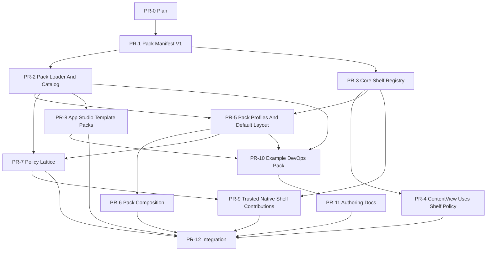

# ASTRA Packs Platform Implementation Plan

> **For agentic workers:** REQUIRED SUB-SKILL: Use superpowers:subagent-driven-development (recommended) or superpowers:executing-plans to implement this plan task-by-task. Steps use checkbox (`- [ ]`) syntax for tracking.

**Goal:** Keep one strong ASTRA Core codebase while allowing vertical products to ship governed ASTRA Packs that add capabilities, templates, policies, shelf configuration, and eventually trusted native shelf modules without long-lived forks.

**Architecture:** ASTRA Core remains the only owner of task state, runtime launch, permission floors, App Studio trust boundaries, and the native shelf framework. Packs contribute declarative manifests and governed resources that Core validates, composes, and exposes through registries. Native shelf modules start as Core-compiled registrations; arbitrary runtime-loaded SwiftUI is explicitly out of scope until signing, crash isolation, and API compatibility are solved.

**Tech Stack:** SwiftPM macOS app, SwiftData, SwiftUI, Swift Testing, ASTRACore package schema, existing capability package services, App Studio HTML app contracts, capability governance, runtime launch/preflight services.

---

## Living Progress Rules

This document is the completion map. Every PR in this program must update this file in the same PR:

- Mark its PR row as `In progress`, `Blocked`, `Ready for review`, or `Merged`.
- Add the branch name, PR number, and final commit hash when available.
- Add focused validation command output summaries under the PR section.
- Never mark a stage complete unless all required validation commands for that stage passed or the remaining blocker is explicitly documented.
- If a PR changes scope, update the dependency graph and downstream PR descriptions before continuing.

Status vocabulary:

- `Not started`: no branch exists.
- `In progress`: branch exists or an agent has begun implementation.
- `Blocked`: implementation cannot continue without a preceding PR, user decision, or external state.
- `Ready for review`: implementation and required validation are done, PR is open.
- `Merged`: PR is merged into `main`.

## Program Progress

| Stage | PR | Status | Branch | PR URL | Required Gate |
| --- | --- | --- | --- | --- | --- |
| 0 | PR-0 Architecture Baseline And Plan | In progress | current detached worktree | none | Plan exists and passes self-review |
| 1 | PR-1 Pack Manifest V1 | Ready for review | `alvaro/astra-packs-manifest-v1` | none | `swift test --filter 'AstraPackManifestTests|AstraPackManifestValidatorTests'` |
| 1 | PR-2 Pack Loader And Catalog | Ready for review | `alvaro/astra-packs-loader` | none | `swift test --filter 'AstraPackCatalogTests|CapabilityLibraryTests'` |
| 2 | PR-3 Core Shelf Registry | Ready for review | `alvaro/shelf-registry-core` | none | `swift test --filter 'ShelfRegistryTests|PanelLayoutGeometryTests'` |
| 2 | PR-4 ContentView Uses Shelf Policy | Ready for review | `alvaro/shelf-policy-contentview` | none | `swift test --filter 'ShelfAvailabilityPolicyTests|PanelLayoutGeometryTests|ArchitectureFitnessTests'` and `./script/build_and_run.sh --verify` |
| 3 | PR-5 Pack Profiles And Default Layout | Ready for review | `alvaro/astra-pack-profiles` | none | `swift test --filter 'AstraPackProfileTests|WorkspacePersistenceTests|WorkspaceCapabilitiesTests|ShelfAvailabilityPolicyTests|ArchitectureFitnessTests'` and `./script/build_and_run.sh --verify` |
| 3 | PR-6 Pack Composition And Conflict Reporting | Ready for review | `alvaro/astra-pack-composition` | none | `swift test --filter 'AstraPackCompositionTests|AstraPackProfileTests|AstraPackManifestTests|AstraPackManifestValidatorTests|AstraPackCatalogTests|LoggerTests|ArchitectureFitnessTests'` and `./script/build_and_run.sh --verify` |
| 4 | PR-7 Restrict-Only Policy Lattice | Ready for review | `alvaro/pack-policy-lattice` | none | `swift test --filter 'AstraPackPolicyTests|MCPToolPolicyEngineTests|CapabilityCatalogPolicyTests|AstraPackManifestTests|AstraPackManifestValidatorTests|AstraPackCompositionTests|AstraPackProfileTests|ShelfAvailabilityPolicyTests|AgentPolicyTests|ArchitectureFitnessTests'` and `./script/build_and_run.sh --verify` |
| 5 | PR-8 App Studio Template Packs | Ready for review | `alvaro/app-studio-template-packs` | none | `swift test --filter 'WorkspaceAppStudioTemplatePackTests|WorkspaceAppStudioGeneratorTests|WorkspaceAppStudioSessionTests|WorkspaceAppManifestTests|WorkspaceAppStudioScopeTests|ArchitectureFitnessTests'` and `./script/build_and_run.sh --verify` |
| 6 | PR-9 Trusted Native Shelf Contributions | Ready for review | `alvaro/trusted-native-shelf-packs` | none | `swift test --filter 'ShelfRegistryTests|TrustedShelfContributionTests|AstraPackManifestValidatorTests|ArchitectureFitnessTests'`, `./script/build_and_run.sh --verify`, and `./script/prepush.sh` |
| 7 | PR-10 Example DevOps Pack | Ready for review | `alvaro/example-devops-pack` | none | `swift test --filter 'AstraPackCatalogTests|PluginCatalogTests|TaskCapabilityResolverTests|WorkspaceAppStudioTemplatePackTests|AstraPackPolicyTests'`, `./script/build_and_run.sh --verify`, and `./script/prepush.sh` |
| 7 | PR-11 Authoring Docs And Validation Runbook | Ready for review | `alvaro/astra-pack-authoring-docs` | none | `git diff --check`, doc link validation by review, and merged-stack focused pack tests |
| 8 | PR-12 Full Integration Pass | Not started | `alvaro/astra-packs-integration` | none | `swift test`, `git diff --check`, `./script/build_and_run.sh --verify` |

## Root-Cause Diagnosis

ASTRA already has strong capability boundaries, but shelves and vertical customization are not yet represented by one contract.

Current facts:

- `ASTRACore/PluginPackage.swift` already models governed capability resources: skills, connectors, local tools, MCP servers, templates, setup requirements, prerequisites, browser adapters, source metadata, and governance.
- `Astra/Services/Capabilities/CapabilityRuntimeResourceMatcher.swift` resolves enabled package resources for workspace/runtime use.
- `Astra/Views/WorkspaceCanvasItem.swift` hard-codes the docked shelf cases: plan, markdown/files, browser, query, and app preview.
- `Astra/Services/Tasks/TaskGeneratedFiles.swift` hard-codes generated-file routing to browser/files/query shelves.
- `Astra/Views/ContentView.swift` owns large parts of shelf visibility, restoration, session creation, generated-file opening, and toolbar presentation.
- Browser has a better runtime boundary than other shelves: `ShelfBrowserBridgeRegistry`, `BrowserBridgeMCPProjection`, `TaskCapabilityResolver.shouldExposeBrowserBridge`, and runtime preflight all participate.

Root cause:

ASTRA has a capability-package model, but not a pack/profile model or a shelf registry model. As a result, vertical product behavior either becomes a fork, a scattered conditional, or a local App Studio customization that cannot safely own privileged native surfaces.

First-principles fix:

```text
Core owns allowed platform contracts.
Packs contribute declarative resources.
Profiles and workspaces enable a subset of allowed resources.
Runtime and policy gates always resolve through Core.
```

## Scope Guardrails

In scope:

- A versioned `AstraPackManifest` schema.
- Loading built-in and local pack manifests.
- Declarative pack contributions for capabilities, App Studio templates, profile defaults, layout defaults, vocabulary, and policy restrictions.
- A native shelf registry that centralizes existing core shelves before any pack shelf contribution is added.
- Deterministic multi-pack composition.
- Restrict-only pack policy contributions.
- Trusted native shelf registrations compiled with Core.
- Example pack proving the model.
- Tests and architecture fitness rules that prevent vertical conditionals in Core.

Out of scope for this program:

- Runtime-loaded arbitrary SwiftUI packages.
- Third-party binary plugin execution inside the app process.
- A public marketplace.
- Remote auto-update of pack code.
- Pack policies that widen Core's security floor.
- App Studio apps gaining privileged native shelf access without explicit Core bridges and validation.

## Dependency Graph



Parallelization:

- PR-1 is the first shared dependency.
- After PR-1 lands, PR-2 and PR-3 can run in parallel.
- After PR-3 lands, PR-4 can run while PR-2 continues.
- After PR-2 and PR-3 land, PR-5 and PR-8 can run in parallel.
- PR-7 depends on pack loading/profile semantics but can run in parallel with PR-8 once PR-2 and PR-5 are stable.
- PR-9 waits for registry plus policy-lattice shape.
- PR-10 should wait until PR-2, PR-5, and PR-8 are merged so the example pack proves the full declarative path.
- PR-11 can begin drafting after PR-1 but should finish after PR-10 so examples are truthful.

## Loop-Based Independent Thread Model

Yes: this program should be built in loops, with a coordinator thread and several independent implementation threads. The loops keep work small enough for agents to finish, review, validate, and merge without turning ASTRA Core into another monolith.

Coordinator thread:

1. Owns this plan, the dependency graph, the progress table, and merge order.
2. Starts each cycle by syncing `main`, reading open PR state, and choosing the next unblocked PRs.
3. Assigns one PR to one implementation thread.
4. Reviews each implementation thread's diff against this document, the architecture guardrails, and the required validation gate.
5. Merges or requests changes before downstream threads advance.
6. Updates the progress table and progress log after each PR cycle.
7. Does not implement feature code except for plan edits, merge-conflict repairs, CI wiring, or doc fixes needed to unblock the program.

Independent implementation threads:

| Thread | Owns | Can Start When | Must Pause Before |
| --- | --- | --- | --- |
| A - Pack Foundation | PR-1, PR-2, PR-6 | Immediately for PR-1 | PR-6 waits for PR-5 because composition needs profile inputs |
| B - Shelf Foundation | PR-3, PR-4 | PR-1 is merged | PR-4 waits for PR-3 and must coordinate if it edits `Astra/Views/ContentView.swift` beyond shelf-policy routing |
| C - Profile And Policy | PR-5, PR-7 | PR-2 and PR-3 are merged for PR-5 | PR-7 waits for PR-5 because policy must compose with profile resolution |
| D - App Studio Templates | PR-8 | PR-2 is merged | Must stop if template loading requires privileged native shelf access |
| E - Trusted Native Shelves | PR-9 | PR-3 and PR-7 are merged | Must stop if it needs runtime-loaded SwiftUI, binary plugin loading, or pack policy widening |
| F - Example And Docs | PR-10, PR-11 | PR-2, PR-5, and PR-8 are merged | PR-11 final pass waits for PR-10 validation evidence |
| Z - Integration | PR-12 | PR-4, PR-6, PR-7, PR-8, PR-9, and PR-11 are ready or merged | Must not start final validation until all upstream acceptance gates are recorded |

Thread lifecycle loop:

1. Claim exactly one PR row in the progress table.
2. Mark the row `In progress` and add the branch name.
3. Verify every upstream dependency is `Merged` or record the dependency as a stacked branch in the PR section.
4. Create an isolated branch from `main` for independent work.
5. Create a stacked branch from the upstream feature branch only when the coordinator explicitly records that stack in this document.
6. Run the focused baseline test command from the PR row before changing implementation code.
7. Add one failing test for the next acceptance case.
8. Implement the smallest Core-owned change that makes that test pass.
9. Rerun the focused test.
10. Repeat steps 7-9 until the PR's acceptance cases are covered.
11. Run the PR's required gate, `git diff --check`, and any visible-app validation named in the PR section.
12. Update this document with validation evidence and a handoff note.
13. Open the PR and mark the row `Ready for review`.
14. Stop until coordinator review either requests changes or marks the PR merged.

Dependent thread rule:

- If a thread depends on an unmerged sibling PR, it must be a stacked PR, not an invisible local assumption.
- The coordinator records the stack base in the dependent PR section before that branch begins.
- When the parent PR changes, the child thread rebases or merges the parent branch, reruns its focused gate, and records the result.
- A dependent thread cannot unblock another downstream thread until its own parent has merged into `main` or the coordinator records a deliberate stack chain.

Shared-file safety rules:

- `Astra/Views/ContentView.swift` belongs to Thread B by default during this program.
- `Astra/Views/WorkspaceCanvasItem.swift` belongs to Thread B during PR-3 and PR-4.
- `ASTRACore/PluginPackage.swift` belongs to Thread A during PR-1 and PR-2.
- `Astra/Services/Capabilities/` changes must be coordinated between Thread A, Thread C, and Thread F.
- `Tests/ArchitectureFitnessTests.swift` can be touched by any thread that adds a real architecture invariant, but the PR section must name the invariant before editing.
- If another thread needs one of these shared files, it updates this plan first with the reason, expected change, and validation command.

Program checkpoint gates:

1. Foundation gate: PR-1 merged. This unlocks PR-2 and PR-3.
2. Core registry gate: PR-2 and PR-3 merged. This unlocks PR-5 and gives PR-8 a stable pack-loader base.
3. Shelf UI gate: PR-4 merged. This proves the visible app can obey shelf policy before pack-driven defaults become product-facing.
4. Policy gate: PR-7 merged. This proves packs can restrict behavior without widening Core.
5. Product proof gate: PR-10 and PR-11 ready. This proves the model with an example pack and author-facing instructions.
6. Integration gate: PR-12 passes full validation and marks all remaining rows `Merged` or records a named deferral with owner approval.

## Agent Execution Loop

Every implementation agent follows this loop:

1. Read this document from the top through the target PR section.
2. Check live checkout state:

   ```bash
   git status --short --branch
   ```

3. Create or switch to the target branch from current `main` in an isolated worktree when possible:

   ```bash
   git switch main
   git pull --ff-only origin main
   git switch -c alvaro/<branch-name>
   ```

4. Update this document's progress table for the target PR to `In progress`.
5. Write the first failing focused test for the PR.
6. Run the focused test and confirm it fails for the expected reason.
7. Implement the minimal code to pass the test.
8. Run the focused test again and confirm it passes.
9. Repeat steps 5-8 for the remaining acceptance cases.
10. Run the PR's required validation gate.
11. Run whitespace validation:

    ```bash
    git diff --check
    ```

12. If the PR touches shared architecture or runtime/persistence behavior, run:

    ```bash
    swift test --filter ArchitectureFitnessTests
    ```

13. If the PR touches visible app/shelf UI, run:

    ```bash
    ./script/build_and_run.sh --verify
    ```

14. Update this document with validation results and final status.
15. Commit all intended changes, including this progress update.
16. Push and open a draft PR unless the user asks for local-only work.

Review loop for supervising agents:

1. Read the PR section and branch diff.
2. Verify tests named in the section exist and fail/pass for the intended reason if rerun.
3. Check that no vertical-specific branch logic entered Core.
4. Check that pack contributions remain declarative unless the PR is PR-9.
5. Check runtime/policy changes fail closed.
6. Request changes before merging if the PR bypasses the documented Core ownership boundary.

## Architecture Target

```text
ASTRA Core
  ASTRACore pack and capability schemas
  Pack loader and validator
  Capability registry
  Shelf registry
  App Studio template registry
  Policy lattice and runtime preflight
  Workspace/admin enablement state

ASTRA Packs
  Pack manifest
  Capability package ID references
  App Studio templates
  Default shelf layout/profile
  Vocabulary and branding strings
  Restrict-only policy contributions
  Optional trusted native shelf contribution references

Workspace/User Layer
  Enabled pack IDs
  Enabled capability IDs
  Enabled shelf IDs from the allowed set
  Pinned App Studio apps
  Per-workspace default shelf
```

Ordering rule:

```text
Core security floor > Pack policy restriction > Workspace/admin preference > User session state
```

Allowed/enabled rule:

```text
Pack and Core registries define what is allowed.
Workspace/admin configuration defines what is enabled.
Session state defines what is currently visible.
```

## File Structure

Create:

- `ASTRACore/AstraPackManifest.swift`
  - Versioned Codable schema for packs, profiles, shelf declarations, template references, policy restrictions, and compatibility requirements.
- `Astra/Services/Packs/AstraPackCatalog.swift`
  - Loads built-in and local pack manifests, merges sources, and exposes validated pack definitions.
- `Astra/Services/Packs/AstraPackManifestValidator.swift`
  - Pure validator for schema compatibility, duplicate IDs, unsafe policy contributions, unknown shelf references, and invalid capability references.
- `Astra/Services/Packs/AstraPackComposition.swift`
  - Deterministic resolver for multiple enabled packs.
- `Astra/Services/Packs/AstraPackProfileResolver.swift`
  - Resolves default shelf layout, vocabulary, and pack-provided defaults for a workspace.
- `Astra/Services/Packs/AstraPackPolicyResolver.swift`
  - Applies restrict-only policy contributions against Core's security floor.
- `Astra/Services/Shelves/ShelfID.swift`
  - Stable shelf IDs and migration helpers for current `WorkspaceCanvasItem` raw values.
- `Astra/Services/Shelves/ShelfDescriptor.swift`
  - Core shelf metadata: title, icon, width constraints, display order, content kind, and safety properties.
- `Astra/Services/Shelves/CoreShelfRegistry.swift`
  - Registers current built-in shelves.
- `Astra/Services/Shelves/ShelfAvailabilityPolicy.swift`
  - Computes allowed, enabled, and presentable shelves from Core, packs, workspace state, and task context.
- `Astra/Services/Shelves/ShelfArtifactRouter.swift`
  - Replaces direct generated-file destination logic with registry-backed routing.
- `Astra/Services/WorkspaceApps/WorkspaceAppTemplatePackCatalog.swift`
  - Loads App Studio templates contributed by packs.
- `Astra/Resources/Packs/README.md`
  - Describes built-in pack resource format.
- `Astra/Resources/Packs/devops-pack.json`
  - Example pack used by tests and later docs.
- `docs/architecture/astra-packs.md`
  - Durable architecture document for ASTRA Core plus Packs.
- `docs/capabilities/astra-pack-authoring.md`
  - Author-facing guide for pack creation and validation.

Modify:

- `Package.swift`
  - Ensure new service files are included by SwiftPM automatically through existing target paths; no target split is planned in this program.
- `Astra/Services/Settings/AppearancePreference.swift`
  - Add storage keys for enabled pack IDs, shelf visibility overrides, and active pack profile state when needed.
- `Astra/Models/Workspace.swift`
  - Add durable workspace-level enabled pack/shelf state only after the profile resolver exists.
- `Astra/Services/Capabilities/CapabilityLibrary.swift`
  - Seed and sync capability packages contributed by packs without creating a second package owner.
- `Astra/Services/Capabilities/PluginCatalog.swift`
  - Keep built-in packages, but allow pack-contributed packages to appear through catalog services rather than hard-coded conditionals.
- `Astra/Services/Capabilities/CapabilityRuntimeResourceMatcher.swift`
  - Continue resolving package resources; ensure pack-contributed packages flow through the same package definitions path.
- `Astra/Views/WorkspaceCanvasItem.swift`
  - Keep as a compatibility facade during migration, then make it map to `ShelfID`.
- `Astra/Views/WorkspaceCanvasItemPreference.swift`
  - Store stable shelf IDs and migrate old raw values.
- `Astra/Services/Tasks/TaskGeneratedFiles.swift`
  - Move routing decisions into `ShelfArtifactRouter`.
- `Astra/Views/ContentView.swift`
  - Consume `ShelfAvailabilityPolicy` and registry descriptors instead of scattered booleans for shelf availability.
- `Astra/Views/ShelfBrowserPanelView.swift`
  - No feature changes expected; registry should host metadata, not rewrite panel internals.
- `Astra/Views/ShelfQueryPanelView.swift`
  - No feature changes expected; registry should host metadata, not rewrite panel internals.
- `Astra/Views/PluginCatalogView.swift`
  - Display pack provenance for pack-contributed capability packages.
- `Astra/Views/WorkspaceRightRailView.swift`
  - Summarize enabled packs and pack-contributed capabilities after the model exists.
- `Tests/ArchitectureFitnessTests.swift`
  - Add guards against vertical-specific Core conditionals and line-budget regressions.

Tests to create:

- `Tests/AstraPackManifestTests.swift`
- `Tests/AstraPackManifestValidatorTests.swift`
- `Tests/AstraPackCatalogTests.swift`
- `Tests/AstraPackCompositionTests.swift`
- `Tests/AstraPackProfileTests.swift`
- `Tests/AstraPackPolicyTests.swift`
- `Tests/ShelfRegistryTests.swift`
- `Tests/ShelfAvailabilityPolicyTests.swift`
- `Tests/ShelfArtifactRouterTests.swift`
- `Tests/WorkspaceAppStudioTemplatePackTests.swift`

---

## Stage 0: Architecture Baseline

### PR-0: Architecture Baseline And Living Plan

**Purpose:** Create this plan and use it as the progress map for the ASTRA Packs program.

**Files:**

- Create: `docs/superpowers/plans/2026-06-28-astra-packs-platform.md`

**Steps:**

- [ ] Create the plan document.
- [ ] Confirm it includes PR slices, test gates, dependency graph, parallelization notes, and progress update rules.
- [ ] Run:

  ```bash
  git diff --check
  ```

  Expected: no whitespace errors.

- [ ] Commit the plan when the user asks for commit/push or when this becomes PR-0.

**Validation Gate:**

```bash
git diff --check
```

Expected: no output.

---

## Stage 1: Pack Manifests And Loading

### PR-1: Pack Manifest V1

**Purpose:** Add a versioned, pure data schema for ASTRA Packs without changing runtime behavior.

**Files:**

- Create: `ASTRACore/AstraPackManifest.swift`
- Create: `Tests/AstraPackManifestTests.swift`
- Create: `Tests/AstraPackManifestValidatorTests.swift`
- Create: `Astra/Services/Packs/AstraPackManifestValidator.swift`
- Modify: `Tests/ArchitectureFitnessTests.swift`

**Acceptance Criteria:**

- Pack manifests decode from JSON and encode back deterministically.
- Manifest includes `formatVersion`, `id`, `name`, `version`, `coreAPIVersion`, `capabilityPackageIDs`, `shelfDefaults`, `appTemplates`, `policyRestrictions`, `vocabulary`, and `branding`.
- Validator blocks empty IDs, unsupported `coreAPIVersion`, duplicate shelf IDs, policy widening declarations, and unknown contribution kinds.
- No runtime behavior changes.

**Implementation Steps:**

- [ ] Add failing tests in `Tests/AstraPackManifestTests.swift`:
  - `packManifestRoundTripsCoreFields`
  - `packManifestDefaultsOptionalCollectionsToEmpty`
  - `packManifestRejectsUnknownFutureRequiredFormat`

- [ ] Add failing validator tests in `Tests/AstraPackManifestValidatorTests.swift`:
  - `validatorRejectsEmptyPackID`
  - `validatorRejectsUnsupportedCoreAPIVersion`
  - `validatorRejectsPolicyWidening`
  - `validatorRejectsDuplicateShelfDefaults`

- [ ] Run:

  ```bash
  swift test --filter 'AstraPackManifestTests|AstraPackManifestValidatorTests'
  ```

  Expected before implementation: fails because the types do not exist.

- [ ] Implement `AstraPackManifest` in `ASTRACore/AstraPackManifest.swift`.

  Required type shape:

  ```swift
  public struct AstraPackManifest: Codable, Equatable, Sendable, Identifiable {
      public var formatVersion: Int
      public var id: String
      public var name: String
      public var version: String
      public var coreAPIVersion: String
      public var description: String
      public var capabilityPackageIDs: [String]
      public var shelfDefaults: [AstraPackShelfDefault]
      public var appTemplates: [AstraPackAppTemplate]
      public var policyRestrictions: [AstraPackPolicyRestriction]
      public var vocabulary: [String: String]
      public var branding: AstraPackBranding?
  }
  ```

- [ ] Implement `AstraPackManifestValidator.validate(_:)` as a pure function returning a report with blockers and warnings.
- [ ] Add an architecture fitness test that requires pack service files to live under `Astra/Services/Packs`.
- [ ] Run focused tests until they pass.
- [ ] Run:

  ```bash
  swift test --filter ArchitectureFitnessTests
  git diff --check
  ```

**Validation Gate:**

```bash
swift test --filter 'AstraPackManifestTests|AstraPackManifestValidatorTests|ArchitectureFitnessTests'
git diff --check
```

### PR-2: Pack Loader And Catalog

**Purpose:** Load validated pack manifests from app resources and local ASTRA-managed storage without enabling any pack behavior yet.

**Files:**

- Create: `Astra/Services/Packs/AstraPackCatalog.swift`
- Create: `Astra/Services/Packs/AstraPackSource.swift`
- Create: `Astra/Resources/Packs/README.md`
- Create: `Astra/Resources/Packs/devops-pack.json`
- Create: `Tests/AstraPackCatalogTests.swift`
- Modify: `Package.swift` if resource copying needs explicit verification.
- Modify: `Astra/Services/Capabilities/CapabilityLibrary.swift` only if shared source metadata helpers are needed.

**Acceptance Criteria:**

- Built-in pack manifests load from `Astra/Resources/Packs`.
- Local pack manifests load from ASTRA-managed app storage through `HostFileAccessBroker`.
- Invalid manifests are skipped with diagnostics, not silently accepted.
- Duplicate pack IDs resolve deterministically: built-in packs win over local packs unless the local pack uses a new version and is explicitly approved in a later PR.
- No pack changes runtime, UI, or capability behavior yet.

**Implementation Steps:**

- [ ] Add tests in `Tests/AstraPackCatalogTests.swift`:
  - `builtInPackCatalogLoadsBundledDevOpsPack`
  - `catalogSkipsInvalidPackAndReportsDiagnostic`
  - `duplicatePackIDsResolveDeterministically`
  - `catalogReadsLocalPacksThroughHostFileAccessBroker`

- [ ] Run:

  ```bash
  swift test --filter AstraPackCatalogTests
  ```

  Expected before implementation: fails because catalog types do not exist.

- [ ] Implement `AstraPackSource` with cases for built-in and local library source metadata.
- [ ] Implement `AstraPackCatalog` with explicit file-access intent for ASTRA-managed storage.
- [ ] Add the bundled `devops-pack.json` with no active shelf or policy effects yet.
- [ ] Run:

  ```bash
  swift test --filter 'AstraPackCatalogTests|CapabilityLibraryTests'
  swift test --filter ArchitectureFitnessTests
  git diff --check
  ```

**Validation Gate:**

```bash
swift test --filter 'AstraPackCatalogTests|CapabilityLibraryTests|ArchitectureFitnessTests'
git diff --check
```

---

## Stage 2: Shelf Registry Before Shelf Packs

### PR-3: Core Shelf Registry

**Purpose:** Centralize built-in shelf metadata and routing identities before packs can influence shelves.

**Files:**

- Create: `Astra/Services/Shelves/ShelfID.swift`
- Create: `Astra/Services/Shelves/ShelfDescriptor.swift`
- Create: `Astra/Services/Shelves/CoreShelfRegistry.swift`
- Create: `Astra/Services/Shelves/ShelfArtifactRouter.swift`
- Create: `Tests/ShelfRegistryTests.swift`
- Create: `Tests/ShelfArtifactRouterTests.swift`
- Modify: `Astra/Views/WorkspaceCanvasItem.swift`
- Modify: `Astra/Services/Tasks/TaskGeneratedFiles.swift`
- Modify: `Tests/PanelLayoutGeometryTests.swift`

**Acceptance Criteria:**

- Core shelves are registered by stable IDs: `plan`, `files`, `browser`, `query`, `appPreview`.
- Existing `WorkspaceCanvasItem` raw values continue to round trip.
- Existing generated-file routing behavior remains identical:
  - HTML opens Browser.
  - SQL opens Query.
  - Markdown/text/source files open Files.
- Registry metadata owns shelf title, icon, min/ideal/max width, and generated-file destination metadata.

**Implementation Steps:**

- [ ] Add `ShelfRegistryTests`:
  - `coreRegistryContainsExistingShelfIDs`
  - `coreShelfDescriptorsPreserveWidthConstraints`
  - `workspaceCanvasItemMapsToShelfID`

- [ ] Add `ShelfArtifactRouterTests`:
  - `htmlRoutesToBrowserShelf`
  - `sqlRoutesToQueryShelf`
  - `markdownRoutesToFilesShelf`
  - `unknownFileHasNoShelfDestination`

- [ ] Run:

  ```bash
  swift test --filter 'ShelfRegistryTests|ShelfArtifactRouterTests|PanelLayoutGeometryTests'
  ```

  Expected before implementation: fails because registry/router types do not exist.

- [ ] Implement the shelf ID and descriptor types.
- [ ] Implement `CoreShelfRegistry.defaultDescriptors`.
- [ ] Implement `ShelfArtifactRouter.destination(for:)`.
- [ ] Update `TaskGeneratedFiles.shelfDestination(for:)` to delegate to the router while preserving the old enum return type.
- [ ] Update `WorkspaceCanvasItem` with conversion helpers to and from `ShelfID`.
- [ ] Run:

  ```bash
  swift test --filter 'ShelfRegistryTests|ShelfArtifactRouterTests|PanelLayoutGeometryTests'
  swift test --filter ArchitectureFitnessTests
  git diff --check
  ```

**Validation Gate:**

```bash
swift test --filter 'ShelfRegistryTests|ShelfArtifactRouterTests|PanelLayoutGeometryTests|ArchitectureFitnessTests'
git diff --check
```

### PR-4: ContentView Uses Shelf Policy

**Purpose:** Move shelf availability decisions out of scattered `ContentView` booleans into a pure policy service.

**Files:**

- Create: `Astra/Services/Shelves/ShelfAvailabilityPolicy.swift`
- Create: `Tests/ShelfAvailabilityPolicyTests.swift`
- Modify: `Astra/Views/ContentView.swift`
- Modify: `Astra/Views/WorkspaceCanvasItemPreference.swift`
- Modify: `Tests/PanelLayoutGeometryTests.swift`
- Modify: `Tests/ArchitectureFitnessTests.swift`

**Acceptance Criteria:**

- Toolbar shelf availability comes from `ShelfAvailabilityPolicy`.
- Remembered shelf restoration asks the policy whether a shelf can be presented.
- If a shelf is disabled or unavailable, restore state does not reopen it.
- Browser visibility and Query visibility behave exactly as before when no packs/profile settings exist.
- `ContentView.swift` does not grow past its architecture line budget.

**Implementation Steps:**

- [ ] Add policy tests:
  - `policyAllowsBrowserForOpenTaskByDefault`
  - `policyAllowsQueryOnlyWhenTaskHasQueryAffordance`
  - `policyRejectsRememberedShelfWhenDisabled`
  - `policyPreservesFilesShelfForWorkspaceContext`
  - `policyPreservesAppPreviewOnlyDuringStudio`

- [ ] Run:

  ```bash
  swift test --filter ShelfAvailabilityPolicyTests
  ```

  Expected before implementation: fails because policy does not exist.

- [ ] Implement `ShelfAvailabilityPolicy` as a pure value type that consumes:
  - registered descriptors
  - selected task state
  - workspace state
  - composing/app-studio state
  - query/file/browser affordance flags
  - disabled shelf IDs

- [ ] Replace `ContentView.topRightActions` shelf availability booleans with policy output.
- [ ] Replace `canPresentWorkspaceCanvasItem(_:)` with policy output.
- [ ] Ensure restore state uses stable shelf IDs and ignores unknown disabled shelves.
- [ ] Run:

  ```bash
  swift test --filter 'ShelfAvailabilityPolicyTests|PanelLayoutGeometryTests|ArchitectureFitnessTests'
  ./script/build_and_run.sh --verify
  git diff --check
  ```

**Validation Gate:**

```bash
swift test --filter 'ShelfAvailabilityPolicyTests|PanelLayoutGeometryTests|ArchitectureFitnessTests'
./script/build_and_run.sh --verify
git diff --check
```

Manual smoke after build:

- Open ASTRA Dev.
- Select a task.
- Confirm Browser shelf can open and close.
- Open an SQL file and confirm Query shelf appears.
- Open a Markdown/text file and confirm Files shelf appears.
- Switch tasks and confirm remembered shelves restore only when valid.

---

## Stage 3: Profiles And Pack Composition

### PR-5: Pack Profiles And Default Layout

**Purpose:** Allow packs to declare default shelf layout and vertical vocabulary without changing runtime security.

**Files:**

- Create: `Astra/Services/Packs/AstraPackProfileResolver.swift`
- Create: `Tests/AstraPackProfileTests.swift`
- Modify: `Astra/Services/Settings/AppearancePreference.swift`
- Modify: `Astra/Models/Workspace.swift`
- Modify: `Astra/Services/Persistence/WorkspaceConfigManager.swift`
- Modify: `Astra/Services/Shelves/ShelfAvailabilityPolicy.swift`
- Modify: `Astra/Resources/Packs/devops-pack.json`

**Acceptance Criteria:**

- Workspace can persist enabled pack IDs and shelf visibility overrides.
- Pack profile defaults can hide a shelf by default, but workspace/admin settings can re-enable it only if the shelf is allowed by Core.
- Vocabulary/branding strings are exposed through a resolver but do not directly mutate SwiftUI views yet.
- Existing workspaces load with no enabled packs and preserve current behavior.

**Implementation Steps:**

- [ ] Add profile tests:
  - `profileDefaultsHiddenShelfWhenPackEnabled`
  - `workspaceOverrideCanEnableAllowedHiddenShelf`
  - `workspaceOverrideCannotEnableUnknownShelf`
  - `legacyWorkspaceWithoutPackStateUsesCoreDefaults`
  - `vocabularyResolverReturnsPackStringThenCoreFallback`

- [ ] Run:

  ```bash
  swift test --filter AstraPackProfileTests
  ```

  Expected before implementation: fails because profile resolver and workspace state do not exist.

- [ ] Add workspace persistence fields for enabled pack IDs and shelf overrides.
- [ ] Update workspace config import/export to preserve the new fields.
- [ ] Implement profile resolver with Core defaults as fallback.
- [ ] Wire profile output into `ShelfAvailabilityPolicy`.
- [ ] Run:

  ```bash
  swift test --filter 'AstraPackProfileTests|WorkspacePersistenceTests|WorkspaceCapabilitiesTests|ShelfAvailabilityPolicyTests'
  git diff --check
  ```

**Validation Gate:**

```bash
swift test --filter 'AstraPackProfileTests|WorkspacePersistenceTests|WorkspaceCapabilitiesTests|ShelfAvailabilityPolicyTests'
git diff --check
```

### PR-6: Pack Composition And Conflict Reporting

**Purpose:** Make multiple enabled packs deterministic and auditable.

**Files:**

- Create: `Astra/Services/Packs/AstraPackComposition.swift`
- Create: `Tests/AstraPackCompositionTests.swift`
- Modify: `Astra/Services/Packs/AstraPackProfileResolver.swift`
- Modify: `Astra/Services/Diagnostics/Logger.swift` if a new audit event is needed.

**Acceptance Criteria:**

- Multiple pack manifests compose in stable order.
- Core pack IDs and built-in pack IDs are sorted before local packs unless explicit priority is declared.
- Conflicting shelf order/defaults resolve deterministically and produce a diagnostic.
- Conflicting vocabulary keys resolve deterministically and produce a diagnostic.
- Conflicting policy restrictions are merged restrictively.

**Implementation Steps:**

- [ ] Add composition tests:
  - `multiplePacksResolveShelfOrderDeterministically`
  - `conflictingVocabularyUsesHighestPriorityPack`
  - `conflictsProduceDiagnostics`
  - `policyRestrictionsMergeRestrictively`

- [ ] Run:

  ```bash
  swift test --filter AstraPackCompositionTests
  ```

  Expected before implementation: fails because composition resolver does not exist.

- [ ] Implement `AstraPackComposition.resolve(packs:)`.
- [ ] Add diagnostic payload fields: `pack_ids`, `conflict_kind`, `winning_pack_id`, `losing_pack_ids`.
- [ ] Connect profile resolver to composition output.
- [ ] Run:

  ```bash
  swift test --filter 'AstraPackCompositionTests|AstraPackProfileTests|LoggerTests'
  git diff --check
  ```

**Validation Gate:**

```bash
swift test --filter 'AstraPackCompositionTests|AstraPackProfileTests|LoggerTests'
git diff --check
```

---

## Stage 4: Restrict-Only Policy Lattice

### PR-7: Restrict-Only Policy Lattice

**Purpose:** Allow packs to add policy restrictions while proving they cannot widen Core's security floor.

**Files:**

- Create: `Astra/Services/Packs/AstraPackPolicyResolver.swift`
- Create: `Tests/AstraPackPolicyTests.swift`
- Modify: `ASTRACore/AstraPackManifest.swift`
- Modify: `Astra/Services/Packs/AstraPackManifestValidator.swift`
- Modify: `Astra/Services/Runtime/AgentPolicyAdapters.swift` only if a narrow injection point is required.
- Modify: `Astra/Services/Runtime/AgentRuntimePolicyGuard.swift` only if a narrow injection point is required.
- Modify: `Tests/AgentPolicyTests.swift`
- Modify: `Tests/MCPToolPolicyEngineTests.swift`

**Acceptance Criteria:**

- Pack policy restrictions can:
  - hide or disable capabilities by tag/id
  - require stricter consent for external effects
  - restrict shelf visibility
  - add extra warnings or review gates
- Pack policy restrictions cannot:
  - lower risk levels
  - auto-approve external writes
  - broaden file/network access
  - bypass existing provider/runtime policy guardrails
  - allow a capability blocked by Core
- Policy decisions include evidence of Core floor and pack restrictions.

**Implementation Steps:**

- [ ] Add policy tests:
  - `packCannotLowerCoreRiskLevel`
  - `packCannotEnableCapabilityBlockedByCore`
  - `packCanRequireExplicitConsentForExternalWrites`
  - `packCanHideBrowserShelfByDefault`
  - `packPolicyDecisionIncludesRestrictionEvidence`

- [ ] Run:

  ```bash
  swift test --filter AstraPackPolicyTests
  ```

  Expected before implementation: fails because resolver does not exist.

- [ ] Add policy restriction schema cases to `AstraPackManifest`.
- [ ] Update validator to reject widening declarations.
- [ ] Implement resolver with monotonic/restrict-only merge semantics.
- [ ] Wire resolver into capability/shelf policy only at explicit boundaries.
- [ ] Run:

  ```bash
  swift test --filter 'AstraPackPolicyTests|AgentPolicyTests|MCPToolPolicyEngineTests|ShelfAvailabilityPolicyTests'
  swift test --filter ArchitectureFitnessTests
  git diff --check
  ```

**Validation Gate:**

```bash
swift test --filter 'AstraPackPolicyTests|AgentPolicyTests|MCPToolPolicyEngineTests|ShelfAvailabilityPolicyTests|ArchitectureFitnessTests'
git diff --check
```

---

## Stage 5: App Studio Template Packs

### PR-8: App Studio Template Packs

**Purpose:** Let packs contribute App Studio templates as the safe last-mile customization layer.

**Files:**

- Create: `Astra/Services/WorkspaceApps/WorkspaceAppTemplatePackCatalog.swift`
- Create: `Tests/WorkspaceAppStudioTemplatePackTests.swift`
- Modify: `ASTRACore/AstraPackManifest.swift`
- Modify: `Astra/Services/Packs/AstraPackManifestValidator.swift`
- Modify: `Astra/Services/WorkspaceApps/WorkspaceAppStudioGenerator.swift`
- Modify: `Astra/Services/WorkspaceApps/WorkspaceAppManifestValidator.swift`
- Modify: `Astra/Views/WorkspaceAppStudioChatView.swift`
- Modify: `Astra/Resources/Packs/devops-pack.json`

**Acceptance Criteria:**

- Pack templates are visible to App Studio generation as templates, not as privileged native UI.
- Template manifests declare required capabilities and bridge bindings.
- App Studio manifest validation rejects templates that request undeclared capability reads/actions.
- Templates contributed by disabled packs are not offered.
- Existing App Studio generation still works when no packs are enabled.

**Implementation Steps:**

- [ ] Add tests:
  - `enabledPackTemplateAppearsInTemplateCatalog`
  - `disabledPackTemplateIsHidden`
  - `templateCannotUseUndeclaredCapabilityRead`
  - `legacyGenerationHasNoPackDependency`

- [ ] Run:

  ```bash
  swift test --filter WorkspaceAppStudioTemplatePackTests
  ```

  Expected before implementation: fails because template catalog does not exist.

- [ ] Add template schema fields to pack manifest.
- [ ] Implement `WorkspaceAppTemplatePackCatalog`.
- [ ] Inject available templates into generator context.
- [ ] Extend manifest validator for declared template bridge bindings.
- [ ] Run:

  ```bash
  swift test --filter 'WorkspaceAppStudioTemplatePackTests|WorkspaceAppManifestValidatorTests|WorkspaceAppStudioScopeTests'
  git diff --check
  ```

**Validation Gate:**

```bash
swift test --filter 'WorkspaceAppStudioTemplatePackTests|WorkspaceAppManifestValidatorTests|WorkspaceAppStudioScopeTests'
git diff --check
```

Manual smoke:

- Enable the example DevOps pack.
- Open App Studio.
- Confirm the pack template appears as an available starting point.
- Generate an app from the template.
- Confirm the preview uses sample data and no undeclared live connector read.

---

## Stage 6: Trusted Native Shelf Contributions

### PR-9: Trusted Native Shelf Contributions

**Purpose:** Allow packs to reference trusted native shelves that are compiled into ASTRA Core, without allowing arbitrary runtime SwiftUI plugins.

**Files:**

- Modify: `ASTRACore/AstraPackManifest.swift`
- Modify: `Astra/Services/Shelves/ShelfDescriptor.swift`
- Modify: `Astra/Services/Shelves/CoreShelfRegistry.swift`
- Modify: `Astra/Services/Shelves/ShelfAvailabilityPolicy.swift`
- Modify: `Astra/Services/Packs/AstraPackManifestValidator.swift`
- Modify: `Astra/Views/ContentView.swift`
- Create: `Tests/TrustedShelfContributionTests.swift` or extend `Tests/ShelfRegistryTests.swift`
- Modify: `Tests/ArchitectureFitnessTests.swift`

**Acceptance Criteria:**

- Pack can request a shelf by stable ID only if Core already registers that shelf as pack-addressable.
- Unknown native shelf IDs are blocked at validation.
- Pack cannot override the view implementation of a Core shelf.
- Pack can set default visibility/order for a trusted shelf.
- Core still owns session lifecycle, runtime bridges, and panel implementation.

**Implementation Steps:**

- [ ] Add tests:
  - `packCanReferenceTrustedNativeShelf`
  - `packCannotReferenceUnknownNativeShelf`
  - `packCannotOverrideCoreShelfImplementation`
  - `trustedShelfUsesCoreSessionLifecycle`

- [ ] Run:

  ```bash
  swift test --filter 'ShelfRegistryTests|TrustedShelfContributionTests|AstraPackManifestValidatorTests'
  ```

  Expected before implementation: fails because trusted shelf contribution validation does not exist.

- [ ] Add `trustedShelfIDs` or equivalent contribution field to manifest schema.
- [ ] Mark selected Core shelves as pack-addressable where safe.
- [ ] Update validator and availability policy.
- [ ] Add architecture fitness test forbidding dynamic SwiftUI type names or arbitrary module paths in pack manifests.
- [ ] Run:

  ```bash
  swift test --filter 'ShelfRegistryTests|TrustedShelfContributionTests|AstraPackManifestValidatorTests|ArchitectureFitnessTests'
  ./script/build_and_run.sh --verify
  git diff --check
  ```

**Validation Gate:**

```bash
swift test --filter 'ShelfRegistryTests|TrustedShelfContributionTests|AstraPackManifestValidatorTests|ArchitectureFitnessTests'
./script/build_and_run.sh --verify
git diff --check
```

---

## Stage 7: Example Pack And Authoring Docs

### PR-10: Example DevOps Pack

**Purpose:** Prove the end-to-end pack model with a useful non-clinical example that avoids sensitive-domain assumptions.

**Files:**

- Modify: `Astra/Resources/Packs/devops-pack.json`
- Create: `Astra/Resources/Packs/devops/README.md`
- Add pack template assets under `Astra/Resources/Packs/devops/`
- Modify: `Tests/AstraPackCatalogTests.swift`
- Modify: `Tests/PluginCatalogTests.swift`
- Modify: `Tests/TaskCapabilityResolverTests.swift`
- Modify: `Tests/WorkspaceAppStudioTemplatePackTests.swift`

**Acceptance Criteria:**

- DevOps pack contributes:
  - default capability package IDs for GitHub workflow resources already known to ASTRA
  - one App Studio template for PR triage or CI summary
  - default shelf ordering that keeps Files and Plan visible and can hide Browser by default if configured
  - vocabulary strings for "PR Queue" and "CI Review"
- Pack does not add new runtime permissions.
- Enabling pack makes its template available and its defaults visible through resolver tests.

**Implementation Steps:**

- [ ] Add tests:
  - `devOpsPackLoadsFromBundledResources`
  - `devOpsPackReferencesOnlyKnownCapabilities`
  - `devOpsPackTemplateAppearsWhenEnabled`
  - `devOpsPackDoesNotWidenPolicyFloor`

- [ ] Run:

  ```bash
  swift test --filter 'AstraPackCatalogTests|PluginCatalogTests|TaskCapabilityResolverTests|WorkspaceAppStudioTemplatePackTests|AstraPackPolicyTests'
  ```

  Expected before implementation: fails because the pack does not yet declare all contributions.

- [ ] Fill out `devops-pack.json` contributions using only validated fields.
- [ ] Add template assets.
- [ ] Run focused tests.
- [ ] Run:

  ```bash
  ./script/build_and_run.sh --verify
  git diff --check
  ```

**Validation Gate:**

```bash
swift test --filter 'AstraPackCatalogTests|PluginCatalogTests|TaskCapabilityResolverTests|WorkspaceAppStudioTemplatePackTests|AstraPackPolicyTests'
./script/build_and_run.sh --verify
git diff --check
```

### PR-11: Authoring Docs And Validation Runbook

**Purpose:** Document how internal and future external authors build packs without forking ASTRA.

**Files:**

- Create: `docs/architecture/astra-packs.md`
- Create: `docs/capabilities/astra-pack-authoring.md`
- Modify: `Astra/Resources/Packs/README.md`
- Modify: `docs/superpowers/plans/2026-06-28-astra-packs-platform.md`

**Acceptance Criteria:**

- Docs explain:
  - Core vs Pack ownership.
  - Allowed vs enabled resources.
  - Pack manifest fields.
  - Restrict-only policy rule.
  - Trusted native shelf limitation.
  - App Studio template trust boundary.
  - How to test a pack.
  - How to migrate a fork delta into pack contributions.
- Docs include the DevOps pack as the canonical example.
- This plan's progress table is up to date.

**Implementation Steps:**

- [ ] Write `docs/architecture/astra-packs.md` with the durable architecture.
- [ ] Write `docs/capabilities/astra-pack-authoring.md` with manifest examples and validation commands.
- [ ] Update `Astra/Resources/Packs/README.md` to point to both docs.
- [ ] Run:

  ```bash
  git diff --check
  ```

**Validation Gate:**

```bash
git diff --check
```

Review checklist:

- No pack doc says packs can bypass Core policy.
- No pack doc implies runtime-loaded SwiftUI support in v1.
- Every manifest field in examples exists in `ASTRACore/AstraPackManifest.swift`.
- Example pack IDs match tests.

---

## Stage 8: Full Integration

### PR-12: Full Integration Pass

**Purpose:** Rebase, consolidate, and verify the entire ASTRA Packs program against the full app.

**Files:**

- Modify: `docs/superpowers/plans/2026-06-28-astra-packs-platform.md`
- Modify only code/docs needed to resolve integration conflicts or final hardening findings.

**Acceptance Criteria:**

- All program PRs have merged or are explicitly deferred with a documented reason.
- No vertical-specific conditionals exist in Core.
- No pack can widen Core policy.
- Existing ASTRA behavior is preserved with no enabled packs.
- Example DevOps pack works.
- App builds and launches.

**Implementation Steps:**

- [ ] Rebase current integration branch on `main`.
- [ ] Run:

  ```bash
  swift test
  ```

- [ ] Run:

  ```bash
  swift test --filter ArchitectureFitnessTests
  git diff --check
  ./script/build_and_run.sh --verify
  ```

- [ ] Manually smoke:
  - Launch ASTRA Dev.
  - Open a workspace with no packs enabled and confirm shelves behave as before.
  - Enable the DevOps pack.
  - Confirm pack defaults apply.
  - Confirm App Studio pack template appears.
  - Confirm Browser/Query shelf visibility follows profile/workspace settings.
  - Start a task and confirm runtime prompt/capability exposure does not include disabled shelf bridges.

- [ ] Update this plan's progress table with merged PR URLs and final validation notes.

**Validation Gate:**

```bash
swift test
swift test --filter ArchitectureFitnessTests
git diff --check
./script/build_and_run.sh --verify
```

## Program-Level Test Matrix

| Area | Required Tests | Command |
| --- | --- | --- |
| Pack schema | round trip, defaulting, unsupported version, invalid IDs | `swift test --filter AstraPackManifestTests` |
| Pack validation | unknown shelves, duplicate defaults, policy widening | `swift test --filter AstraPackManifestValidatorTests` |
| Pack loading | built-in/local loading, invalid skip, duplicate IDs | `swift test --filter AstraPackCatalogTests` |
| Shelf registry | built-in descriptors, width preservation, ID migration | `swift test --filter ShelfRegistryTests` |
| Artifact routing | HTML/SQL/files preserve current routing | `swift test --filter ShelfArtifactRouterTests` |
| Shelf policy | allowed/enabled/presentable logic | `swift test --filter ShelfAvailabilityPolicyTests` |
| Composition | multi-pack deterministic merge | `swift test --filter AstraPackCompositionTests` |
| Policy lattice | restrict-only policy and Core-deny precedence | `swift test --filter AstraPackPolicyTests` |
| App Studio templates | template visibility and bridge declaration validation | `swift test --filter WorkspaceAppStudioTemplatePackTests` |
| Architecture | folder boundaries, line budgets, no vertical conditionals | `swift test --filter ArchitectureFitnessTests` |
| UI build | SwiftUI compile and launch verification | `./script/build_and_run.sh --verify` |
| Full regression | all suites | `swift test` |

## Architecture Fitness Additions

Add the following guards as the program progresses:

- `Packs service files stay under Astra/Services/Packs`
- `Shelf service files stay under Astra/Services/Shelves`
- `Core contains no vertical-specific conditionals`
- `Pack manifests cannot reference arbitrary SwiftUI module/type names`
- `ContentView delegates shelf availability to ShelfAvailabilityPolicy`
- `TaskGeneratedFiles delegates shelf routing to ShelfArtifactRouter`
- `Large owner files stay within current debt budgets`

The no-vertical-conditionals test should scan `Astra` and `ASTRACore` for known pack IDs and vertical tokens outside allowed resource/test/doc folders. Initial blocked tokens:

```text
clinical
devops
research
sales
healthcare
```

Allowed paths:

```text
Astra/Resources/Packs
docs
Tests
```

## Risk Register

| Risk | Severity | Mitigation |
| --- | --- | --- |
| Packs become forks by another name | High | Declarative manifest first; no vertical conditionals in Core; architecture tests |
| Pack policies widen Core security | High | Restrict-only policy lattice; tests where malicious pack loses |
| Multiple packs conflict unpredictably | High | Deterministic composition resolver; diagnostics; tests |
| Shelf registry becomes another monolith | Medium | Small files by responsibility; `ContentView` only consumes descriptors/policy |
| App Studio templates misuse capability bridge | High | Template declarations plus manifest validation; bridge rejects undeclared reads/actions |
| Runtime-loaded UI causes crashes/security issues | High | Out of scope; only trusted Core-compiled shelf references in this program |
| Old workspaces break | Medium | Default empty pack state; migration tests; preserve raw shelf IDs |
| Pack API changes silently break packs | Medium | `coreAPIVersion`; validator fails loudly |
| Example pack overfits to current ASTRA repo | Medium | DevOps pack uses generic GitHub/CI vocabulary and existing capabilities only |

## Fork Migration Runbook

For each existing or proposed vertical fork:

1. Diff the fork against Core.
2. Classify each delta:
   - capability package
   - App Studio template
   - shelf default/profile
   - vocabulary/branding
   - policy restriction
   - trusted native shelf request
   - Core platform change
3. Move declarative deltas into a pack manifest.
4. Move custom workflow UI into App Studio templates where possible.
5. Move privileged native UI only into trusted Core shelf registrations.
6. Reject or redesign deltas that require pack policy to widen Core.
7. Add tests proving the pack behavior without vertical conditionals in Core.

## Completion Definition

This program is complete when:

- `main` contains the pack schema, loader, composition, profile, policy, shelf registry, App Studio template pack support, trusted native shelf references, example pack, and authoring docs.
- Full tests pass.
- ASTRA Dev builds and launches.
- A workspace with no packs behaves like current ASTRA.
- A workspace with the example DevOps pack shows pack-provided defaults/templates/capability provenance.
- This document has every PR row marked `Merged` or a clearly documented deferral.

## Progress Log

Append one entry per PR update.

### 2026-06-28 - PR-0

- Status: In progress.
- Branch: current detached worktree.
- Change: Created the ASTRA Packs Platform implementation map.
- Change: Added coordinator, independent thread, stacked dependent thread, shared-file safety, and checkpoint gate loops.
- Validation: `git diff --check` passed with no whitespace errors.
- Validation: Placeholder-language scan passed with no matches.

### 2026-06-28 - PR-1

- Status: Ready for review.
- Branch: `alvaro/astra-packs-manifest-v1`.
- Change: Started the subagent-driven implementation loop for Pack Manifest V1.
- Change: Added manifest schema, pure validator, focused manifest/validator tests, and pack-service architecture fitness rule.
- Change: Spec review caught missing `formatVersion` defaulting; added regression coverage and made JSON `formatVersion` required.
- Change: Code-quality review caught incomplete ID/reference validation; added nested capability/template ID regressions and centralized ID validation.
- Validation: `swift test --filter 'AstraPackManifestTests|AstraPackManifestValidatorTests|ArchitectureFitnessTests'` passed with 59 tests.
- Validation: `git diff --check` passed with no whitespace errors.

### 2026-06-28 - PR-2

- Status: Ready for review.
- Branch: `alvaro/astra-packs-loader`.
- Change: Added validated built-in/local pack catalog loading, bundled pack resource scaffolding, and catalog diagnostics.
- Review: Fixed local discovery to use `HostFileAccessBroker` and fixed unsupported `formatVersion` diagnostics.
- Validation: `swift test --filter 'AstraPackCatalogTests|CapabilityLibraryTests|AstraPackManifestValidatorTests|AstraPackManifestTests|ArchitectureFitnessTests'` passed.
- Validation: `git diff --check` passed with no whitespace errors.

### 2026-06-28 - PR-3

- Status: Ready for review.
- Branch: `alvaro/shelf-registry-core`.
- Change: Added stable shelf IDs, core shelf descriptors, generated-file shelf routing, and view-side compatibility adapters.
- Review: Moved view-layer shelf mapping out of services and added an architecture fitness guard for the boundary.
- Validation: `swift test --filter 'ShelfRegistryTests|ShelfArtifactRouterTests|TaskFileShelfSnapshotTests|PanelLayoutGeometryTests|ArchitectureFitnessTests'` passed.
- Validation: `git diff --check` passed with no whitespace errors.

### 2026-06-28 - PR-4

- Status: Ready for review.
- Branch: `alvaro/shelf-policy-contentview`.
- Change: Added pure `ShelfAvailabilityPolicy` and routed `ContentView` shelf toolbar, presentation, and remembered-restore decisions through it.
- Review: Fixed a target-task Plan first-click regression by seeding plan content from the validated target before policy-gated presentation.
- Validation: `swift test --filter 'ShelfAvailabilityPolicyTests|PanelLayoutGeometryTests|ArchitectureFitnessTests'` passed with 90 tests.
- Validation: `./script/build_and_run.sh --verify` passed and launched `ASTRA Dev.app`.
- Validation: `git diff --check` passed with no whitespace errors.

### 2026-06-28 - PR-5

- Status: Ready for review.
- Branch: `alvaro/astra-pack-profiles`.
- Stack: Started from the combined PR-2, PR-3, and PR-4 base; final head is `5a2ef05`.
- Change: Added durable workspace `enabledPackIDs`, shelf overrides, config import/export version 11, migration coverage, profile resolution, and `ContentView` policy consumption.
- Review: Fixed App Studio startup policy, active hidden shelf invalidation, and direct V9 migration regressions.
- Validation: `swift test --filter 'AstraPackProfileTests|WorkspacePersistenceTests|WorkspaceCapabilitiesTests|ShelfAvailabilityPolicyTests|ArchitectureFitnessTests'` passed with 116 tests.
- Validation: `swift test --filter SchemaVersionTests` passed with 32 tests.
- Validation: `./script/build_and_run.sh --verify` passed and launched `ASTRA Dev.app`.
- Validation: `git diff --check` passed with no whitespace errors.

### 2026-06-29 - PR-6

- Status: Ready for review.
- Branch: `alvaro/astra-pack-composition`.
- Commit: `478e216`.
- Stack: Started from PR-5 final head so composition consumes durable profile inputs.
- Change: Added optional `compositionPriority`, deterministic pack ordering, conflict diagnostics, shelf default composition, vocabulary composition, and restrictive policy union.
- Review: Fixed shared-shelf capability bindings so metadata has one winner while shelf capability package IDs remain additive.
- Validation: `swift test --filter 'AstraPackCompositionTests|AstraPackProfileTests|AstraPackManifestTests|AstraPackManifestValidatorTests|AstraPackCatalogTests|LoggerTests|ArchitectureFitnessTests'` passed with 100 tests.
- Validation: `./script/build_and_run.sh --verify` passed and launched `ASTRA Dev.app`.
- Validation: `git diff --check` passed with no whitespace errors.

### 2026-06-29 - PR-7

- Status: Ready for review.
- Branch: `alvaro/pack-policy-lattice`.
- Commit: `5bf6594`.
- Stack: Started from PR-6 final head so pack runtime policy consumes composed `policyRestrictions`.
- Change: Added restrict-only pack policy decisions, workspace-derived policy resolution, capability catalog enforcement, MCP explicit-consent escalation, profile shelf clamping, and audit evidence.
- Review: Fixed injectable-only policy plumbing, MCP empty-policy defaults, review-gate satisfaction, and composition/resolver semantic drift.
- Validation: `swift test --filter 'AstraPackPolicyTests|MCPToolPolicyEngineTests|CapabilityCatalogPolicyTests|AstraPackManifestTests|AstraPackManifestValidatorTests|AstraPackCompositionTests|AstraPackProfileTests|ShelfAvailabilityPolicyTests|AgentPolicyTests|ArchitectureFitnessTests'` passed with 184 tests.
- Validation: `./script/build_and_run.sh --verify` passed and launched `ASTRA Dev.app`.
- Validation: `script/prepush.sh` passed 410 tests across runtime, persistence, policy, capability, and architecture guardrails.

### 2026-06-28 - PR-8

- Status: Ready for review.
- Branch: `alvaro/app-studio-template-packs`.
- Commit: `1faaa04`.
- Stack: Started from PR-5 because real App Studio template visibility depends on durable workspace pack enablement.
- Change: Added template pack catalog, template context, App Studio choices, selected template state, and template-pack refresh revisioning.
- Review: Fixed visible selection, prompt-injection risk, capability-ID-vs-pack-ID confusion, missing durable pack state, and stale async template refresh races.
- Validation: `swift test --scratch-path /tmp/astra-pr8-template-pack-verify --jobs 1 --filter 'WorkspaceAppStudioTemplatePackTests|WorkspaceAppStudioGeneratorTests|WorkspaceAppStudioSessionTests|WorkspaceAppManifestTests|WorkspaceAppStudioScopeTests|ArchitectureFitnessTests'` passed with 156 tests.
- Validation: `swift test --scratch-path /tmp/astra-pr8-template-pack-verify --jobs 1 --filter 'AstraPackProfileTests|ShelfAvailabilityPolicyTests|SchemaVersionTests'` passed with 47 tests.
- Validation: `./script/build_and_run.sh --verify` passed and launched `ASTRA Dev.app`.
- Validation: `git diff --check` passed with no whitespace errors.

### 2026-06-29 - PR-9

- Status: Ready for review.
- Branch: `alvaro/trusted-native-shelf-packs`.
- Commit: `ae5b1ed`.
- Stack: Started from PR-7 final head so trusted native shelf references build on the restrict-only policy lattice and composed pack defaults.
- Change: Added `ShelfDescriptor.isPackAddressable`, centralized stable shelf ID parsing, blocked unknown/non-pack-addressable shelf defaults, rejected dynamic shelf implementation fields, and guarded resolver/override bypasses.
- Review: Fixed override bypass coverage, resolver-bypass coverage, stable-ID parsing duplication, and forbidden-key table coverage.
- Validation: `swift test --filter 'ShelfRegistryTests|TrustedShelfContributionTests|AstraPackManifestValidatorTests|AstraPackManifestTests|AstraPackCompositionTests|AstraPackProfileTests|AstraPackPolicyTests|ShelfAvailabilityPolicyTests|ArchitectureFitnessTests'` passed with 106 tests.
- Validation: `./script/build_and_run.sh --verify` passed and launched `ASTRA Dev.app`.
- Validation: `./script/prepush.sh` passed 411 tests across runtime, persistence, policy, capability, sandbox, and architecture guardrails, followed by `git diff --no-ext-diff --check origin/main...HEAD`.

### 2026-06-29 - PR-10

- Status: Ready for review.
- Branch: `alvaro/example-devops-pack`.
- Commit: `41373f1`.
- Stack: Started from PR-8 final head so the example pack exercises bundled catalog loading, workspace profile state, and App Studio template-pack support together.
- Change: Updated the bundled DevOps manifest, added `devops/README.md` and `devops/pr-ci-review-template.md`, and added catalog, known-capability, App Studio template, policy-floor, shelf-profile, and task-runtime safety tests.
- Review: Spec reviewer reported compliant; code-quality reviewer found no critical or important issues.
- Validation: Initial focused test failed because the bundled DevOps pack was inert and assets were absent.
- Validation: `swift test --filter 'AstraPackCatalogTests|PluginCatalogTests|TaskCapabilityResolverTests|WorkspaceAppStudioTemplatePackTests|AstraPackPolicyTests'` passed with 84 tests.
- Validation: `./script/build_and_run.sh --verify` passed and launched `ASTRA Dev.app`.
- Validation: `./script/prepush.sh` passed 411 tests across runtime, persistence, policy, capability, sandbox, and architecture guardrails, followed by `git diff --no-ext-diff --check origin/main...HEAD`.

### 2026-06-29 - PR-11

- Status: Ready for review.
- Branch: `alvaro/astra-pack-authoring-docs`.
- Commit: `e38d1d5`.
- Stack: Started from PR-10 final head `41373f1`, then merged PR-9 final head `ae5b1ed` so authoring docs, policy tests, composition tests, and trusted shelf tests exist in one reviewable branch.
- Change: Added the durable ASTRA Packs architecture doc, pack authoring/runbook guide, resource README links, and fork-to-pack migration guardrails.
- Review: Spec re-review found the previous missing-suite P1 fixed and reported PR11 spec compliant.
- Review: Quality re-review found the old `externalWrite` policy example invalid; fixed it with a supported `requireExplicitConsent` example plus the supported v1 policy-action table. Final quality re-review found no critical or important issues.
- Validation: `git diff --check` passed with no whitespace errors.
- Validation: `swift test --filter 'AstraPackCatalogTests|PluginCatalogTests|TaskCapabilityResolverTests|WorkspaceAppStudioTemplatePackTests|AstraPackPolicyTests|AstraPackCompositionTests|TrustedShelfContributionTests|ShelfRegistryTests|ArchitectureFitnessTests'` passed with 159 tests.
- Validation: Commit hook passed `ArchitectureFitnessTests` with 47 tests and cached diff check.
